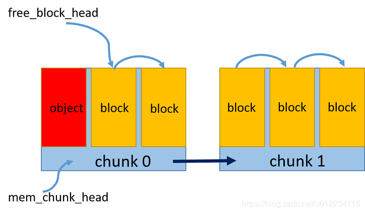
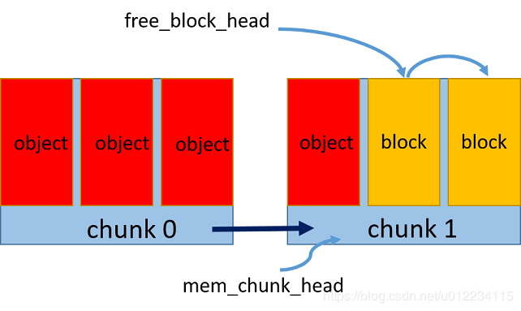
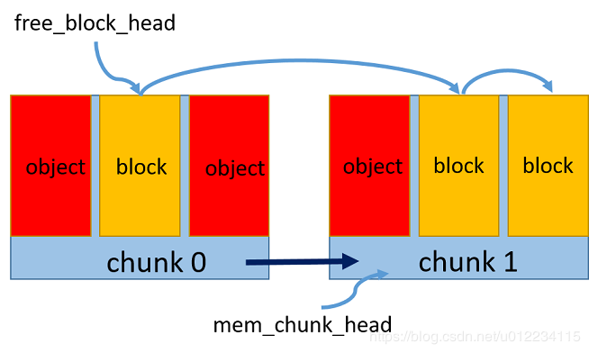
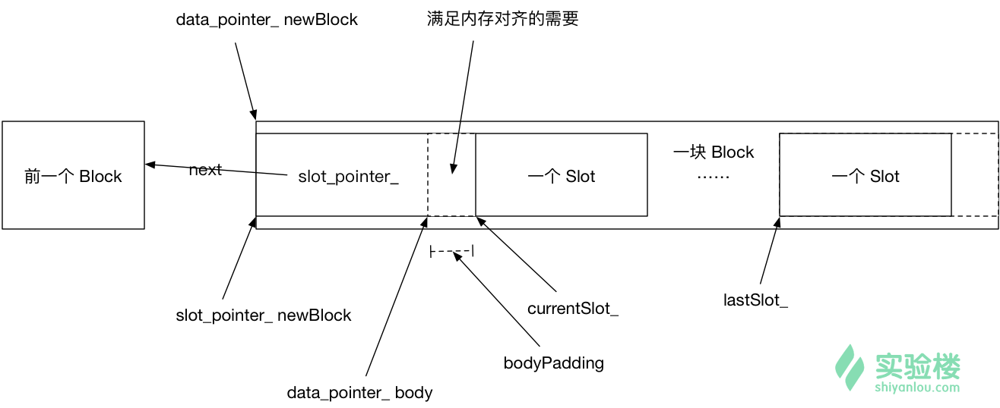

# C++ 实现内存池

[TOC]

## 1.基本描述和基本知识

当内存不足时管理优化自身已经使用的内存。

- 使用`new delete `时每次申请释放都要系统调用，从堆中分配内存，操作过于频繁则会产生大量的内存碎片
- 每次申请都要经过复杂的系统调用，n次则需要时间为nT
- 可以最初接分配好内存区域，当需要内存时，直接在分配好的内存中使用

### 1.1 内存池设计的算法与原理

**原理：**在真正使用内存之前，预先申请一点数量大小的内存块留作备用，当有新的内存需求时，就从内存池中分出一部分的内存块，内存块不够就再继续申请新的内存， 当内存释放时就归还到内存池中

**算法：**

- 预申请一个内存区chunk，将内存区的对象按照对象大小划分成多个内存块block
- 维持一个空闲块链表，通过指针相连，标记头指针为第一个空闲块
- 每次新申请一个对象的空间，则将该内存块从空闲链表中去除，更新空闲链表头指针
- 每次释放一个对象空间时，则重新将该内存块加到空闲链表头
- 若内存区占满，则新开辟一个内存区，维持一个内存区的链表，头指针指向最新的内存区

**如图**







### 1.2: 左值与右值，右值引用，std::move  std::forward

[详情](https://www.ibm.com/developerworks/cn/aix/library/1307_lisl_c11/)

**左值：** l-value : 可以引用地址，在内存中的值

**右值：**对于临时对象，可以被存在寄存器中，无法区地址；对于常量，是编码到机器指令的立即数

- 但在C++标准中将字符串字面值常量定为常量左值，可以取地址，其地址为进程的刻度内存空间，其他的字面值常量都是“纯右值”

**右值引用的例子**

```c++
void process_value(int& i){
    std::cout<<"RValue processed: "<<i<<std::endl;
}

void process_value(int&& i){
    std::cout<<"RValue processed: "<<i<<std::endl;
}

int main(){
    int a = 0;
    process_value(a); //  RValue processed: 0
    process_value(1); //  RValue processed: 1
    return 1;
}
```

临时对象 `1 `通过一个接受优质的函数传递给另一个函数，转换成了左值，即

```c++
void process_value(int& i){
    std::cout<<"LValue processed: "<<i<<std::endl;
}

void process_value(int&& i){
    std::cout<<"RValue processed: "<<i<<std::endl;
}

void forward_value(int&& i){
    process_value(i);
}
int main(){
    int a = 0;
    process_value(a); // LValue processed: 0
    process_value(1); // RValue processed: 1
    forward_value(2); // LValue processed: 2
    return 1;
}
```

**右值引用解决的问题：**用来支持转移语义，即将资源从一个对象转移到另外一个对象时不是通过创建，拷贝，销毁。

**使用拷贝构造和拷贝赋值的例子**:一个string类

```c++
class MyString { 
private: 
 char* _data; 
 size_t   _len; 
 void _init_data(const char *s) { 
   _data = new char[_len+1]; 
   memcpy(_data, s, _len); 
   _data[_len] = '\0'; 
 } 
public: 
 MyString() { 
   _data = NULL; 
   _len = 0; 
 } 
 
 MyString(const char* p) { 
   _len = strlen (p); `
   _init_data(p); 
 } 
 
 MyString(const MyString& str) { 
   _len = str._len; 
   _init_data(str._data); 
   std::cout << "Copy Constructor is called! source: " << str._data << std::endl; 
 } 
 
 MyString& operator=(const MyString& str) { 
   if (this != &str) { 
     _len = str._len; 
     _init_data(str._data); 
   } 
   std::cout << "Copy Assignment is called! source: " << str._data << std::endl; 
   return *this; 
 } 
 
 virtual ~MyString() { 
   if (_data) free(_data); 
 } 
}; 
 
int main() { 
 MyString a; 
 a = MyString("Hello"); 
 std::vector<MyString> vec; 
 vec.push_back(MyString("World")); 
}
```

运行结果

```c++
Copy Assignment is called! source: Hello 
Copy Constructor is called! source: World
```

可知调用右值临时变量`MyString("Hello")` `MyString("World")`时，都还是要调用拷贝构造和拷贝赋值，造成了无意义的资源申请和释放的操作

**实现转移构造和转移赋值**

```C++
MyString(MyString&& str) { 
   std::cout << "Move Constructor is called! source: " << str._data << std::endl; 
   _len = str._len; 
   _data = str._data; 
   str._len = 0; 
   str._data = NULL; 
}
MyString& operator=(MyString&& str) { 
   std::cout << "Move Assignment is called! source: " << str._data << std::endl; 
   if (this != &str) { 
     _len = str._len; 
     _data = str._data; 
     str._len = 0; 
     str._data = NULL; 
   } 
   return *this; 
}
```

**注意**

- 参数(右值)的符号必须是右值引用符号 &&
- 参数(右值)不可以是常量
- 参数（右值）的资源链接和标记必须修改。否则，右值的析构函数就会释放资源。转移到新对象的资源也就无效了。

#### std::move 

命名对象都是左值引用，但是有一个不再被使用而想对它调用 转移拷贝/赋值函数，就需要将左值引用当成右值引用来做，此时使用 `std::move`,将左值引用转换成右值引用

```c++
void ProcessValue(int& i) { 
     std::cout << "LValue processed: " << i << std::endl; 
} 
 
void ProcessValue(int&& i) { 
     std::cout << "RValue processed: " << i << std::endl; 
} 
 
int main() { 
     int a = 0; 
     ProcessValue(a); 
     ProcessValue(std::move(a)); 
}
```

#### Perfect Forwarding 完美转发


## 2. 主函数的设计

设计一个高性能的内存池就要对比已有的内存，而比较已有的内存分配结构，就要一个动态分配结构。**主函数则测试 内存池的动态结构与默认分配器释放相同数量的元素所用的时间 **.

>  其中 `std::allocator`是C++标准库默认的分配器，它的特点是 在new对象时，必然要调用构造函数，它将构造与内存分配两部分分离开来，使得分配的内存是原始的为构造的。

```c++
#include<iostream>
#include<cassert>
#include<ctime>
#include<vector>

#include"MemoryPool.hpp"
#include"StackAlloc.hpp"

// 插入元素个数
#define ELEMS 1000000

// 重复次数
#define REPS 100

int main(){

    clock_t start;
    // 使用默认分配器 std::allocator
    StackAlloc<int,std::allocator<int>> stackDefalut;
    start = clock();
    for(int j = 0;j < REPS;++j){
        assert(stackDefalut.empty());
        for(int i = 0; i < ELEMS; ++i){
            stackDefalut.push(i);
        }
        for(int i = 0; i < ELEMS; ++i){
            stackDefalut.pop();
        }
    }
    std::cout<<"Default Allocator Time: ";
    std::cout<<(((double)clock() - start) / CLOCKS_PER_SEC)<<"\n\n";

    // 使用内存池
    StackAlloc<int, MemoryPool<int>> stackPool;
    start = clock();
    for (int j = 0; j < REPS; j++) {
        assert(stackPool.empty());
        for (int i = 0; i < ELEMS; i++)
          stackPool.push(i);
        for (int i = 0; i < ELEMS; i++)
          stackPool.pop();
    }
    std::cout << "MemoryPool Allocator Time: ";
    std::cout << (((double)clock() - start) / CLOCKS_PER_SEC) << "\n\n";

    return 1;
}
```

## 3. 栈的构造

```c++
#ifndef STACK_ALLOC_H__
#define STACK_ALLOC_H__

#include<memory> 

template<typename T>
// 用链式结构来实现栈
struct StackNode_{
    // 数据
    T data;
    // 指向前一个节点
    StackNode_* prev;
};

template <typename T, typename Alloc = std::allocator<T>>
class StackAlloc{
// 都调用内存分配器来管理内存
public: 
    typedef StackNode_<T> Node;
    // 得到 std::allocator<StackNode_<T>>
    // typedef typename std::allocator<T>::template rebind<Node>::other allocator;
    // 该作用为 对一个给定类型T1的分配器，想根据相同策略得到类型T2的分配器
    // 用 typename 来指明 other是一个类型
    typedef typename Alloc::template rebind<Node>::other allocator;

    StackAlloc(){head_ = 0;}
    ~StackAlloc(){ clear();}

    // 当栈中元素为空时返回 true
    bool empty(){return (head_ == 0);}
    // 释放栈中元素的所有内存
    void clear(){
        Node* curr = head_;
        // 依次出栈
        while(curr != 0){
            Node* tmp = curr->prev;
            // 先析构再回收内存,归还到空闲区
            allocator_.destroy(curr);
            allocator_.deallocate(curr,1);
            curr = tmp;
        }
        head_ = 0;
    }
    
    // 压栈
    void push(T element){
        // 为一个节点分配内存
        Node* newNode = allocator_.allocate(1);
        // 调节节点构造函数
        allocator_.construct(newNode,Node());
        // 入栈
        newNode->data = element;
        newNode->prev = head_;
        head_ = newNode;
    }
    // 出栈
    T pop(){
        T result = head_->data;
        Node* tmp = head_->prev;
        allocator_.destroy(head_);
        allocator_.deallocate(head_,1);
        head_ = tmp;
        return result;
    }
    // 返回栈顶元素
    T top(){
        return head_->data;
    }
private:
    allocator allocator_;
    // 栈顶
    Node* head_;
};

#endif // STACK_ALLOC_H__
```

## 4. 内存池的设计

设计：`rebind<T>::other ` `allocate()` `dealocate()`   `construct`  `destroy()`  提供与默认分配器相同的接口

### MemoryPool类的设计：

**数据成员**

- 使用链表来管理内存区块
- 定义固定大小的基本内存块 Block
- 在其中定义一个可以实例化为存放对象内存槽的对象槽和对象槽指针的union

- 定义四个特殊的指针：
  - *指向当前内存区块*
  - *指向当前内存区块的一个对象槽*
  - *指向当前内存区块的最后一个对象槽*
  - *指向当前内存区块中的空闲对象槽*

**成员函数**

* 默认构造函数，初始化所有槽指针
* 析构函数，销毁现有的内存槽
* `allocate` 每次分配一个对象
* `deallocate` 销毁p指向的内存块, 即将当前内存块放入空闲块链上
* `construct` 
* `destroy`销毁内存中的对象，即调用对象的析构函数

#### 成员函数的实现

##### MemoryPool::construct()的实现

```c++
// 以右值拷贝
template <typename U,typename...Args>
void construct(U* p, Args&&... args){
	new (p) U(std::forward<Args>(args)...);
}
```
##### MemoryPool::destroy()的实现

```c++
// 销毁内存池中的对象，调用对象的析构函数
template<typename U>
void destroy(U* p){
    p->~U();
}
```

##### MemoryPool::deallocate()的实现

```c++
// 销毁p指向的内存块
void deallocate(pointer p, size_t n = 1){
    if(p != nullptr){
        // 用reinterpret_cast 强制类型转换
        // 访问next必须将p转换为 slot_pointer_
        reinterpret_cast<solt_pointer_>(p)->next = freeSlots_;
        freeSlots_ = reinterpret_cast<slot_pointer_>(p);
    }
}
```

**MemoryPool::allocate()的实现**

```c++
pointer allocate(size_t n=1,const T* hint=0){
        // 如果有空闲对象槽，直接将空闲区域交出去
        if(freeSlots_ != nullptr){
            pointer result = reinterpret_cast<pointer>(freeSlots_);
            freeSlots_ = freeSlots_->next;
            return result;
        }
        // 对象槽不够用，则分配一个新的内存区块
        else{
            if(currentSlot_ >= lastSlot_){
                data_pointer_ newBlock = reinterpret_cast<data_pointer_>(operator new(BlockSize));
                reinterpret_cast<slot_pointer_>(newBlock)->next = currentBlock_;
                currentBlock_ = reinterpret_cast<slot_pointer_>(newBlock);
                // 填充整个区域来满足元素内存区域的对齐要求
                // 分配的内存区+指向内存区域的指针 并计算其（指针）大小
                data_pointer_ body = newBlock + sizeof(slot_pointer_);
                uintptr_t result = reinterpret_cast<uintptr_t>(body);
                size_t bodyPadding = (alignof(slot_type_) - result)%alignof(slot_type_);
                currentSlot_ = reinterpret_cast<slot_pointer_>(body+bodyPadding);
                lastSlot_ = reinterpret_cast<slot_pointer_>(newBlock+BlockSize-sizeof(slot_type_));
            }
            return reinterpret_cast<pointer>(currentSlot_++);
        }
    }
```

