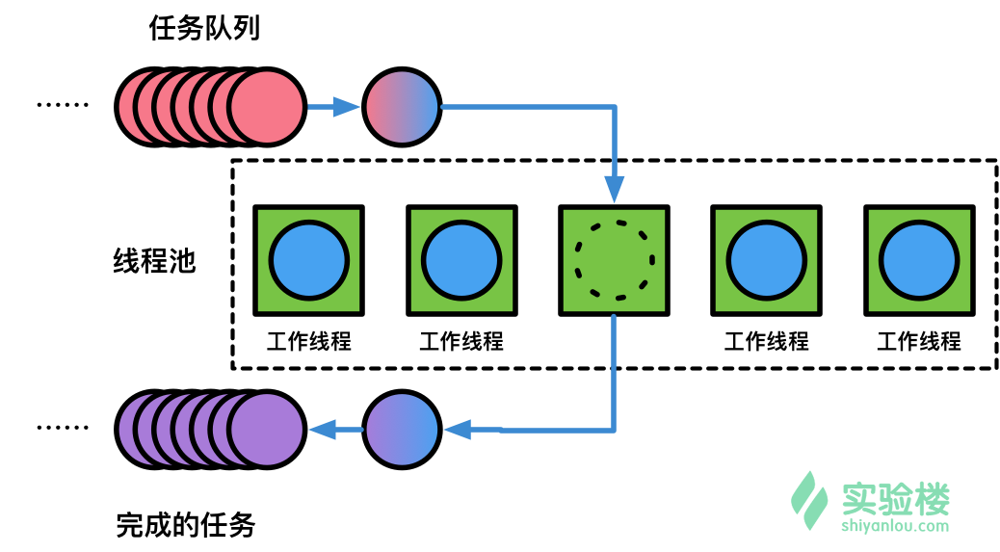

# C++ 线程池 

[TOC]

## 1.基础知识

**1.线程池的组成部分：**

1.  线程池管理器 thread pool
2. 工作线程 worker
3. 任务队列 tasks queue



- 一个处理器完成一项任务通常会有创建，执行，销毁线程三个过程；在web服务器中大量的创建销毁操作会占据大量的时间。
- 使用线程池在程序启动后创建一定数量的线程，当任务到达后， 缓冲队列将任务加到线程中去执行，执行完成后，线程不销毁，而是等待下一个任务的到来

**2. Lambda表达式**

格式`[捕获列表](参数列表) mutable(可选)异常属性->返回类型{ // 函数体   }`

**2.1 值捕获： **

- 捕获值可拷贝
- 在表达式创建时捕获，而非调用时; 捕获的是引用则还是引用，同普通函数

```c++
void learn_lambda_func_1(){
    int value_1 = 1;
    // auto copy_value_1 = [&value_1]  引用捕获
    auto copy_value_1 = [value_1]{
        return value_1;
    }
    value_1 = 100;
    auto stored_value_1 = copy_value_1();
    // stored_value_1 == 1
}
```

**隐式捕获**

- `[]` 空捕获列表
- `[name1, name2 , ...]` 捕获一系列变量
- `[&]`引用捕获，让编译器推导捕获列表
- `[=]`值捕获，让编译器推导

**3 尾置函数返回类型**

利用 `decltype`来推导函数返回类型

```c++
template <typename T>
auto &getItem(T begin, T end)->decltype(*begin){
    return *begin;
}
```

```c++
int (*)[5] func(int value){}
// 等同于
auto func(int value)->int (*)[5]{}
```

**4.1 std::thread**

`get_id()`获取穿件线程的ID，`join()`来加入一个线程

```c++
#include<iostream>
#include<thread>
void foo(){
    std::cout<<"hello world"<<std::endl;
}
int main(){
    std::thread t(foo);
    t.join();
    return 0;
}
```

**4.2 std::mutex  std::lock_guard	std::unique_lock**

通过实例化mutex来创建互斥量，通过lock()  unlock()来上锁或解锁, 使用RAII语法的`lock_guard`

```c++
void some_operation(const std::string &message){
    static std::mutex mutex;
    std::lock_guard<std::mutex> lock(mutex);
    // 这个作用域可以看成时个临界区
    // 离开时互斥锁被析构，同时unlock互斥锁
}
```

而使用`std::unique_lock`更加灵活， `std::unique_lock`对象会以独占所有权的方式管理`mutex`对象上的上锁与解锁

```c++
#include<iostream>
#include<thread>
#include<mutex>

std::mutex mtr

void block::area(){
	std::unique_lock<std::mutez> lock(mtx)
	// 临界区
}

int main(){
	std::thread thd1(block_area);
	thd1.join();
	return 1;
}
```

**4.3 std::future     std::promise   std::packaged_task**

- 利用`std::future`访问异步操作结果, 通过查看`future_status`来获取,

  `future_status`的三种状态

  - deferred  异步操作还没开始
  - ready    异步操作已经完成
  - timeout    异步操作超时

- `std::packaged_task`用来封装可调用目标，用于实现异步的调用


```c++
#include<iostream>
#include<future>
#include<thread>

int main(){
    //  封装一个返回7的Lambda表达式
    //  std::packaged_task的模板参数为封装函数的类型
    std::packaged_task<int()>  task([](){return 7;}) 
    //  获取task的future
    std::future<int> result = task.get_future();
    //  在一个线程执行 task
    std::thread(std::move(task)).detach();
    std::cout<<"waiting...";
    result.wait();
    //  输出执行结果
    std::cout<<" Done "<<std::endl<<"Result is "<< result.get()<<"\n";
    
    return 1;
}
```

**4.4 std::condition_variable**

用于唤醒等待线程从而避免死锁，`std::condition_variable`的`notify_one()`唤醒一个线程，`notify_all()`唤醒所有线程

```c++
#include<condition_variable>
#include<mutex>
#include<thread>
#include<iostream>
#include<queue>
#include<chrono>

int main(){
    // 生产者数量
    std::queue<int> produced_nums;
    // 互斥锁
    std::mutex m;
    // 条件变量
    std::condition_variable cond_var;
    // 结束标志
    bool done = false;
    // 通知标志
    bool notified = false;

    // 生产者线程
    std::thread producer([&](){
        for(int i=0;i<5;++i){
            std::this_thread::sleep_for(std::chrono::seconds(1));
            // 互斥锁
            // 进入临界区 P
            std::unique_lock<std::mutex> lock(m);
            std::cout<<" producing "<<i<<"\n";
            produced_nums.push(i);
            notified = true;
            // 通知一个线程
            // 出临界区 V
            cond_var.notify_one();
        }
        done = true;
        cond_var.notify_all();
    }
    );

    // 消费者线程
    std::thread consumer([&](){
        std::unique_lock<std::mutex> lock(m);
        while(!done){
            while(!notified){
                cond_var.wait(lock);
            }
            while(!produced_nums.empty()){
                std::cout<<" consuming "<<produced_nums.front()<<"\n";
                produced_nums.pop();
            }
            notified = false;
        }
    }
    );

    producer.join();
    consumer.join();
}
```


**4.5 std::bind**

使用`std::bind`来绑定参数

```c++
#include<functional>
int foo(int a, int b, int c){
    ;
}
int main(){
    // 使用 std::placeholders::_1 来对第一个参数进行占位
    auto bindFoo = std::bind(Foo, std::placeholders::_1,1,2);
    // 只需要提供第一个参数
    bindFoo(1);
}
```

## 2. 实现

### 2.1 测试

```c++
#include<iostream>  // std::cout  std::cin
#include<vector>    // std::vector  
#include<string>    // std::string    
#include<future>    // std::future    
#include<thread>    // std::this_thread::sleep_for     
#include<chrono>    // std::chrono::seconds

#include"ThreadPool.h"

int main(){
    // 创建一个并打执行4个线程的线程池
    ThreadPool pool(4);
    // 创建并发执行线程的结果列表
    std::vector<std::future<std::string>> results;
    // 启动8个需要执行的线程任务
    for(int i = 0;i < 8;++i){
        // 将并发执行任务的返回值添加到结果列表中
        results.emplace_back(
            // 将下面的打印任务添加到线程池中
            pool.enqueue([i]{
                std::cout<<"hello "<<i<<std::endl;
                // 上一行输出后，线程会等待一秒
                std::this_thread::sleep_for(std::chrono::seconds(1));
                // 然后在继续输出并返回执行情况
                std::cout<<"world "<<i<<std::endl;
                return  std::string("---thread ")+std::to_string(i)+
                        std::string(" finished.---");
            })
        );
    }

    // 输出线程任务的结果
    for(auto && result: results)
        std::cout<<result.get()<<' ';
    std::cout<<std::endl;
    return 1;
}
```

### 2.2 线程池的设计

- 按照上图线程池模型，定义一个`ThreadPool`对象

```c++
class ThreadPool{
public: 
    // 在线程池中创建 threads 个工作线程
    ThreadPool(size_t threads);
    // 线程池中增加线程
    // 由   ->  后的推断返回类型
    template<typename F,typename... Args>
    auto enqueue(F&& f, Args&&... args)
        ->std::future<typename std::result_of<F(Args...)>::type>;
    ~ThreadPool();

private:
    // 需要持续追踪线程来保证使用join
    std::vector<std::thread> workers;
    // 任务队列
    std::queue<std::function<void()>> tasks;
    //--------------------同步相关
    // 互斥锁
    std::mutex queue_mutex; 
    // 互斥条件变量
    std::condition_variable condition;
    //--------------------停止相关
    // 线程池的工作状态,ture为结束
    bool stop;
};
```

#### 实现

**线程池的构造与销毁**

- 构造线程池应创建指定线程数量
- 任务的执行与结束都在临界区，确保不会并发执行多个需要执行的任务

```c++
inline ThreadPool::ThreadPool(size_t threads):stop(false){
    // 启动 threads 数量的工作线程 worker
    for(size_t i=0;i<threads;++i){
        workers.emplace_back(
            // 用Lambda来捕获this,即线程实例
            [this]{
                // 循环避免虚假唤醒
                for(;;){
                    // 定义函数对象的容器，存储任意返回类型为void,参数列表为空的函数
                    std::function<void()> task;
                    // 临界区
                    {
                        // 创建互斥量
                        std::unique_lock<std::mutex> lock(this->queue_mutex);
                        // 阻塞当前线程，直到 condition_variable被唤醒
                        this->condition.wait(lock,
                            [this]{return this->stop || !this->tasks.empty();});
                        // 如果当前线程池已经结束且等待队列为空，则直接返回
                        if(this->stop && this->tasks.empty())
                            return ;
                        // 否则运行任务队列队首
                        task = std::move(this->tasks.front());
                        this->tasks.pop();
                    }

                    // 执行当前任务
                    task();
                }
            }
        );
    }
}

```

**线程池的销毁**

- 禁止新的线程加入,  先创建临界区将线程池的状态标记为停止
- 等待正在执行的线程

```c++
// 销毁线程池中的创建的所有线程
inline ThreadPool::~ThreadPool(){
    // 临界区中改变 stop
    {
        std::unique_lock<std::mutex> lock(queue_mutex);
        stop = true;
    }
    // 通知所有等待线程
    condition.notify_all();
    // 使所有异步线程转成同步执行
    for(std::thread &worker: workers)
        worker.join();
}
```

**向线程池中添加新的任务**

- 支持多个入队任务参数时需要使用变长参数模板
- 为了调度执行的任务，需要包装执行的任务
- 使用RAII的形式，在一个作用域中创建临界区

```c++
// 添加一个新的线程到线程池
template<typename F,typename...Args>
auto ThreadPool::enqueue(F&& f,Args&&... args)
    ->std::future<typename std::result_of<F(Args...)>::type>{
        using return_type = typename std::result_of<F(Args...)>::type;
        // 获取当前任务
        auto task = std::make_shared<std::packaged_task<return_type()>>(
            std::bind(std::forward<F>(f),std::forward<Args>(args)...)
        );
        // 获取std::future对象以便实施同步
        std::future<return_type> res = task->get_future();
        // 临界区
        {
            std::unique_lock<std::mutex> lock(queue_mutex);
            // 禁止在线程池停止后加入新的线程
            if(stop)
                throw std::runtime_error("enqueue on stopped ThreadPool");
            // 将线程添加到执行任务对了中
            tasks.emplace([task]{(*task)();});
        }
        // 通知一个在等待的线程
        condition.notify_one();
        return res;
}
```

