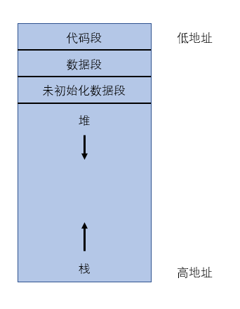

[TOC]

# C 编译器

## 1. 设计

### 1.1 编译器的主要组成：

- 词法分析器：将字符串转化为内部的表示结构
- 语法分析器： 将词法分析得到的标记流(token)生成一颗语法树
- 目标代码的生成： 将语法树转化为目标代码

所以按下面三个步骤构建编译器：

1. 构建虚拟机和指令集，生成的目标代码便是我们构造的指令集
2. 构建词法分析器
3. 构建语法分析器

编译器的主要函数：

1. `next()`: 词法分析，获取下一个标记， 它自动忽略空白
2. `program()`： 语法分析的入口，分析整个C语言程序
3. `expression(level)` : 解析下一个表达式
4. `eval()` : 虚拟机入口，用于解释目标代码

```c
#include <stdio.h>
#include <stdlib.h>
#include <memory>
#include <string.h>

int token;  // current token
char* src, * old_src; // pointer to source code string
int poolsize; // default size of text/data/stack
int line; // line number

// 获取下一个标记 token
void next() { 
	token = *src++;
	return;
}

// 解析下一个1表达式
void expression(int level) {
}

// 语法分析的入口，分析整个C语言程序
void program() {
	next(); // get next token
	while (token > 0) {
		printf("token is: %c\n", token);
		next();
	}
}

// 虚拟机入口，用于解释目标代码
int eval() {
	return 0;
}

int main(int argc, char** argv) {
	int i, fd;
	argc--;
	argv++;

	poolsize = 256 * 1024; // arbitrary size
	line = 1;

	if ((fd = open(*argv, 0)) < 0) {
		printf("could not open(%s)\n", *argv);
		return -1;
	}

	if (!(src = old_src = malloc(poolsize))) {
		printf("could not malloc(%d) for source area\n", poolsize);
		return -1;
	}

	// read the source file
	if ((i = read(fd, src, poolsize - 1)) <= 0) {
		printf("read() returned %d\n", i);
		return -1;
	}
	src[i] = 0; //add EOF character
	close(fd);

	program();
	return eval();
}
```

## 2. 虚拟机 

### 2.1 内存

进程的内存被分为如下几个段：



- 代码段(text segment) ： 存放代码(指令)
- 数据段(data segment) : 存放初始化的数据,如 `int i = 10;`
- 未初始化数据段(bss segment) : 存放未初始化的数据`int i[1000];`,因为不关心其中的真正数值，所以单独存放
- 栈(stack) : 函数调用相关的数据
- 堆(heap) : 程序动态分配内存

为简单起见只关心代码段，数据段，栈。 数据段只用来存放字符串, 在代码段(text)中存放指针内存地址的数据,  

```c
int *text, // text segment,
    *old_text, // dump text segment
    *stack; //stack
char* data;  // data segment
```

接着`main`中加入初始化代码，真正为其分配内存

```c
int main(){
    close(fd);
	...
	// 初始化，为虚拟机分配内存
	if (!(text = old_text = malloc(poolsize))) {
		printf("could not malloc(%d) for text area\n", poolsize);
		return -1;
	}
	if (!(data = malloc(poolsize))) {
		printf("could not malloc(%d) for stack area\n", poolsize);
		return -1;
	}
	if (!(stack = malloc(poolsize))) {
		printf("could not malloc(%d) for stack area\n", poolsize);
	}
	memset(text, 0, poolsize);
	memset(data, 0, poolsize);
	memset(stack, 0, poolsize);
    ...
    program();
}
```

### 2.2 寄存器

- PC : 程序寄存器，存放下一条要执行的计算机指令
- SP ：指令寄存器，指向当前栈顶，向低地址增长
- BP  : 基址寄存器， 指向栈的某些位置，调用函数时使用
- AX  :  通用寄存器，存放一条指令执行后的结果

```c
int *pc,*bp,*sp,ax,cycle; 
```

PC的初始应指向目标代码中的`main()`函数, 暂时不处理。

```c
memset(stack, 0, poolsize);
...
bp = sp = (int *)((int)stack + poolsize);
ax = 0;
...
program();
```

### 2.3 指令集

使用X86指令集， 用枚举类型。

```c
// instructions
enum { LEA ,IMM ,JMP ,CALL,JZ  ,JNZ ,ENT ,ADJ ,LEV ,LI  ,LC  ,SI  ,SC  ,PUSH,
       OR  ,XOR ,AND ,EQ  ,NE  ,LT  ,GT  ,LE  ,GE  ,SHL ,SHR ,ADD ,SUB ,MUL ,DIV ,MOD ,
       OPEN,READ,CLOS,PRTF,MALC,MSET,MCMP,EXIT };
```

- MOV :  `MOV dest , source `将数据放入寄存器或内存地址，将source中的内容放到dest中， 由于这个虚拟机只有一个寄存器，识别参数的类型(地址还是数据)比较困难， 因此将`MOV`指令拆成5个指令，这些指令只接受一个参数.
  - `IMM  <num>` 将 `<num>`放入寄存器ax中
  - LC 将对应地址中的字符载入ax中， 要求ax中存放地址
  - LI  将对应地址中的整数载入ax中，要求ax中存放地址
  - SC将ax中数据作为字符载入地址，要求栈顶中存放地址
  - SI将ax中的数据作为整数存放入地址中，要求栈顶存放地址