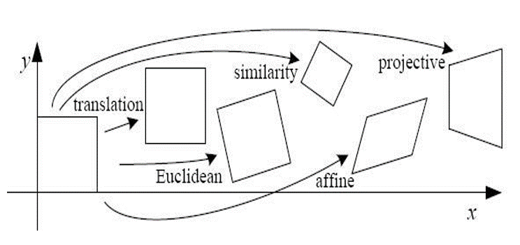

# Loacal feature detection and matching

## 1. 挑战

### Geometric transformations

- Translation
- Euclidean (translation + rotation) 
- Similarity (transl. + rotation + scale) 
- Affine transformations
- Projective transformations

### Disturbances

- Noise
- Image blur
- Discretization errors
- Compression artefacts
- Deviiations from the mathematicall Model (non-linearities, non-planarities, etc.)
- Intra-class variations

## 2. 常用方法

### 2.1 Feature detectors

#### 2.1.1 Harris corner detector

[具体参考](https://zhuanlan.zhihu.com/p/67770305)

