#2.关系数据库

**关系表**
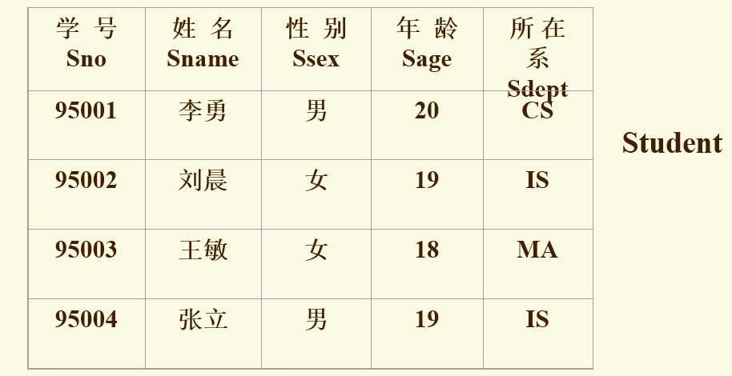
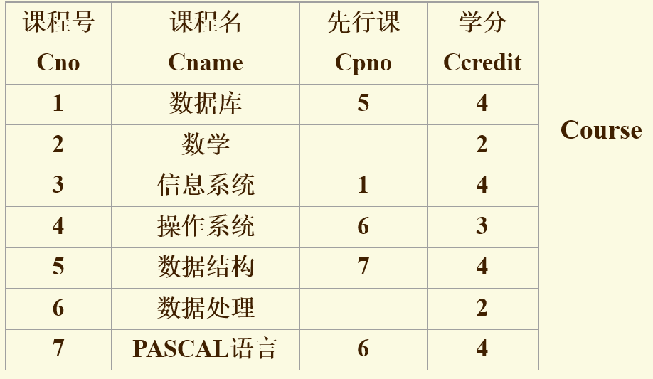
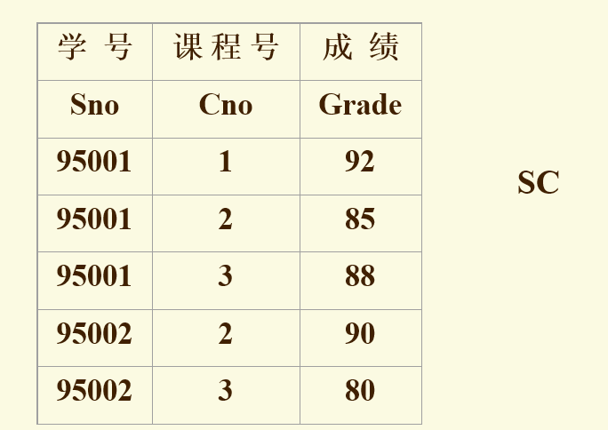

**2.1**关系模式是型，关系是值，关系是关系模式的实例
关系模式可以描述为 R(U,D,DOM,F)
其中R:关系名,U:组成该关系的属性名集合,D:U的域,DOM:,F
**2.2 关系模型的完整性依赖**
>**实体完整性**：主属性不能为空
**参照完整性**：如果外属性在别的关系中是主属性，则外属性取值必须是外关系上的值，或者是空值。
**用户定义完整性**: 涉及的数据要满足规范，如学生年龄150岁。

**2.3 关系代数**
>**选择**：
> 选出元组
查询IS系全体学生$$\sigma_{sdept='IS'}(Student)$$,查询年龄小于20的学生$$\sigma_{Sage>20}(Student)$$

>**投影**：
> 选出属性
>选出若干列,会去重复行
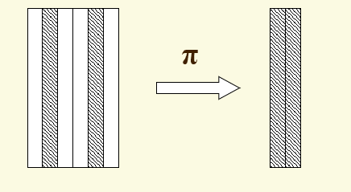
查询学生姓名和所在系
$$\pi_{Sname,Sdept}(Student)$$
查询学生关系Studnet中都有哪些系
$$\pi_{Sdept}(Student)$$

>**连接**：两关系的笛卡尔积中选取满足一定关系的行,其中自然连接消除重复列
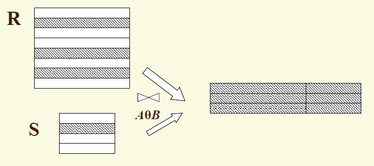
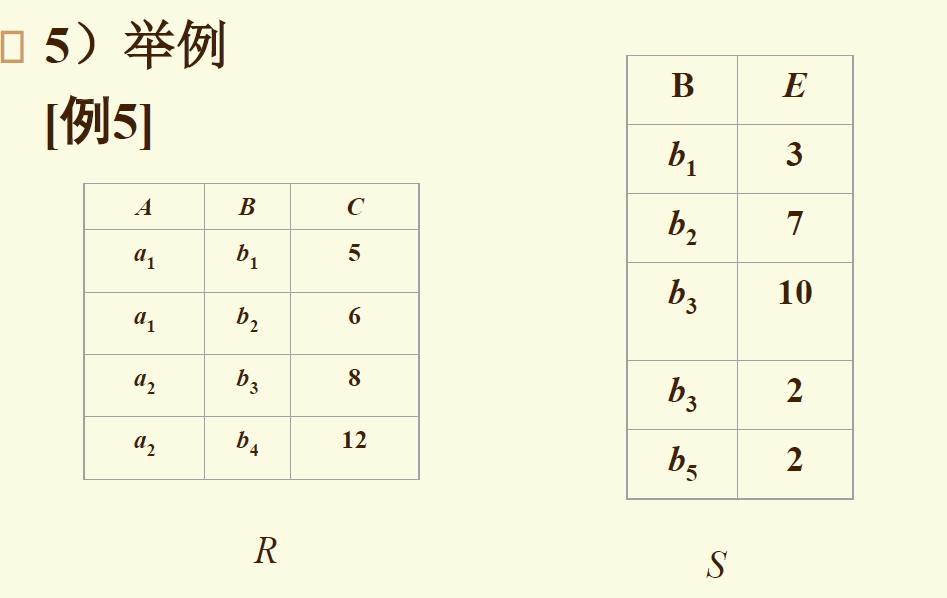
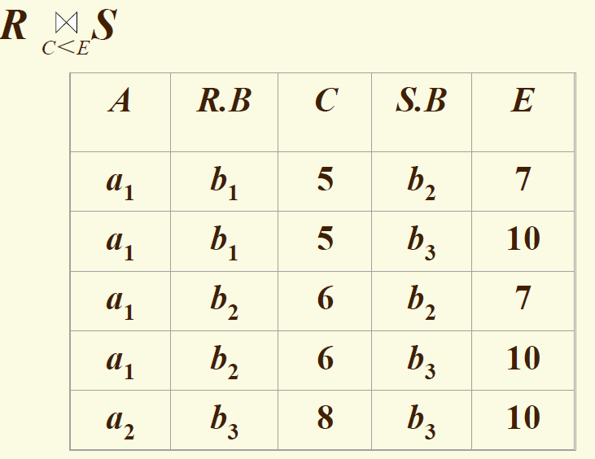
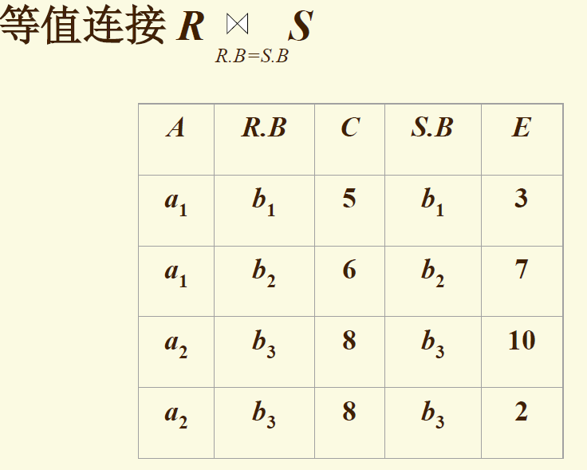
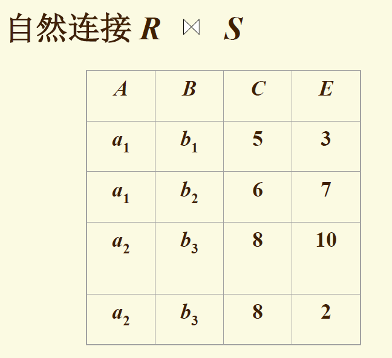
外连接

>**除**：
R/S = T,则T包含所有在R但不在S中的属性，且 T与S的组合都在R中。
该操作 行列上同时进行
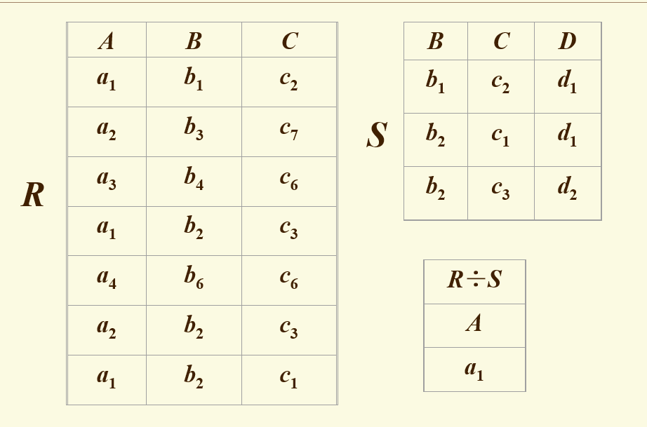

**2.4 关系演算**
**Alpha语言**
>- 查询所有学生的数据 GET W(Student)
>- 查询3个IS系中年龄小于20的学生的学号和年龄
GET W (3) (Studnet.Sno, Student.Sage):Student.Sdept='IS' $\Lambda$ Student.Sage<20
> - 用元组变量,查询选2号课程的学生姓名
> RANGE SC X
> GET W (SC.Sname):$\exists$X(X.Sno=Student.Sno $\Lambda$ X.Cno='2') 
> - 内建函数 COUNT TOTAL MAX MIN AVG
> - 查询学生所在系的数目
>   GET W (COUNT(Student.Sdept))
> - 修改：先HOLD到工作区，再修改，再UPDATE W
> 把201215127学生从计算机系转到信息系
> HOLD W(Student.Sno, Student.Sdept):Student.Sno='201215127'
> MOVE 'IS' TO W.Sdept
> UPDATE W
> **不能修改主值，如果要修改则应该先删除该主值，再插入到表**
> - 插入：先新建一个元组，再PUT
> 学校开个2学分’‘计算机组织与结构’‘，课程号8，直接先行课为6号课程
> MOVE '8' TO W.Cno
> MOVE '计算机组织与结构' TO W.Cname
> MOVE '6' TO W.Cpno
> MOVE '2' TO W.Ccredit
> PUT W(Course)
> - 删除：先HOLD 后DELETE
> 删除学生201215230
> HOLD W(Student):Student.Sno='201215122'
> DELETE W

**域关系演算语言QBE**
就是照着表格看操作
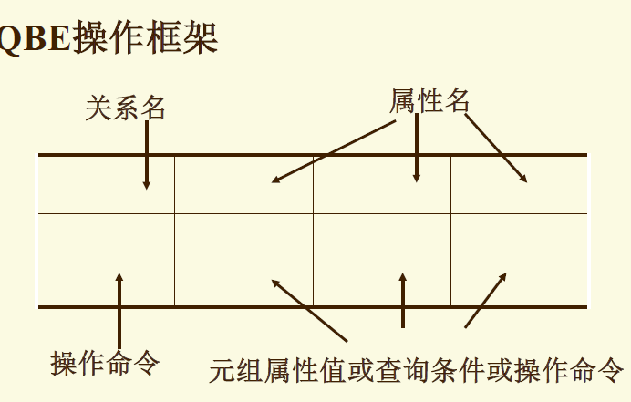

