#3. SQL语言-structured query language
## 3.1 创建
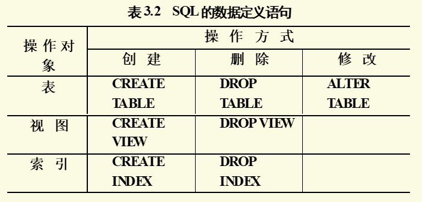
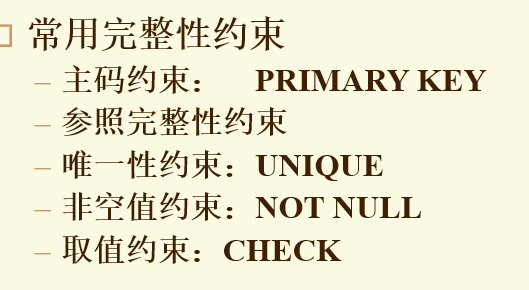
 -  建立一个“学生选课”表SC，它由学号Sno、课程号Cno，修课成绩Grade组成，其中(Sno, Cno)为主码。
```sql
CREATE TABLE SC(
    Sno CHAR(5),
    Cno CHAR(3),
    Grade int,
    Primary key(Sno,Cno)
);
```
## 3.2 修改基本表
操作
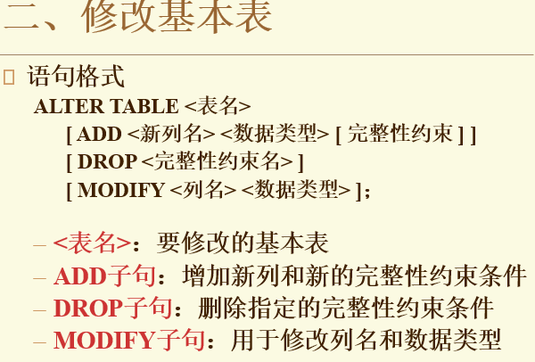
只能间接删除属性列
> - 把表中要保留的列及其内容复制到一个新的表中
> - 删除原表
> - 再将新表重命名为原表名
>**不能修改完整性约束**
>**不能为已有列增加完整性约束**

 - 向Student表增加“入学时间”列，其数据类型为日期型
```sql
ALTER TABLE Student ADD Scome DATA;
```
 - 将年龄的数据类型改为半字长整数
```sql 
ALTER TABLE Student MODIFY Sage SMALLINT;
```
- 删除学生姓名必须取唯一值的约束
```sql
ALTER TABLE Student DROP UNIQUE(Sname);
```
- 删除Student表
```sql
DROP TABLE Student;
```
## 3.3 建立和删除索引
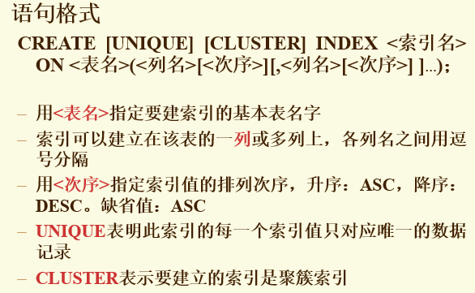
- 含重复值的不能建立UNIQUE索引，相当于加了个UNIQUE约束条件
- 建立聚簇索引后，基表中数据也需要按指定的聚簇属性值的升序或降序存放。也即聚簇索引的索引项顺序与表中记录的物理顺序一致。
```sql
CREATE CLUSTER INDEX Stusname ON Student(Sname);
//在Student表的Sname（姓名）列上建立一个聚簇索引，而且Student表中的记录将
//按照Sname值的升序存放 

```
**一个表最多一个簇索引**
**适用范围**
**很少对基表进行增删操作**
**很少对其中的变长列进行修改操作**

- 为学生-课程数据库中的Student，Course，SC三个表建立索引。其中Student表按学号升序建唯一索引，Course表按课程号升序建唯一索引，SC表按学号升序和课程号降序建唯一索引。
```sql
CREATE UNIQUE INDEX Stusno ON Student(Sno);
CREATE UNIQUE INDEX Coucno ON Course(Cno);
CREATE UNIQUE INDEX SCno ON SC(Sno ASC,Cno DESC);
```
- 删除Student表的Stusname索引
```sql
DROP INDEX Stusname
```
## 3.4 查询
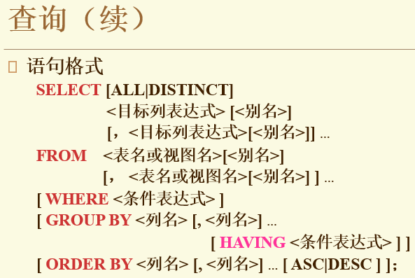
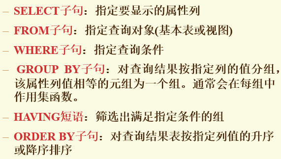
**3.4.1 单表查询**
投影运算，不删除重复行
- 例1 查询全体学生的学号与姓名
```sql
SELECT Sno, Sname
FROM Student;
```
- 例2 查询全体学生的姓名、学号、所在系
```sql
SELECT Sname, Sno, Sdept
FROM Student;
```
- 例3 查询全体学生的所有信息
```sql
SELECT *
FROM Student;
```
- 例4 查全体学生的姓名及其出生年份
```sql
// 算术表达式
SELECT Sname, 2019 - Sage
FROM Student;
```
- 例5 查询全体学生的姓名、出生年份和所有系，要求用小写字母表示所有系名
```sql
SELECT Sname, 'Year of Birth:', 2019 - Sage, ISLOWER(Sdept)
FROM Student;
```

**3.4.2 选择若干元组**
能够消除重复的行
使用方法 SELECT DISTINCT
```sql
SELECT DISTINCT Sno
FROM SC;
```
- 查询计算机系全体学生的名单
```sql
SELECT Sname
FROM Student
WHERE Sdept = 'CS';
```
- 查询所有年龄在20岁以下的学生姓名及其年龄
```sql
SELECT Sname,Sage
FROM Student
WHERE Sage < 20;
//或者
SELECT Sname,Sage
FROM Student
WHERE NOT Sage >= 20;
```
- 查询年龄在20~23岁（包括20岁和23岁）之间的学生的姓名、系别和年龄。
```sql
SELECT Sname,Sdept,Sage
FROM Student
WHERE Sage BETWEEN 20 AND 23;
```
- 查询信息系（IS）、数学系（MA）和计算机科学系（CS）学生的姓名和性别。
```sql 
SELECT Sname,Ssex
FROM Student
WHERE Sdept IN ('IS','MA','CS');
```
**3.4.3字符串匹配**
使用LIKE 或者NOT LIKE
通配符%任意长
通配符_单个字符
若不要通配：   \\_
- 查询学号为95001的学生的详细情况
```sql
SELECT*
FROM Student
WHERE Sno LIKE '95001';
//或者
SELECT*
FROM Student
WHERE Sno = '95001';
```
- 查询所有姓刘学生的姓名、学号和性别
```sql
SELECT Sname , Sno, Ssex
FROM Student
WHERE Sname LIKE '刘%';
```
**IS NULL 不能用 = NULL代替**
- 某些学生选修课程后没有参加考试，所以有选课记录，但没有考试成绩。查询缺少成绩的学生的学号和相应的课程号
```sql
SELECT Sno, Cno
FROM SC
WHERE Grade IS NULL;
```
- 查所有有成绩的学生学号和课程号
```sql
SELECT Sno, Cno
FROM SC
WHERE Grade IS NOT NULL;
```
**GROUP BY**
按GROUP BY的值，将SELECT其他的分组
- 求各个课程号及相应的选课人数
```sql
SELECT Cno, COUNT(Sno)
FROM SC
GROUP BY Cno;
```
得到结果
|Cno|COUNT(Sno)|
|-----|-----|
|1|13|
|2|7|
|4|3|
|5|8|
**HAVING**
> HAVING 与 WHERE的区别，
> HAVING作用于组，WHERE作用于基表
- 查询选修了3门以上课程的学生学号
```sql
SELECT Sno
FROM SC
GROUP BY Sno
HAVING COUNT(*)>3
```
- 查询有3门以上课程在90分以上的学生的学号及90分以上的课程数
```sql
SELECT Sno, Cno
FROM SC
WHERE Grade  >= 90
GROUP BY Sno
HAVING COUNT(*)>=3;
```
#### 3.4.4 连接查询
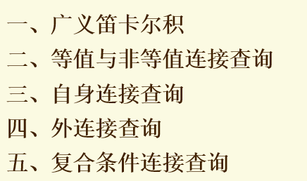
**1. 等值连接**
- 查询每个学生及其选修课程的情况
```sql
SELECT Student.* , SC.*
FROM Student , SC
WHERE Student.Sno = Sc.Sno;
```
结果:
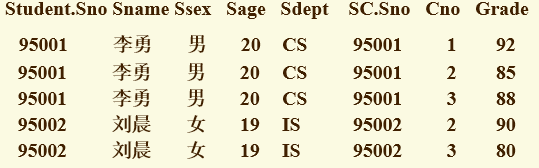
- 自然连接去掉重复属性，不能直接用SELECT实现
```sql
SELECT Student.Sno, Sname, Ssex,Sage,Sedpt,Cno,Grade
FROM Student,SC
WHERE Student.Sno = SC.Sno;
```
**自身连接，使用多个别名**
- 查询每一门课的间接先修课（即先修课的先修课
```sql
SELECT FIRST.Cno , SECOND.Cpno
FROM Corse FIRST ,Course SECOND
WHERE FIRST.Cpno = SECOND.Cno;
```
#### 3.4.5 嵌套查询
```sql
SELECT Sno, Sname , Sdept 
FROM Student 
WHERE Sdept IN 
(SELECT Sdept 
 FROM Student
 WHERE Sname = '张三');
```
**可以用 = 代替 IN**
```sql
SELECT Sno, Sname , Sdept 
FROM Student 
WHERE Sdept =
 SELECT Sdept 
 FROM Student
 WHERE Sname = '张三';
```
**ANY ：任意一个**
**ALL ：所有值**
**EXISTS**
- 查询没有选修1号课程的学生姓名
```sql
SELECT Sname 
FROM Student
WHERE NOT EXISTS(
 SELECT *
 FROM SC
 WHERE Sno = Student.Sno AND Cno = '1'
 );
```
**全称量词$\forall$的实现**
> 在sql中没有$\forall$，所以用存在来替换
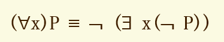

- 查询选修了全部课程的学生姓名
```sql
SELECT Sname
FROM Student
WHERE NOT EXISTS(
    SELECT * 
    FROM COURSE
    WHERE NOT EXISTS(
        SELECT * 
        FROM SC
        WHERE Sno = Student.Sno
        AND Cno = Course.Cno
    )
);
```
#### 数据更新
> - 插入
> - 修改
> - 删除
> 
**INTO 插入的值顺序与原表要一致**
**VALUES的值要与INTO匹配**
- 将一个新学生记录（学号：95020；姓名：陈冬；性别：男；所在系：IS；年龄：18岁）插入到Student表中
```sql
INSERT 
INTO Student
VALUES('95020',‘陈冬','男','IS',18);
```
- 对每一个系，求学生的平均年龄，并把结果存入数据库
```sql
CREATE TABLE Deptage(
    Sdpet CHAR(15), /*系名*/
    Avgage SMALLINT  /*学生平均年龄*/
);

INSERT 
INTO Deptage(Sdpet,Avgage)
SELECT Sdept,AVG(Sage)
FROM Student
GROUP BY Sdept;
```
**修改**
- 将学生95001的年龄改为22岁
```sql
UPDATE Student
SET Sage = 22
WHERE Sno = '95001';
```
- 将计算机科学系全体学生的成绩置零
```sql
UPDATE SC
SET Grade = 0
WHERE SNO IN (
    SELECT Sno
    FROM Student
    WHERE Sdept = 'CS'
);
```
**删除数据**
**删除时会检查完整性规则**
- 删除学号为95019的学生记录
```sql
DELETE
FROM Student
WHERE Sno = '95019';
```
- 删除计算机科学系所有学生的选课记录
```sql
DELETE 
FROM SC
WHERE 'CS' = (
    SELECT Sdept
    FROM Student
    WHERE Student.Sno = SC.Sno
);
```
## 3.5 视图
> 基于一个或多个表导出的表

**3.5.1 建立**
- 建立信息系学生的视图
```sql
CREATE VIEW IS_Student
    AS 
    SELECT Sno,Sname,Sage
    FROM Student
    WHERE Sdept = 'IS';
```
WITH CHECK OPTION
表示对视图进行UPDATE DELETE INSERT操作时，要符合条件
- 建立信息系学生的视图，并要求透过该视图进行的更新操作只涉及信息系学生
```sql
CREATE VIEW IS_Student
    AS
    SELECT Sno, Sname, Sage
    FROM Sdept = 'IS'
    WITH CHECK OPTION;
```
- 建立1号课程的选课视图，并要求透过该视图进行的更新操作只涉及1号课程，同时对该视图的任何操作只能在工作时间进行
```sql
CREATE VIEW IS_SC
AS 
SELECT Sno, Cno, Grade
FROM SC
WHERE Cno = '1'
AND TO_CHAR(SYSDATA,'HH24') BETWEEN 9 AND 17
AND TO_CHAR(SYSDATA,'D') BETWEEN 2 AND 6
WITH CHECK OPTION;
```
**基于视图的视图**
- 建立信息系选修了1号课程且成绩在90分以上的学生的视图
```sql
CREATE VIEW IS_S2
AS
SELECT Sno,Sname,Grade
FROM IS_S1
WHERE Grade >= 90;
```
## 权限控制
- 把查询Student表权限授给用户U1
```sql
GRANT SELECT
ON TABLE Student
TO U1;
```
- 把对Student表和Course表的全部权限授予用户U2和U3
```sql
GRANT ALL PRIVILIGES
ON TABLE Student, Course
TO U2,U3;
```
- 把查询Student表和修改学生姓名的权限授给用户U4
```sql
GRANT UPDATE(Sname),SELECT
ON TABLE Student
TO U4;
```
**如果指定了WITH GRANT OPTION子句，则获得某种权限的用户还可以把这种权限再授予别的用户**
- 把对表SC的INSERT权限授予U5用户，并允许他再将此权限授予其他用户
```sql
GRANT INSERT 
ON TABLE SC
TO U5
WITH GRANT OPTION;
```
- 把用户U4修改学生学号的权限收回
```sql
REVOKE UPDATE(Sno)
ON TABLE Student
FROM U4;
```
## 嵌入式 SQL
*在程序预编译阶段将嵌入式SQL换成函数调用，形式上消除SQL*
> **主语言访问SQL的步骤**
> - 打开数据库
> - 定义必要的主变量和数据通信区
> - 用SQL访问数据库，并对返回结果进行处理
> - 关闭数据库


**1.实例**
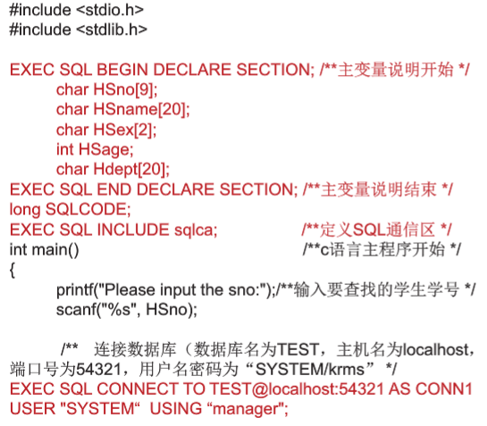
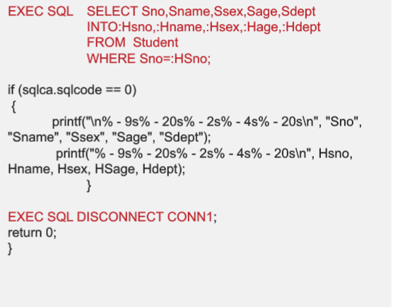
- 根据学生学号查询学生信息
```sql
EXEC SQL SELECT Sno,Sname,Ssex,Sage,Sdept
    INTO :Hsno, :Hname, :Hsex, :Hage, :Hdept
    From Student
    WHERE Sno =: givensno;

```
- INTO 用于保存查询结果
- 前面带 ：的为主变量，即主语句中的变量

**2.格式**
> 前缀一般为 **EXEC SQL**
1. 以C或者PL/1作为主语言的嵌入式SQL语句的一般形式
   **EXEC SQL <SQL语句>**
```sql
EXEC SQL DROP TABLE Student;
```
**3.通信**
> - 向主语言传递SQL语句的执行状态信息，使主语言控制流程， SQL通信区
> - 主语言向SQL语句提供参数 ， 主变量实现
> - 将SQL语句查询数据库的结果返回给主语句， 主变量和游标

**通信区**
SQLCA
**游标**
数据库系统为用户开辟的缓冲区，每个游标区都有一个名字，相当于该数据区的指针，SQL语句逐一从游标中获取记录，覆盖主变量，交由主语句处理
- 使用游标
```sql
EXEC SQL DECLARE <游标名> CURSOR 
    FOR <SELECT语句>; 
```
不执行SELECT语句，而是向系统申请一个数据空间，用于存放未来执行SELECT的结果的数据集
**例子**
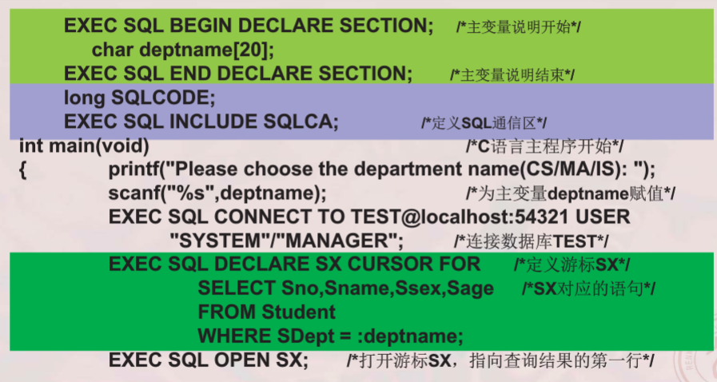