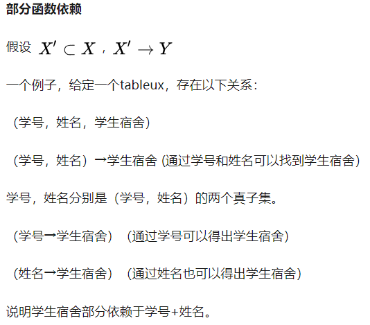
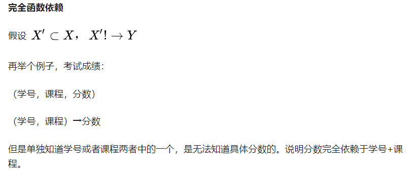
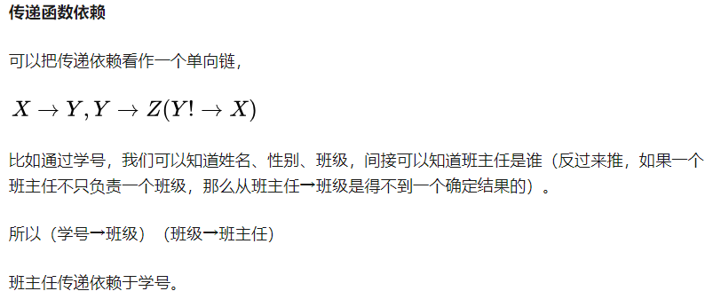
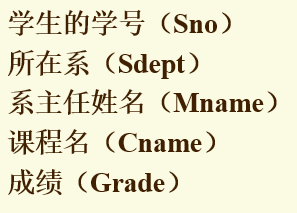
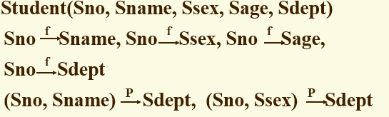
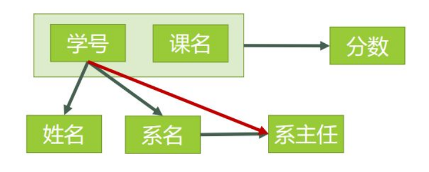
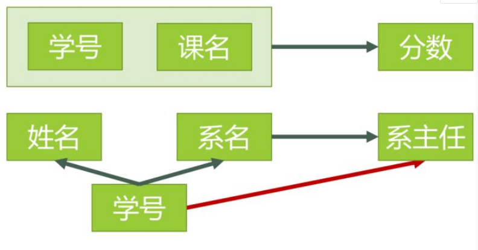
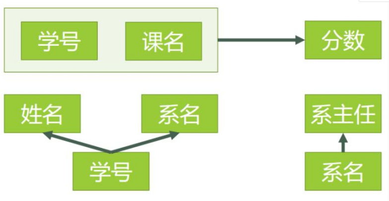
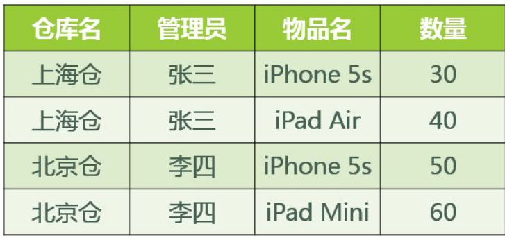

码 == (主属性1，主属性2，主属性3,...)
**函数依赖**： X——>Y,唯一的X推出唯一的Y

有X的真子集X‘都有，X’不函数依赖Y
完全函数依赖记为$X\rightarrow^FY$
部分函数依赖记为$X\rightarrow^PY$

### 1. 第一范式(1NF)：所有属性不可再分
下表不满足第一范式

 - 不满足1NF的不是关系数据库
> 缺点：
> - 插入异常
> - 删除异常
> - 数据冗余度大
> - 修改复杂
### 2. 第二范式(2NF)：消除部分函数依赖
> -  找到所有**码**
> -  在码中，找到所有**主属性**
> - 在表中去除主属性，剩下**非主属性**
> - 看非主属性与码是否有**部分函数依赖**

存在部分函数依赖，不满足2NF，只满足1NF
**修改**
>消除部分函数依赖的方法，将大数据表拆成多个更小的表，该过程叫模式分解

将主属性改为学号，非主属性是姓名，系名，系主任

### 3. 第三范式(3NF):在2NF基础上消除非主属性对码的传递函数依赖
$\because$学号$\rightarrow$系名，系名$\rightarrow$系主任，$\therefore$非主属性系主任和码 学号之间有部分函数依赖

### 4.BCNF(修正的第三范式)：

**问题原因**：存在主属性对码的部分函数依赖与传递函数依赖，仓库名 对 码【管理员，物品名】的部分函数依赖

### 5.第四范式(4NF)：属性之间不允许有非平凡且非函数依赖的多值依赖