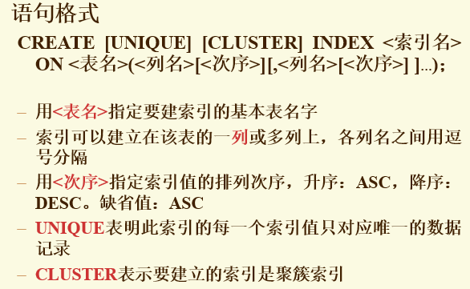

#3. SQL语言-structured query language
**3.1 创建**


 -  建立一个“学生选课”表SC，它由学号Sno、课程号Cno，修课成绩Grade组成，其中(Sno, Cno)为主码。
```sql
CREATE TABLE SC(
    Sno CHAR(5),
    Cno CHAR(3),
    Grade int,
    Primary key(Sno,Cno)
);
```
**3.2 修改基本表**
操作

只能间接删除属性列
> - 把表中要保留的列及其内容复制到一个新的表中
> - 删除原表
> - 再将新表重命名为原表名
>**不能修改完整性约束**
>**不能为已有列增加完整性约束**

 - 向Student表增加“入学时间”列，其数据类型为日期型
```sql
ALTER TABLE Student ADD Scome DATA;
```
 - 将年龄的数据类型改为半字长整数
```sql 
ALTER TABLE Student MODIFY Sage SMALLINT;
```
- 删除学生姓名必须取唯一值的约束
```sql
ALTER TABLE Student DROP UNIQUE(Sname);
```
- 删除Student表
```sql
DROP TABLE Student;
```
**3.3 建立和删除索引**

- 含重复值的不能建立UNIQUE索引，相当于加了个UNIQUE约束条件
- 建立聚簇索引后，基表中数据也需要按指定的聚簇属性值的升序或降序存放。也即聚簇索引的索引项顺序与表中记录的物理顺序一致。
```sql
CREATE CLUSTER INDEX Stusname ON Student(Sname);
//在Student表的Sname（姓名）列上建立一个聚簇索引，而且Student表中的记录将
//按照Sname值的升序存放 

```
**一个表最多一个簇索引**
**适用范围**
**很少对基表进行增删操作**
**很少对其中的变长列进行修改操作**

- 为学生-课程数据库中的Student，Course，SC三个表建立索引。其中Student表按学号升序建唯一索引，Course表按课程号升序建唯一索引，SC表按学号升序和课程号降序建唯一索引。
```sql
CREATE UNIQUE INDEX Stusno ON Student(Sno);
CREATE UNIQUE INDEX Coucno ON Course(Cno);
CREATE UNIQUE INDEX SCno ON SC(Sno ASC,Cno DESC);
```
- 删除Student表的Stusname索引
```sql
DROP INDEX Stusname
```
**3.4 查询**


**3.4.1 单表查询**
投影运算，不删除重复行
- 例1 查询全体学生的学号与姓名
```sql
SELECT Sno, Sname
FROM Student;
```
- 例2 查询全体学生的姓名、学号、所在系
```sql
SELECT Sname, Sno, Sdept
FROM Student;
```
- 例3 查询全体学生的所有信息
```sql
SELECT *
FROM Student;
```
- 例4 查全体学生的姓名及其出生年份
```sql
// 算术表达式
SELECT Sname, 2019 - Sage
FROM Student;
```
- 例5 查询全体学生的姓名、出生年份和所有系，要求用小写字母表示所有系名
```sql
SELECT Sname, 'Year of Birth:', 2019 - Sage, ISLOWER(Sdept)
FROM Student;
```

**3.4.2 选择若干元组**
能够消除重复的行
使用方法 SELECT DISTINCT
```sql
SELECT DISTINCT Sno
FROM SC;
```
- 查询计算机系全体学生的名单
```sql
SELECT Sname
FROM Student
WHERE Sdept = 'CS';
```
- 查询所有年龄在20岁以下的学生姓名及其年龄
```sql
SELECT Sname,Sage
FROM Student
WHERE Sage < 20;
//或者
SELECT Sname,Sage
FROM Student
WHERE NOT Sage >= 20;
```
- 查询年龄在20~23岁（包括20岁和23岁）之间的学生的姓名、系别和年龄。
```sql
SELECT Sname,Sdept,Sage
FROM Student
WHERE Sage BETWEEN 20 AND 23;
```
- 查询信息系（IS）、数学系（MA）和计算机科学系（CS）学生的姓名和性别。
```sql 
SELECT Sname,Ssex
FROM Student
WHERE Sdept IN ('IS','MA','CS');
```
**3.4.3字符串匹配**
使用LIKE 或者NOT LIKE
通配符%任意长
通配符_单个字符
若不要通配：   \\_
- 查询学号为95001的学生的详细情况
```sql
SELECT*
FROM Student
WHERE Sno LIKE '95001';
//或者
SELECT*
FROM Student
WHERE Sno = '95001';
```
- 查询所有姓刘学生的姓名、学号和性别
```sql
SELECT Sname , Sno, Ssex
FROM Student
WHERE Sname LIKE '刘%';
```
**IS NULL 不能用 = NULL代替**
- 某些学生选修课程后没有参加考试，所以有选课记录，但没有考试成绩。查询缺少成绩的学生的学号和相应的课程号
```sql
SELECT Sno, Cno
FROM SC
WHERE Grade IS NULL;
```
- 查所有有成绩的学生学号和课程号
```sql
SELECT Sno, Cno
FROM SC
WHERE Grade IS NOT NULL;
```


