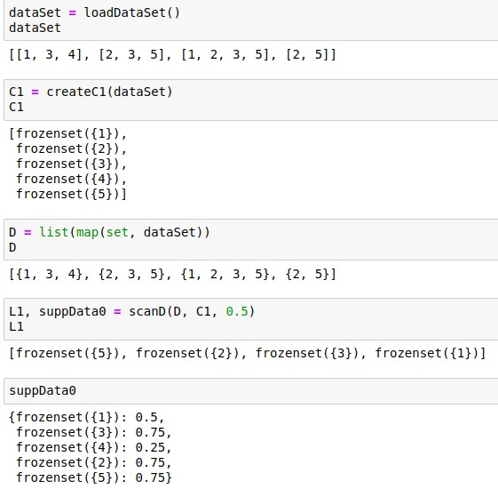
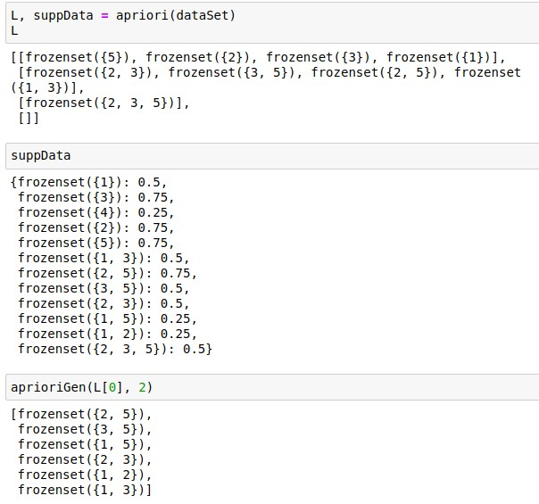
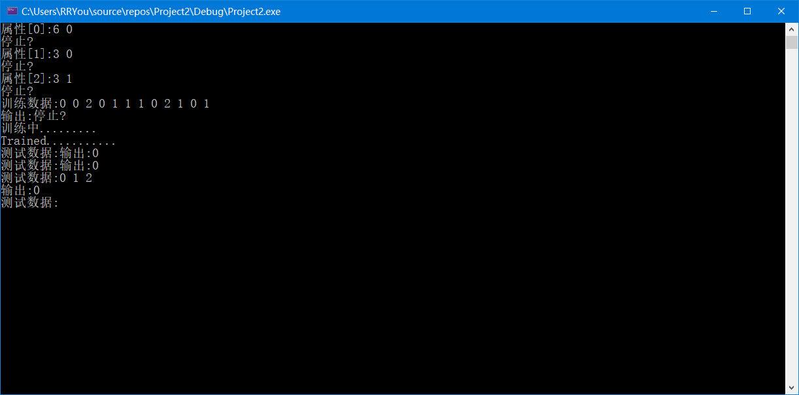

# <center>数据挖掘作业

  <br/><br/><br/><br/>

  <br/><br/><br/><br/>
  <br/><br/><br/><br/>
### <center> 姓名：杨崇焕
### <center> &nbsp;&nbsp;&nbsp;&nbsp;&nbsp;&nbsp;&nbsp;&nbsp;&nbsp;&nbsp;学号：U201610531
### <center> &nbsp;&nbsp;&nbsp;&nbsp;&nbsp;&nbsp;&nbsp;&nbsp;&nbsp;&nbsp;&nbsp;&nbsp;班级：电信中英1601


  <br/><br/><br/><br/>
    <br/><br/><br/><br/>
      <br/><br/><br/><br/>
        <br/><br/><br/><br/>
<div STYLE="page-break-after: always;"></div>

### 作业一：为什么要对数据进行预处理？数据预处理有哪些基本方法？它们的作用分别是什么？

> - 现实中的数据一般是不完整的，有噪声的和不一致的，数据预处理有助于提高挖掘的质量

> - 基本方法及作用
> - 数据清洗：填写空缺值，平滑噪声，识别删除孤立点，解决不一致性
> - 数据集成：集成多个数据库，数据立方体或文件；合并成一致的数据存储
> - 数据变换：规范化：同一尺度，提高准确性和有效性
> - 数据规约：减少数据规模但得到相同或相近的结果
> - 数据离散化：通过概念分层或数据离散化来规约数据

### 作业二：什么是关联分析？理解Apriori算法并使用你熟悉的程序语言设计Apriori算法

> - 关联分析用于发现隐藏在大型数据集中令人感兴趣的频繁出现的模式，关联和相关性

> -  以下为用python实现的Apriori算法

**Apriori**
```python
from numpy import *
# 生成一个数据集
def loadDatatSet():
    #return [[1, 3, 4], [2, 3, 5], [1, 2, 3, 5], [2, 5]]
    return [[1,2,3],[4,5,6]]
# 生成C1项集
def creatC1(dataSet):
    C1 = []
    for item_1 in dataSet:
        for item_2 in item_1:
            if [item_2] not in C1:
                C1.append([item_2])
    C1.sort()
    return list(map(frozenset, C1))

# 剪枝,生成Lk
# D:数据集 
# Ck：候选项集列表
# minSupport ： 最小支持度
def scanD(D, Ck, minSupport):
    ssCnt = {}
    # 用dict记录候选集中项在数据集出现次数
    for tid in D:
        for can in Ck:
            if can.issubset(tid):
                if can not in ssCnt:
                    ssCnt[can] = 1
                else: ssCnt[can] += 1
    numItems = float(len(D))
    retList = []
    supportData = {}

    # 计算支持度，将频繁项插入到retList中
    # supportData储存Ck中每项的支持度
    for key in ssCnt:
        support = ssCnt[key]/numItems
        if support >= minSupport:
            retList.insert(0,key)
        supportData[key] = support
    return retList, supportData
```
运行结果

```python
# 生成Ck
# 生成时比较每个项的前k-2个元素是否相同（当前项长k-1），
# 如果相同，则通过集合并来生成k长项集
def apriorGen(Lk,k):
    retList = []
    lenLk = len(Lk)
    for i in range(lenLk):
        for j in range(lenLk):
            L1 = list(Lk[i])[:k-2]
            L2 = list(Lk[j])[:k-2]
            L1.sort()
            L2.sort()
            if L1 == L2:
                retList.append(Lk[i] | Lk[j])
    return retList

def apriori(dataSet, minSupport = 0.5):
    C1 = createC1(dataSet)
    D = list(map(set, dataSet))
    L1, supportData = scanD(D, C1, minSupport)
    L = [L1]
    k = 2
    while (len(L[k-2]) > 0):
        Ck = aprioriGen(L[k-2], k)
        Lk, supK = scanD(D, Ck, minSupport)#scan DB to get Lk
        supportData.update(supK)
        L.append(Lk)
        k += 1
    return L, supportData
```
结果


### 作业三：简述决策树分类的主要步骤。试比较贝叶斯分类算法和k近邻分类算法。理解ID3算法并用你熟悉的程序设计语言实现ID3算法。

> - 计算当前样本纯度，对每个特征计算划分后样本的纯度，选择使样本纯度提高最大的特征进行划分

> - 贝叶斯分类利用$贝叶斯判别准则h_{nb}(x)=arg\,\max_{c\in\gamma}p(c)\prod_{i=0}^dp(x_i|c)$进行分类
> - KNN则基于数据间的"距离"进行分类

> - C++实现ID3

```C++
#ifndef DECISIONTREE
#define DECISIONTREE
#include<vector>
#include<math.h>
using namespace std;

//训练用数据
class TrainData{
public:
    vector<vector<int> > Input;//一行一条数据
    vector<int> OutPut;//允许离散的输出值
    void InSertData(vector<int> data,int out){//输入一行数据和目标输出
        Input.push_back(data);
        OutPut.push_back(out);
    }
};

class Node{
public:
    int Attribute;//属性序号
    bool IsLeaf;//是否是叶节点
    vector<Node*> Num;//子女节点
    Node(int ID,bool a):Attribute(ID),IsLeaf(a){}

};

//决策树
class Tree{
private:
    Node* Root;//根节点

    vector<vector<int> > AttrData;//属性列表

    Node* CreateTree(TrainData data,vector<int> usedAttr);//ID3算法生成树
    int MostNormalOutPut(TrainData data);//将最普遍的输出作为节点值
    int Best(TrainData data,vector<int> usedAttr);//计算信息增益最高的属性
    double Entropy(TrainData data);//计算信息熵
public:
    Tree();
    void GetOutPut();//输入一个案例，获得输出
};

Tree::Tree(){
    /*输入属性列表，输入每个属性的分类属性个数即可*/
    int stop=0,num=0;
    while(!stop){
        vector<int> temp;
        cout<<"Attribute"<<"["<<num<<"]"<<":";
        int aa;
        cin>>aa;
        for(int i=0;i<aa;i++)
            temp.push_back(i);
        AttrData.push_back(temp);
        cout<<"Stop?"<<endl;
        cin>>stop;
        num++;
    }

    /*输入训练数据，直接按顺序输入分类属性序号*/
    TrainData data;
    stop=0;
    while(!stop){
        vector<int> train;
        cout<<"TrainData:";
        int aa=0;
        for(unsigned int i=0;i<AttrData.size();i++){
            cin>>aa;
            train.push_back(aa);
        }
        cout<<"OutPut:";
        bool aaa;
        cin>>aaa;
        data.InSertData(train,aaa);
        cout<<"Stop?"<<endl;
        cin>>stop;
    }

    vector<int> temp2;
    Root=CreateTree(data,temp2);
    cout<<"Training........."<<endl;
}

Node* Tree::CreateTree(TrainData data,vector<int> usedAttr){

    Node* root=new Node(0,0);//创建根节点

    /*如果输出都一样，则创建一个节点，值为该输出，且为叶节点*/
    int stop=1;
    for(unsigned int i=1;i<data.OutPut.size();i++){
        if(data.OutPut[i]!=data.OutPut[i-1])
            stop=0;
    }
    if(stop)
        return new Node(data.OutPut[0],1);

    /*如果所有属性都用过，那么返回的节点的值为最普遍的输出，且为叶节点*/
    if(usedAttr.size()==AttrData.size())
        return new Node(MostNormalOutPut(data),1);

    /*选出信息增益最高的属性作为节点*/
    int A=Best(data,usedAttr);
    usedAttr.push_back(A);//加入已使用属性
    root->Attribute=A;

    /*递归的在每一个分类属性下新建一棵树*/
    for(unsigned int i=0;i<AttrData[A].size();i++){
        TrainData tempExample;
        for(unsigned int j=0;j<data.OutPut.size();j++){
            if(i==data.Input[j][A]){
                tempExample.InSertData(data.Input[j],data.OutPut[j]);
            }
        }
        if(tempExample.OutPut.empty()){
            root->Num.push_back(new Node(MostNormalOutPut(data),1));
        }
        else{
            root->Num.push_back(CreateTree(tempExample,usedAttr));
        }
    }

    return root;
}

int Tree::MostNormalOutPut(TrainData data){
    vector<int> out;//记录输出的种类
    vector<int> count;//记录种类的数量
    for(unsigned int i=0;i<data.OutPut.size();i++){
        bool ex=0;
        int index=0;
        for(unsigned int j=0;j<out.size();j++){
            if(out[j]==data.OutPut[i]){
                ex=1;
                index=j;
            }
        }
        if(ex){
            count[index]++;
        }
        else{
            out.push_back(data.OutPut[i]);
            count.push_back(1);
        }
    }
    /*计算数量最多的种类*/
    int maxi=0;
    int max=0;
    for(unsigned int i=0;i<count.size();i++){
        if(count[i]>max){
            maxi=i;
            max=count[i];
        }
    }
    return out[maxi];
}

double Tree::Entropy(TrainData data){
    /*计算输出种类和数量*/
    vector<double> out;
    vector<double> count;
    for(unsigned int i=0;i<data.OutPut.size();i++){
        bool ex=0;
        int index=0;
        for(unsigned int j=0;j<out.size();j++){
            if(out[j]==data.OutPut[i]){
                ex=1;
                index=j;
            }
        }
        if(ex){
            count[index]++;
        }
        else{
            out.push_back(data.OutPut[i]);
            count.push_back(1);
        }
    }
     /*计算信息熵*/
    double total=0;
    for(unsigned int i=0;i<count.size();i++)
        total+=count[i];
    double sum=0;
    for(unsigned int i=0;i<count.size();i++){
        double a=0;
        if((count[i]/total)!=0)
            a=log2((count[i]/total));
        sum-=(count[i]/total)*a;
    }
    return sum;
}

int Tree::Best(TrainData data,vector<int> usedAttr){
    vector<double>  Gain;//记录每一个属性的信息增益

    bool used;
    /*将使用过的属性的信息增益设置为0*/
    for(unsigned int i=0;i<AttrData.size();i++){
        used=0;
        for(unsigned int k=0;k<usedAttr.size();k++)
            if(i==usedAttr[k]){
                Gain.push_back(0.0);
                used=1;
            }
        if(used)
            continue;
        /*计算信息增益*/
        else{
            double es=Entropy(data);
            for(unsigned int j=0;j<AttrData[i].size();j++){
                TrainData tempData;
                for(unsigned int k=0;k<data.Input.size();k++){
                    if(j==data.Input[k][i]){
                        tempData.InSertData(data.Input[k],data.OutPut[k]);
                    }
                }
                if(!tempData.Input.empty()){
                    es-=(double(tempData.Input.size())/double(data.Input.size()))*Entropy(tempData);
                }
            }
            Gain.push_back(es);
        }
    }

    /*计算信息增益最高的属性*/
    int maxi=0;
    double max=0;
    for(unsigned int i=0;i<Gain.size();i++){
        if(Gain[i]>max){
            maxi=i;
            max=Gain[i];
        }
    }
    return maxi;
}

void Tree::GetOutPut(){
    vector<int> data;
    cout<<"TestData:";
    int aa=0;
    for(int i=0;i<AttrData.size();i++){
        cin>>aa;
        data.push_back(aa);
    }
    if(Root->IsLeaf){
        cout<<"OutPut:"<<Root->Attribute<<endl;
        return;
    }
    Node* current=Root->Num[data[Root->Attribute]];
    while(!current->IsLeaf)
        current=current->Num[data[current->Attribute]];
    cout<<"OutPut:"<<current->Attribute<<endl;
}

#endif // PAIR
```
```C++
#include <iostream>
#include"DecisionTree.h"
using namespace std;
int main(){    
    Tree* tree=new Tree;
    cout<<"Trained..........."<<endl;

    while(1)
    tree->GetOutPut();

    return 0;
}
```

**决策树结果**
数据集:
年龄：幼儿，儿童，少年，青年，中年，老年 
压力：小，中，大 
是否幸福：不幸福，普通，很幸福

样例： 1.幼儿 小 很幸福 2.儿童 中 普通 3.少年 中 不幸福

则对应的输入为 :
```c++
6 0 
3 0 
3 1  // 属性输入完成
0 0 2 0 
1 1 1 0 
2 1 0 1 // 训练数据输入完成
```
**输入格式**：
1. 先输入每个属性的维度，如6 0，
2. 最后一位
    0 代表属性未输入完，1 代表属性输入完
3. 训练数据格式
    `[属性1，属性2,...,label,0 或者 1 ]`

为别采用ID3对数据集进行划分,得到结果如下图



### 作业四：简述聚类的基本概念，你认为一个好的聚类算法应该具备哪些特征 ？试比较k-means与k-中心点算法的优缺点，设计实现k-means

> - 特征：
1 ，计算复杂度低
2 ，受离群点影响小

**k-means**
> - 优点：
> - 是聚类算法中的一种经典，快速，简单的算法
> - 对处理大数据集，该算法保持可伸缩性和可扩展性
> - 当簇接近高斯分布时，结果较好

> - 缺点：对离群点敏感
> - 在簇的平均值可被定义的情况下才能使用，可能不适用于某些应用，比如说标量数据
> - 在 K-means 算法中 K 是事先给定的，这个 K 值的选定是非常难以估计的。很多时候，事先并不知道给定的数据集应该分成多少个类别才最合适
> - 在 K-means 算法中，首先需要根据初始聚类中心来确定一个初始划分，然后对初始划分进行优化。这个初始聚类中心的选择对聚类结果有较大的影响，一旦初始值选择的不好，可能无法得到有效的聚类结果。
> - 该算法需要不断地进行样本分类调整，不断地计算调整后的新的聚类中心，因此当数据量非常大时，算法的时间开销是非常大的
> - 若簇中含有异常点，将导致均值偏离严重（即:对噪声和孤立点数据敏感）
> - 不适用于发现非凸形状的簇或者大小差别很大的簇

**k-中心点算法**
> - 优点：离群点不会造
成划分的结果偏差过大，少数数据不会造成重大影响
> - 缺点：如果数据分布不够均匀，则偏差较大
> - 算法的时间复杂度也比K-means上升了O(n)

**k-mean实现**
处于性能的原因这里用python实现二分k-means
```python
# -*- coding: utf-8 -*-
"""
Created on Mon May 22 16:57:43 2019

@author: ChonghuanYang
"""

from numpy import *
'''
def loadDataSet(fileName):      #general function to parse tab -delimited floats
    dataMat = []                #assume last column is target value
    fr = open(fileName)
    for line in fr.readlines():
        curLine = line.strip().split('\t')
        fltLine = map(float,curLine) #map all elements to float()
        A=list(fltLine) #与2.x区别
        dataMat.append(A)
    return dataMat
'''
def distEclud(vecA, vecB):
    return sqrt(sum(power(vecA - vecB, 2)))

#随机生成簇中心函数
# 生成 K×N ： centroids, 每行即为一个中心点
def randCent(dataSet, k):
    n = shape(dataSet)[1]
    centroids = mat(zeros((k,n)))
    for j in range(n):
        minJ = min(dataSet[:,j]) 
        rangeJ = float(max(dataSet[:,j]) - minJ)
        centroids[:,j] = mat(minJ + rangeJ * random.rand(k,1))
    return centroids

#dataSet为数据集，k为分簇数目，distEclud为距离函数，randCent为随机选择簇中心方法
def kMeans(dataSet, k, distMeas=distEclud, createCent=randCent):
    m = shape(dataSet)[0]
    #初始化矩阵clusterAssment，第1列记录簇索引值，第2列存储误差
    clusterAssment = mat(zeros((m,2)))  
    #初始化簇中心                            
    centroids = createCent(dataSet, k)
    #标志变量，用于判断是否继续迭代
    clusterChanged = True
    while clusterChanged:
        clusterChanged = False
    #将每个样本点分配到与其最近的簇中心所在的簇
        for i in range(m): 
            minDist = inf; minIndex = -1
            for j in range(k):
                distJI = distMeas(centroids[j,:],dataSet[i,:])
                if distJI < minDist:
                    minDist = distJI; minIndex = j
    #如果样本被划分到不同的簇，则改变标志变量，表示需要继续迭代
            if clusterAssment[i,0] != minIndex: clusterChanged = True
            clusterAssment[i,:] = minIndex,minDist**2
    #打印簇中心
        #print (centroids)
    #由于样本划分发生变化，因此需要重新计算簇中心
        for cent in range(k):
    #提取处属于同一簇的所有样本
            ptsInClust = dataSet[nonzero(clusterAssment[:,0].A==cent)[0]]
    #计算不同簇所有样本的平均值作为簇中心
            centroids[cent,:] = mean(ptsInClust, axis=0) 
    return centroids, clusterAssment

#dataSet为数据集，k为分簇数目，distEclud为距离函数
def biKmeans(dataSet, k, distMeas=distEclud):
    m = shape(dataSet)[0]
    clusterAssment = mat(zeros((m,2)))
    #将所有样本的均值作为簇中心
    centroid0 = mean(dataSet, axis=0).tolist()[0]
    #创建簇中心列表
    centList =[centroid0] 
    #计算每个样本的误差
    for j in range(m):
        clusterAssment[j,1] = distMeas(mat(centroid0), dataSet[j,:])**2
    while (len(centList) < k):
        lowestSSE = inf
    #拆分每个簇，并计算拆分后的SSE，选择拆分后SSE最小的簇，保存拆分
        for i in range(len(centList)):
            ptsInCurrCluster = dataSet[nonzero(clusterAssment[:,0].A==i)[0],:]
            centroidMat, splitClustAss = kMeans(ptsInCurrCluster, 2, distMeas)
            sseSplit = sum(splitClustAss[:,1])
            sseNotSplit = sum(clusterAssment[nonzero(clusterAssment[:,0].A!=i)[0],1])
            #print ("sseSplit, and notSplit: ",sseSplit,sseNotSplit)
            if (sseSplit + sseNotSplit) < lowestSSE:
                bestCentToSplit = i
                bestNewCents = centroidMat
                bestClustAss = splitClustAss.copy()
                lowestSSE = sseSplit + sseNotSplit
    #一个簇拆分为二后，其中一个簇新增加簇索引，另一个保存原簇索引号
        bestClustAss[nonzero(bestClustAss[:,0].A == 1)[0],0] = len(centList) 
        bestClustAss[nonzero(bestClustAss[:,0].A == 0)[0],0] = bestCentToSplit
        #print ('the bestCentToSplit is: ',bestCentToSplit)
        #print ('the len of bestClustAss is: ', len(bestClustAss))
    #重置簇中心
        centList[bestCentToSplit] = bestNewCents[0,:].tolist()[0]
        centList.append(bestNewCents[1,:].tolist()[0])
    #调整样本的簇索引号及误差
        clusterAssment[nonzero(clusterAssment[:,0].A == bestCentToSplit)[0],:]= bestClustAss
    return mat(centList), clusterAssment

#根据经纬度计算球面距离，vecA[0,：]表示A点经纬度
def distSLC(vecA, vecB):
    a = sin(vecA[0,1]*pi/180) * sin(vecB[0,1]*pi/180)
    b = cos(vecA[0,1]*pi/180) * cos(vecB[0,1]*pi/180) * \
                      cos(pi * (vecB[0,0]-vecA[0,0]) /180)
    return arccos(a + b)*6371.0 

import matplotlib
import matplotlib.pyplot as plt
#numClust为簇数目
def clusterClubs(numClust=5):
    datList = []
    #导入数据
    for line in open('places.txt').readlines():
        lineArr = line.split('\t')
        datList.append([float(lineArr[4]), float(lineArr[3])])
    datMat = mat(datList)
    #采用二分k-均值算法进行聚类
    myCentroids, clustAssing = biKmeans(datMat, numClust, distMeas=distSLC)
    #定义画布，背景
    fig = plt.figure()
    rect=[0.0,0.0,1.0,1.0]
    #不同图形标识
    scatterMarkers=['s', 'o', '^', '8', 'p', \
                    'd', 'v', 'h', '>', '<']
    axprops = dict(xticks=[], yticks=[])
    ax0=fig.add_axes(rect, label='ax0', **axprops)
    #导入地图
    imgP = plt.imread('Portland.png')
    ax0.imshow(imgP)
    ax1=fig.add_axes(rect, label='ax1', frameon=False)
    #采用不同图形标识不同簇
    for i in range(numClust):
        # 找到第i类簇的点
        ptsInCurrCluster = datMat[nonzero(clustAssing[:,0].A == i)[0],:]
        # 选择标注类型
        markerStyle = scatterMarkers[i % len(scatterMarkers)]
        # 在该点位置标注
        ax1.scatter(ptsInCurrCluster[:,0].flatten().A[0], ptsInCurrCluster[:,1].flatten().A[0], marker=markerStyle, s=90)
    #采用‘+’表示簇中心
    ax1.scatter(myCentroids[:,0].flatten().A[0], myCentroids[:,1].flatten().A[0], marker='+', s=300)
    plt.show()
```
**聚类结果**


