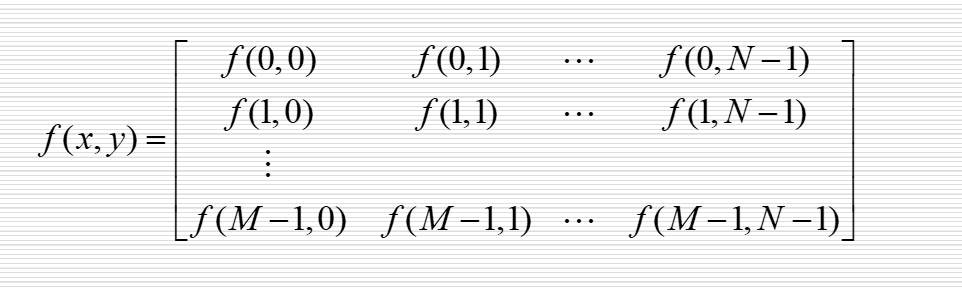
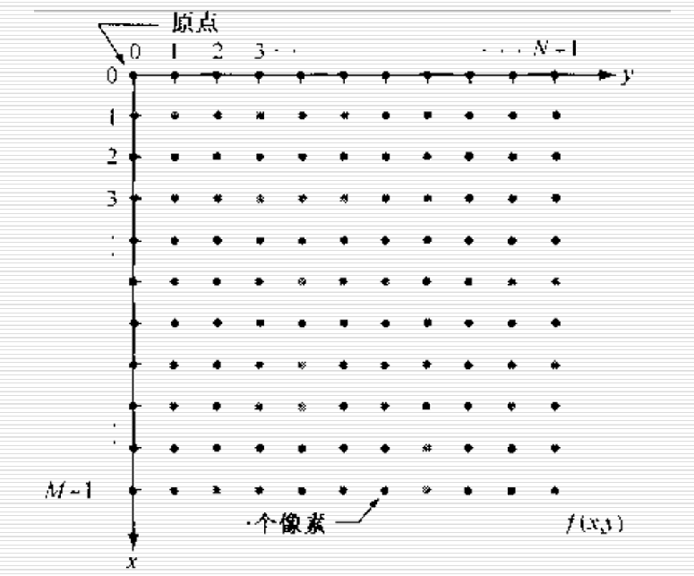
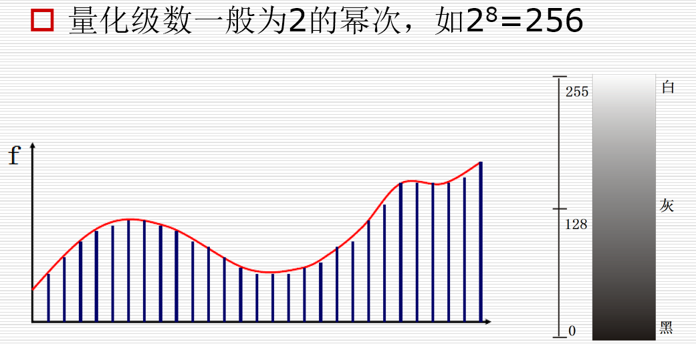
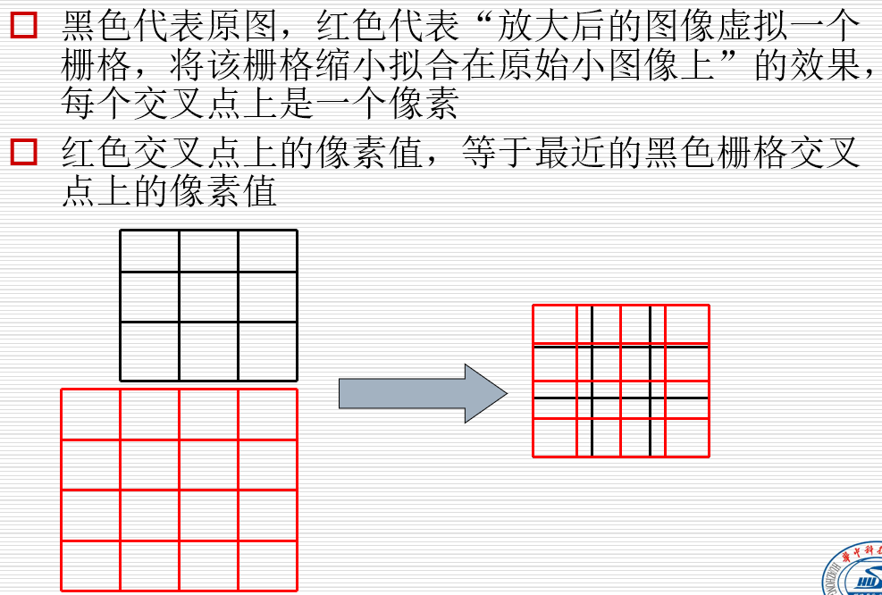
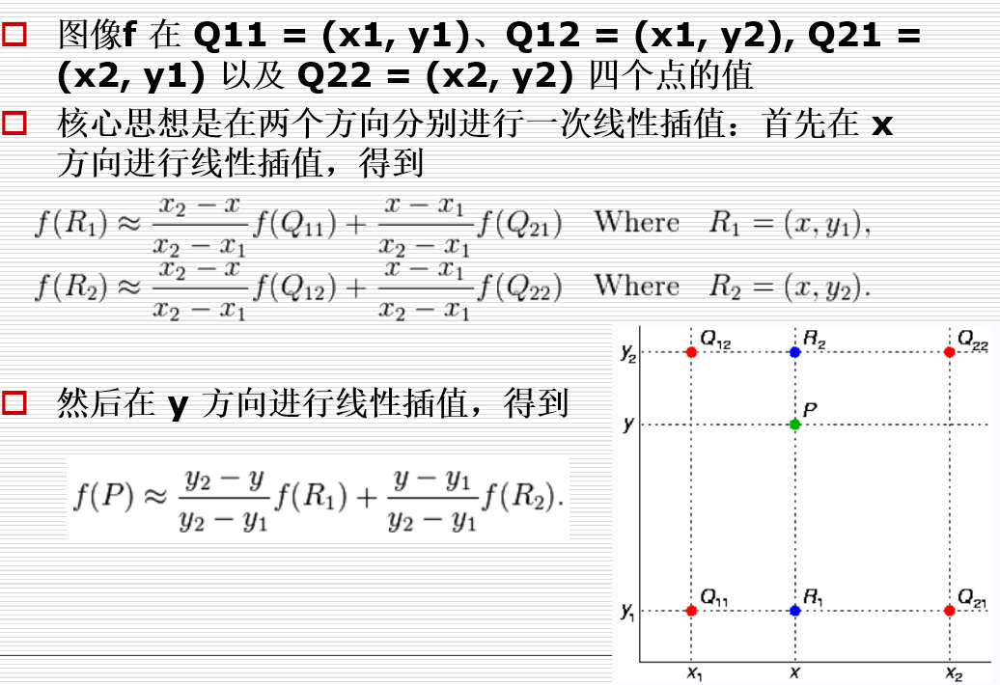
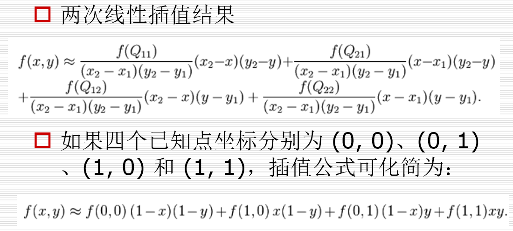

# <center>数字图像处理基础
 
  
### 1. HVS(human vision system)：

**人类视觉系统特性**
> - **空间频率上看是个低通线性系统，对高频不敏感**
> - **对亮度的响应是对数函数**
> - **对亮度的分辨能力大于对颜色的分辨能力**
> - **对图像的边缘敏感**
> - **人眼视觉的掩盖效应是一种局部效应，受背景照度，纹理复杂性，信号频率的影响**

### 2. 空间图像的一般约定:
**matlab中为1开始，原点为(1,1)**



### 3. 空间分辨率与图像分辨率：
> **空间分辨率**：图像可分辨的最小细节，单位长度黑白线对的数量(线对/毫米),不考虑实际大小时用**行数X列数**表示，如1920*1080
### 4. 灰度：

### 5.图像的放缩
> **最邻近插值**
> **双线性内插法**
#### 5.1：最邻近插值：
>为放大后的图像画个栅格，然后缩小拟合到原来图像，把离栅格最近的点赋给栅格。


**matlab实现**
```matlab
% ./pic/girl.jpg
img = imread('girl.jpg');
img = rgb2gray(img);
imshow(img);
[m n]=size(img);%128 x 124
w = m*6;
h = n*6;
imgn = zeros(w,h);
% 放大后行列间距是原图行列间距的倍数
% plus:间距数量为：  行数（列数） - 1，压缩后小方格长宽
% w_step，h_step倍 （小于1）
w_step = (m-1)/(w-1);
h_step = (n-1)/(h-1);

for x=1:w
    for y=1:h
        %原点（1，1）还对应（1，1）
        pix = [(x-1)*w_step (y-1)*h_step];
        %依据四舍五入来判断离哪个最近
        imgn(x,y)=img(round(pix(1))+1,round(pix(2))+1);
    end
end
figure,imshow(uint8(imgn))
```
#### 5.2：双线性内插法：
> **离哪个点越近越接近那个值**
> **1.先在x轴做一次线性插值，得到点R1,R2**
> **2.R1,R2在y轴做一次线性插值,得到点P**


