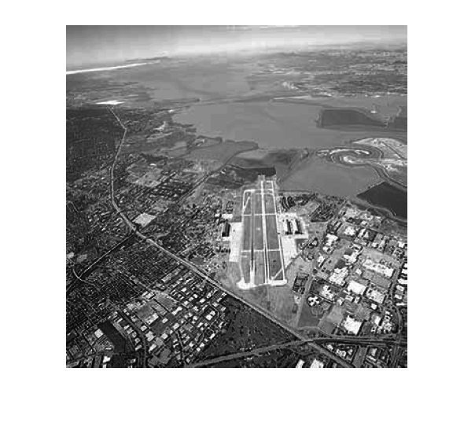
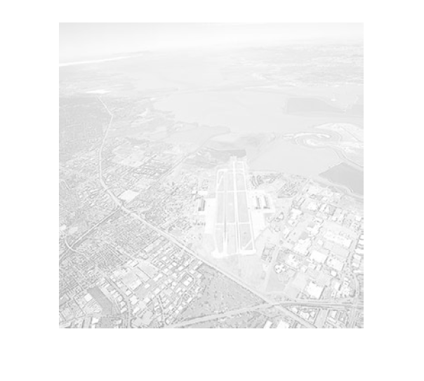
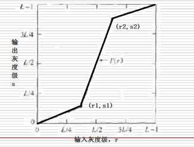
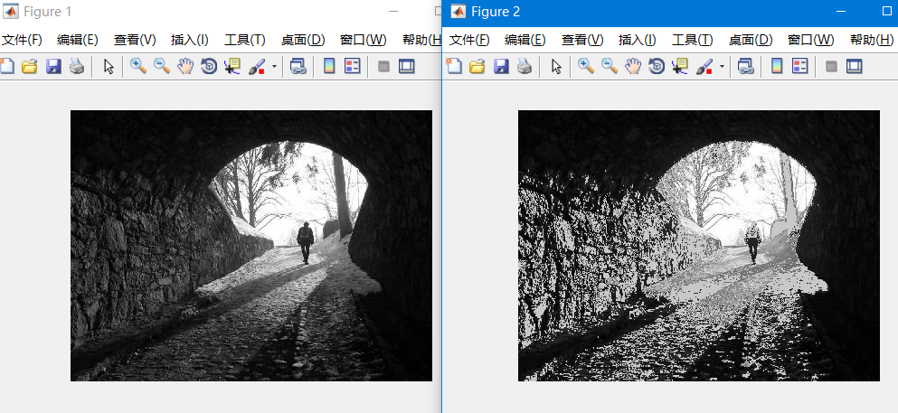
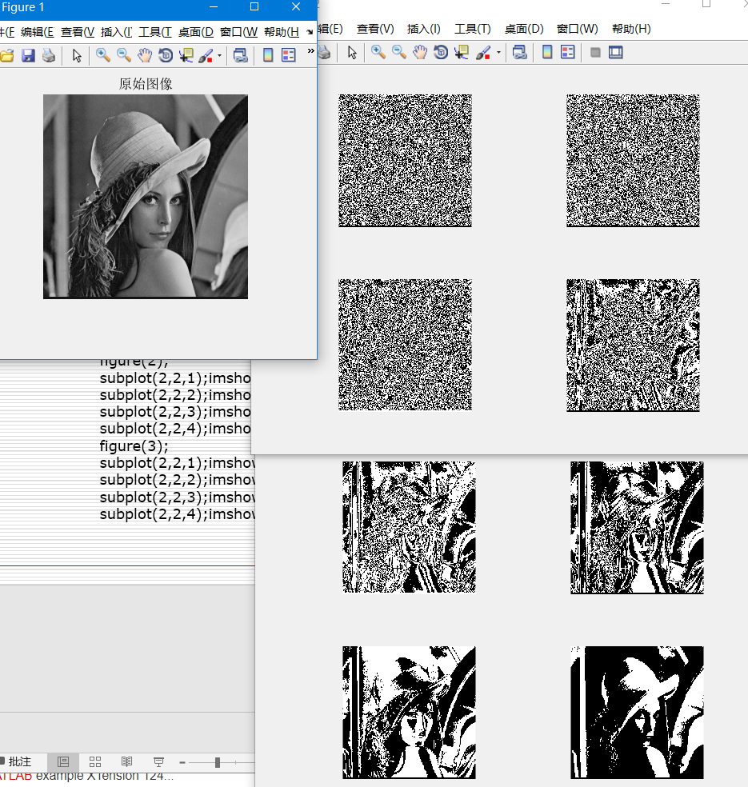
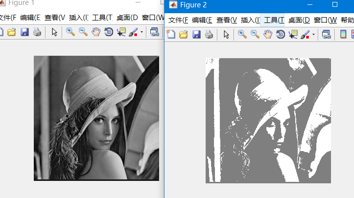
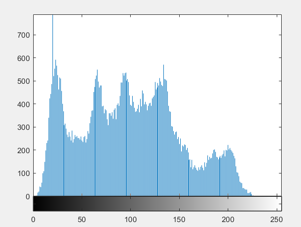

# <center>空域图像增强
**方法分为**
> - 点处理
> - 模板处理
### 1. 灰度变换

#### 1.1 图像反转
设图像灰度级[0,L-1]，变换S=L-1-r
```matlab
im = imread('./pics/hofi.bmp');
imshow(im);
im = 255 - im;
figure;
imshow(im);
```
#### 1.2 对数变换
$S = c\log(1+r)$
 C为常数，r>=0
一种灰度压缩方式，用于当原图灰度范围太大时，用来进行灰度压缩
#### 1.3 幂次变换
$S = Cr^Y$
C,Y为常数，
r为归一化的精度
Y < 1时，提高灰度级
Y > 1时，降低灰度级
```matlab
Y=5;
im = imread('./pics/sat.bmp');
im = im(:,:,1);
imshow(im);
im_1 = double(im)./255;
im_1 = im_1.^Y;
im_1 = uint8(im_1.*255);
figure;
imshow(im_1);

im_2 = double(im)./255;
im_2 = im_2.^0.5;
im_2 = uint8(im_2.*255);
figure;
imshow(im_2);
```



#### 1.4 分段线性变化
类似这种

```matlab
im = imread('./pics/huafen.bmp');
im = im(:,:,1);
subplot(2,2,1);
imshow(im);
subplot(2,2,2);
imhist(im);
rmin = min(min(im));
rmax = max(max(im));
k = 255/(rmax - rmin);
im = k.*(im - rmin);
subplot(2,2,3);
imshow(im);
subplot(2,2,4);
imhist(im);
```


#### 1.5 灰度切割
提高特定灰度级的亮度
```matlab
close all;
img = imread('./pics/hofi.bmp');
imshow(img);
[ m n] =size(img);
for i = 1:m
    for j = 1:n
        if img(i,j) > 50 && img(i,j)<100
            img(i,j)=200;
        end
    end
End
figure;imshow(img);
```


#### 1.6 位图切割
- 8位图像有8个位平面
- 较高位包含大多数视觉重要数据
- 较低位对微小细节有作用
```matlab
clear all;
close all;
A = imread('./pics/standard_lena.bmp');
b0 = 1;
b1 = 2;
b2 = 4;
b3 = 8;
b4 = 16;
b5 = 32;
b6 = 64;
b7 = 128;
B0 = bitand(A,b0);
B1 = bitand(A,b1);
B2 = bitand(A,b2);
B3 = bitand(A,b3);
B4 = bitand(A,b4);
B5 = bitand(A,b5);
B6 = bitand(A,b6);
B7 = bitand(A,b7);
figure(1);
imshow(A);title('原始图像');
figure(2);
subplot(2,2,1);imshow(B0,[]);
subplot(2,2,2);imshow(B1,[]);
subplot(2,2,3);imshow(B2,[]);
subplot(2,2,4);imshow(B3,[]);
figure(3);
subplot(2,2,1);imshow(B4,[]);
subplot(2,2,2);imshow(B5,[]);
subplot(2,2,3);imshow(B6,[]);
subplot(2,2,4);imshow(B7,[]);
```

位平面处理
- 例 0~6位平面置1
```matlab
close all;
I = imread('./pics/standard_lena.bmp');
imshow(I);
I = bitor(I,127);
figure,imshow(I);
```


#### 1.7 直方图
灰度级与数量的关系
反应灰度级与该灰度级出现概率
```matlab
close all;
I = imread('./pics/standard_lena.bmp');
imshow(I);
A = I;
figure;imhist(A);
```


> **直方图意义**
> - 低端分布，图像较暗
> - 高端分布，图像太两
> - 分布狭窄，对比度不够
> - 多个峰值，一般对应多类目标

直方图增强的方向
- 均衡化：均匀分布，扩大动态范围
- 规定化：符合特定分布，找兴趣目标

**直方图均衡化**：
累计直方图


