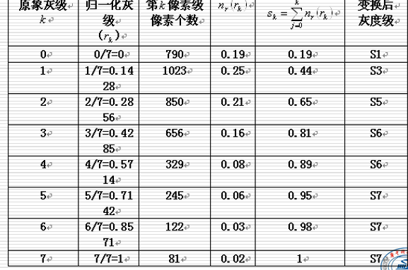
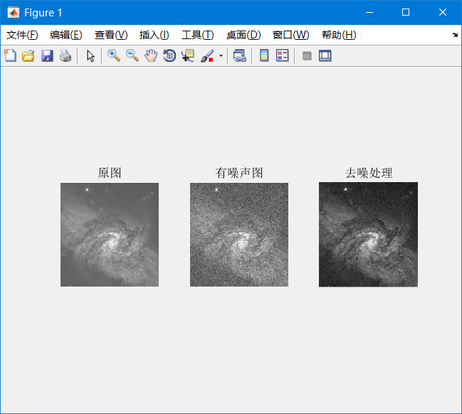
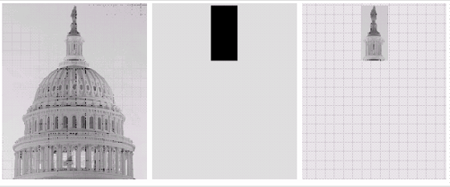
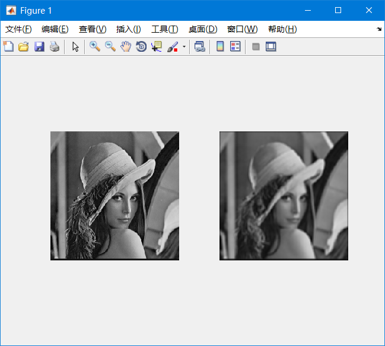
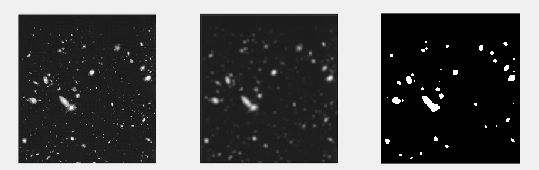
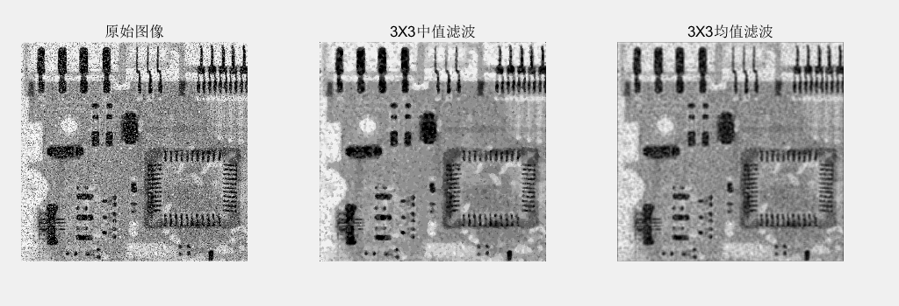
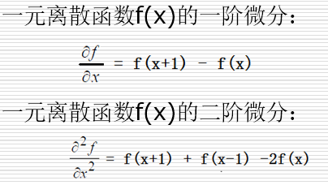
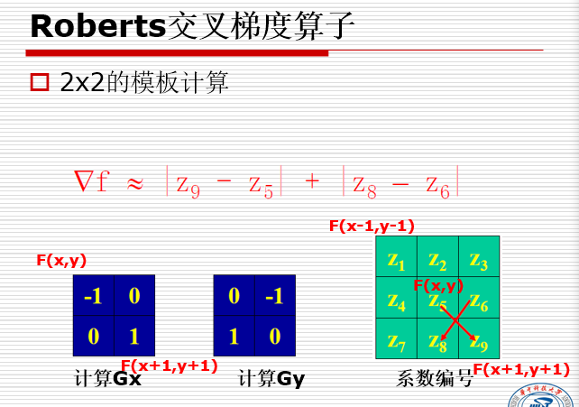
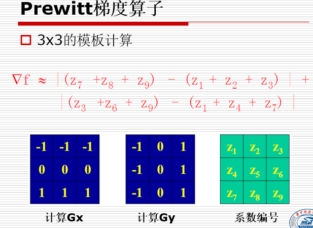
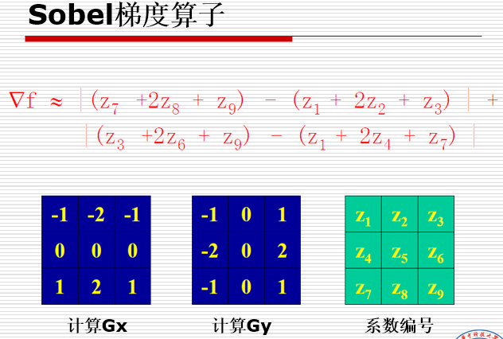

# <center>空域图像增强
**方法分为**
> - 点处理
> - 模板处理
### 1. 灰度变换

#### 1.1 图像反转
设图像灰度级[0,L-1]，变换S=L-1-r
```matlab
im = imread('./pics/hofi.bmp');
imshow(im);
im = 255 - im;
figure;
imshow(im);
```
#### 1.2 对数变换
$S = c\log(1+r)$
 C为常数，r>=0
一种灰度压缩方式，用于当原图灰度范围太大时，用来进行灰度压缩
#### 1.3 幂次变换
$S = Cr^Y$
C,Y为常数，
r为归一化的精度
Y < 1时，提高灰度级
Y > 1时，降低灰度级
```matlab
Y=5;
im = imread('./pics/sat.bmp');
im = im(:,:,1);
imshow(im);
im_1 = double(im)./255;
im_1 = im_1.^Y;
im_1 = uint8(im_1.*255);
figure;
imshow(im_1);

im_2 = double(im)./255;
im_2 = im_2.^0.5;
im_2 = uint8(im_2.*255);
figure;
imshow(im_2);
```


#### 1.4 分段线性变化
类似这种

```matlab
im = imread('./pics/huafen.bmp');
im = im(:,:,1);
subplot(2,2,1);
imshow(im);
subplot(2,2,2);
imhist(im);
rmin = min(min(im));
rmax = max(max(im));
k = 255/(rmax - rmin);
im = k.*(im - rmin);
subplot(2,2,3);
imshow(im);
subplot(2,2,4);
imhist(im);
```


#### 1.5 灰度切割
提高特定灰度级的亮度
```matlab
close all;
img = imread('./pics/hofi.bmp');
imshow(img);
[ m n] =size(img);
for i = 1:m
    for j = 1:n
        if img(i,j) > 50 && img(i,j)<100
            img(i,j)=200;
        end
    end
End
figure;imshow(img);
```


#### 1.6 位图切割
- 8位图像有8个位平面
- 较高位包含大多数视觉重要数据
- 较低位对微小细节有作用
```matlab
clear all;
close all;
A = imread('./pics/standard_lena.bmp');
b0 = 1;
b1 = 2;
b2 = 4;
b3 = 8;
b4 = 16;
b5 = 32;
b6 = 64;
b7 = 128;
B0 = bitand(A,b0);
B1 = bitand(A,b1);
B2 = bitand(A,b2);
B3 = bitand(A,b3);
B4 = bitand(A,b4);
B5 = bitand(A,b5);
B6 = bitand(A,b6);
B7 = bitand(A,b7);
figure(1);
imshow(A);title('原始图像');
figure(2);
subplot(2,2,1);imshow(B0,[]);
subplot(2,2,2);imshow(B1,[]);
subplot(2,2,3);imshow(B2,[]);
subplot(2,2,4);imshow(B3,[]);
figure(3);
subplot(2,2,1);imshow(B4,[]);
subplot(2,2,2);imshow(B5,[]);
subplot(2,2,3);imshow(B6,[]);
subplot(2,2,4);imshow(B7,[]);
```

位平面处理
- 例 0~6位平面置1
```matlab
close all;
I = imread('./pics/standard_lena.bmp');
imshow(I);
I = bitor(I,127);
figure,imshow(I);
```


#### 1.7 直方图
灰度级与数量的关系
反应灰度级与该灰度级出现概率
```matlab
close all;
I = imread('./pics/standard_lena.bmp');
imshow(I);
A = I;
figure;imhist(A);
```


> **直方图意义**
> - 低端分布，图像较暗
> - 高端分布，图像太亮
> - 分布狭窄，对比度不够
> - 多个峰值，一般对应多类目标

直方图增强的方向
- 均衡化：均匀分布，扩大动态范围
- 规定化：符合特定分布，找兴趣目标

**直方图均衡化**：
累计直方图:由累加概率来对应不同灰度级，以此改变单个像素的灰度
```matlab
I=imread('./pics/huafen.bmp');
A = rgb2gray(I);
J = histeq(A);
subplot(2,2,1),imshow(A);
subplot(2,2,2),imshow(J);
subplot(2,2,3),imhist(A);
subplot(2,2,4),imhist(J);
```



**直方图规定化**：
变换概率分布,有选择性的增强


#### 1.8 算术逻辑增强
**图像加法去噪声**
将一个含噪声的图集相加
```matlab
clear all;
A = imread('./pics/xingxi.bmp');
A = A(:,:,1);
n = 0.005;
N1 = imnoise(A,'gaussian',0,n);
N2 = imnoise(A,'gaussian',0,n);
N3 = imnoise(A,'gaussian',0,n);
N4 = imnoise(A,'gaussian',0,n);
N5 = imnoise(A,'gaussian',0,n);
N6 = imnoise(A,'gaussian',0,n);
N7 = imnoise(A,'gaussian',0,n);
N8 = imnoise(A,'gaussian',0,n);

B = 0.125*N1+0.125*N2+0.125*N3+0.125*N4+0.125*N5+0.125*N6+0.125*N7+0.125*N8;
figure(1);
subplot(1,3,1) ;imshow(A); title('原图');
subplot(1,3,2) ;imshow(N2); title('有噪声图');
subplot(1,3,3) ;imshow(B,[]); title('去噪处理');
```

**图像减法**
应用
> - 显示差异，如同一场景两幅图像之间的变化
> - 去除重叠图案
> - 图像分割：如分割运动车辆，减法去静止部分，剩余运动元素和噪声

减法中负数的处理，减后范围为-255~+255
- 先加255，变成0-510，除2 得 0~255
- 加上最小负数得绝对值，得到0-255

**逻辑运算**
与或非，提取出感兴趣区域


#### 1.9 空域图像滤波
使用空间模板进行处理
可以进行去噪，或增强图像细节
分类一：线性空间滤波，如平滑线性滤波器
        非线性空间滤波，如中值滤波
分类二：平滑(低通)滤波器
        锐化(高通)滤波器

> - 低通滤波器 : 去噪，平滑，但降低图像清晰度
> - 高通滤波器 ： 使细节和边缘突出，但加强了噪声
> - 空间平滑滤波器 ：模糊处理，去除不重要得细节，减小噪声


**线性滤波器**
模板超出边缘得部分，补0，补常数


均值滤波实现
```matlab
clear all;
close all;
im = imread('./pics/standard_lena.bmp');
% 模板操作，最后相加，所以除25
h = ones(5,5)/25;
out = imfilter(im,h);
subplot(1,2,1);imshow(im);
subplot(1,2,2);i
```


```matlab
im = imread('./pics/xingxing.bmp');
im = rgb2gray(im);
subplot(1,3,1);imshow(im);
h = ones(5,5)/25;
im = imfilter(im,h);
level = graythresh(im);
bw = im2bw(im,level);
// 均值滤波
subplot(1,3,2);imshow(im);
// 二值化
subplot(1,3,3);imshow(bw);
```


**统计排序滤波器**
模板区域内的统计特征
- 中值滤波器：
- 最大值滤波器
- 最小值滤波器

**中值滤波器**
- 用模板像素点的中间值，突消除孤立的亮(暗)点
- 去除噪音的同时，保留边缘锐度和图像细节
- 有效去除脉冲噪声(黑白点叠加)

```matlab
clear all;close all;
im = imread('./pics/zaosheng.bmp');
im = im(:,:,1);
out = medfilt2(im,[3 3]);
h = ones(3,3)/9;
out2 = imfilter(im,h);
subplot(1,3,1);imshow(im);title('原始图像');
subplot(1,3,2);imshow(out);title('3X3中值滤波');
subplot(1,3,3);imshow(out2);title('3X3均值滤波');
```


**锐化滤波器**
- 增强图像的细节
- 印刷中增强细微层次,弥补扫描产生的图像钝化
- 超声探测成像，分辨率低，边缘模糊，通过锐化来改善
- 图像识别中，分割前的边缘提取
- 锐化处理恢复过度钝化、暴光不足的图像
- 目标识别、定位

分类
> - 二阶微分--拉普拉斯算子
> - 一阶微分--梯度算子



**比较**
> - 一阶产生较宽的边缘
> - 二阶产生细边缘
> - 二阶对细节响应较强
> - 图像增强二阶更好

```matlab
clear all;close all;
im = imread('./pics/moon.bmp');
im = im(:,:,1);
imshow(im);
f = im2double(im);
w = fspecial('laplacian',0);
g1 = imfilter(f,w,'replicate');
f = f-g1;
figure,imshow(f);
```
其他算子





