#  彩色图像处理

### 1. 颜色基础知识：

- 特性：色调，饱和度，亮度

> 色调：观察者接收的主要颜色。
>
> 饱和度：颜色的纯度，区别颜色的深浅程度，混入白光越少，饱和度越高。

- 视网膜对光的感知：

锥细胞：颜色敏感， 杆细胞：亮度敏感

锥细胞比例： 红：65%  绿：33%  蓝：2%

- 加色混色模型：

> rgb三色光叠加实现
>
> 适用于显示器等发光体的显示

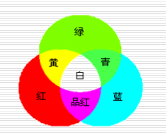

- 减色混色模型:

> 减色基：青，品红，黄
>
> 白光中减去某个基色得到，如： 白光 - 绿 = 品红
>
> 适用于彩色打印，印刷行业等

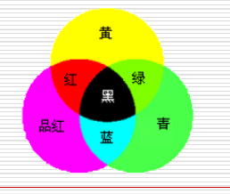

- CIE色度图：

红色：x轴； 绿色：y轴；没有z轴，蓝色比例为：z = 1-x-y

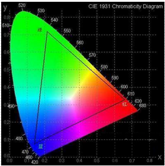
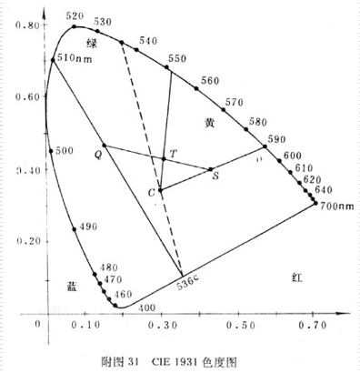

**注解:**
- 越接近C点，颜色越不纯
- 任意直线上上的颜色可由两端点混合得到
- 任意三角形内的可以由三个顶点混合得到

### 2.颜色空间
#### 2.1 RGB空间
r,g,b分别位于立方体的三个轴，其中O点为(0,0,0)的rgb即为黑色，顶点为(1,1,1)的rgb即为白色。
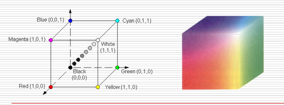

越接近红色则在红色方向上的灰度级就越高，同理

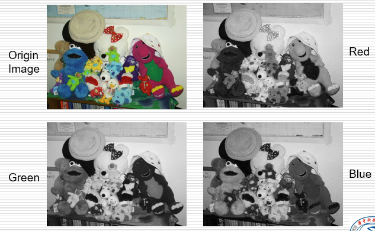

```matlab
I = imread('./pics/Fig6.08.jpg');
R = I(:,:,1);
G = I(:,:,2);
B = I(:,:,3);
subplot(2,2,1),imshow(I),title('原始图像');
subplot(2,2,2),imshow(R),title('红色分量');
subplot(2,2,3),imshow(G),title('绿色分量');
subplot(2,2,4),imshow(B),title('蓝色分量');
```
得到结果
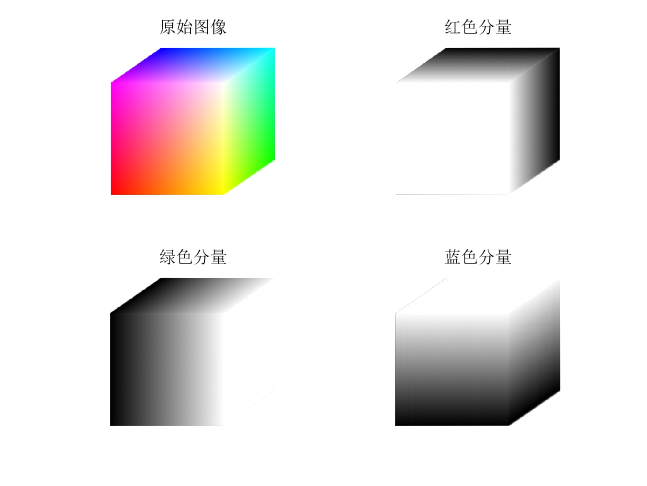

#### 2.2 CMY和CMYK 彩色空间
CMY(青，品红，黄)
CMYK(青，品红，黄，黑)

**用途**：纸上沉积颜料的设备，如打印机，复印机，引入K也是因为打印机主要也是黑色为主

#### 2.3 HSI彩色空间

HSI: 色调，饱和度，亮度
将色调，饱和度，亮度分开以避免光照明暗(亮度)的干扰

**特点：**
- I分量于图像的颜色无关
- H,S分量与人感受颜色密切相关

H: 色调由角度表示(0：红),(120：绿),(240：蓝)
S: 饱和度由半径长度表示，中心饱和度为0，边缘饱和度为1
I：由柱坐标高度表示
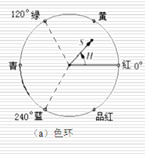
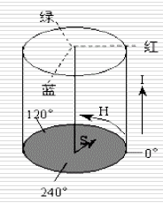

#### 2.4 其他彩色空间
YIQ : Y亮度，IQ色调，用于北美彩色电视广播
YUV : Y亮度，UV色调，用于欧洲电视广播
YCbCr : JPEG采用的彩色空间，Y亮度，Cb,Cr由UV调整得到

### 3. 彩色空间的转换
#### 3.1 RGB到CMY彩色空间
将RGB和CMY都归一化到`[0,1]`
$ [C,M,Y]^T = [1,1,1]^T - [R,G,B]^T $
#### 3.2 RGB到HSI彩色空间
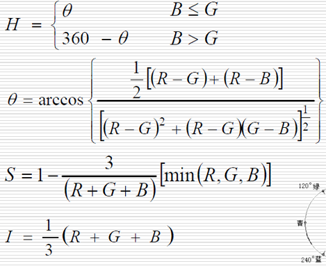

#### 3.3 HSI到RGB颜色空间
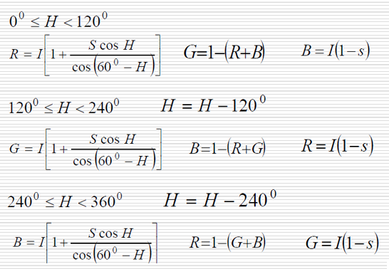

#### 3.4 RGB与YIQ
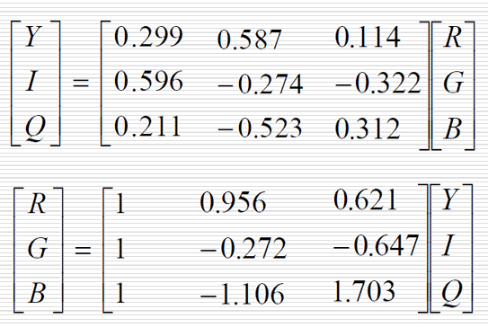

#### 3.5 RGB与YUV
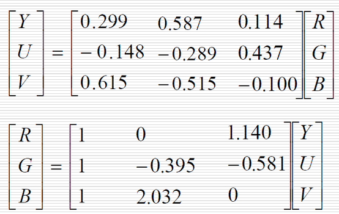

#### 3.5 RGB与YCbCr
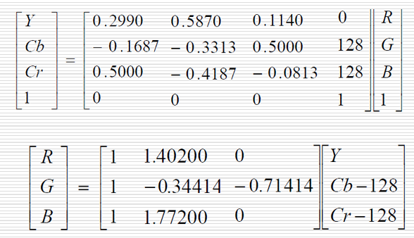

### 4.伪彩色处理
将一个无色灰度图映射到彩色空间中

**处理方法**
- 强度分层
- 灰度级到彩色转换

(ppt44)
