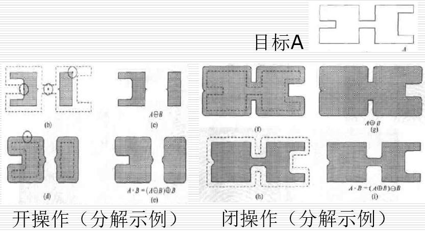
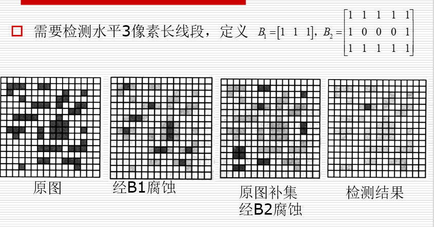

# 形态学图像处理

[代码](https://www.cnblogs.com/daxiongblog/p/6289551.html)

### 1.基本概念：

​     **概念**：用具有一定形态的**结构元素**去量度和提取图像中的对应形状，达到对图像分析和识别的目的

​     **基本运算**：膨胀，腐蚀，开操作，闭操作， 击中击不中

​    **处理对象**：二值图，灰度图

### 2.膨胀

$A \bigoplus B$

- B的中心点绕A的边界区域平移,
	如下图所示：
	
- 膨胀会增长，粗化二值图中的物体
- 应用：桥接裂缝，如处理断裂字符
	
### 3.腐蚀

$A \ominus B$

- B 平移后刚好覆盖A的边界

  

- 腐蚀是一种收缩或细化操作，细化了物体，将小的细节滤去

  

**腐蚀-膨胀组合**

- 膨胀-腐蚀：去毛刺，恢复目标尺寸
- 腐蚀-膨胀： 填空洞，恢复目标尺寸

### 4.开操作和闭操作

**开操作**：

- 先腐蚀再膨胀
- 除去细小的突出物，断开狭窄的裂缝，来平滑目标

**闭操作**

- 先膨胀再腐蚀
- 填充小孔洞，消除狭窄的裂缝，来平滑目标

### 5.击中击不中变换

$A \odot B = (A \ominus X ) - (A - \oplus (W-X))$

- 对多个目标构成的图像用腐蚀操作来进行目标检测

**操作步骤**

- 用`W`腐蚀`A`，得到比`D`大或和`D`一样大的目标
- 用`W-D`腐蚀$A^c$,得到比`D`小或和`D`一样大的目标
- 综合得到`D`

例：

### 6.边界提取

$\beta(A) = A - (A \ominus B)$

### 7.区域填充

**步骤**：

1. 从每一个孔洞对应的$X_0$开始
2. $X_k = (X_{k-1} \bigoplus B) \cap A^c    k = 1,2,3,...$
3. 当$X_k = X_{k+1}$时结束

​	

### 8.细化

- $A \otimes B = A - (A \odot B) = A \cap(A \odot B)^c$

- 细化是将需要消除的目标检测并剔除，用击中击不中来检测目标

可以用来提取骨架

### 9.粗化

- 消除间断点
- 先细化$A^c$,再求补

