# 图像分割

[TOC]

## 1.概述：

- 图像分割就是将图像分成各个特性的区域，再提取出感兴趣目标的技术和过程

- 一般将图像中感兴趣的区域称为**目标**或**前景**

## 2.间断检测

一般方法：利用模板检测

**分类：**

- 点检测
- 线检测
- 边缘检测

### 2.1 点检测

可以利用模板，加上设置阈值来检测孤立点

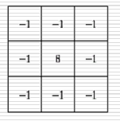

### 2.2 线检测

**常用模板：**

分别适用于：水平线，+45，垂线，-45


****

**Matlab实现**

```matlab
clear all;close all;
im = imread('./pics/xian.bmp');
%im = rgb2gray(im);
h1 = [-1,-1,-1;
       2, 2 ,2;
       -1,-1,-1];
h2 = [ -1,-1,  2;
       -1, 2, -1;
        2,-1,-1];
h3 = [-1,2,-1;
       -1, 2, -1;
       -1,2,-1];
h4 = [2,-1,-1;
       -1, 2, -1;
       -1,-1,2];
A1 = imfilter(im,h1);
A2 = imfilter(im,h2);
A3 = imfilter(im,h3);
A4 = imfilter(im,h4);
% 将图像反转 便于观察
A1 = 255 - A1;
A2 = 255 - A2;
A3 = 255 - A3;
A4 = 255 - A4;

subplot(2,3,1),imshow(im),title('原图');
subplot(2,3,2),imshow(A1),title('水平直线');
subplot(2,3,3),imshow(A2),title('+45');
subplot(2,3,4),imshow(A3),title('垂线');
subplot(2,3,5),imshow(A4),title('-45');
```
结果:
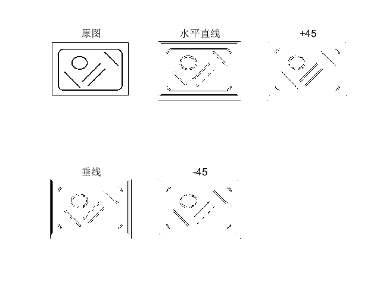

### 2.3 边缘检测

**概述：**

- R为图像中的像素子集，若R是连通集，则称R是一个区域
- 边缘：一组相连的像素集合，这些像素位于两个**区域**的边界上
- 边缘常具有灰度级尖端的特点
- 利用**导数**来识别边缘

**数字边缘模型**


**导数**

- 一阶导数 $\frac{\partial f}{\partial x} = f(x+1) - f(x)$
- 二阶导数 $\frac{\partial^2 f}{\partial x^2} = f(x+1) +f(x-1)-2f(x)$

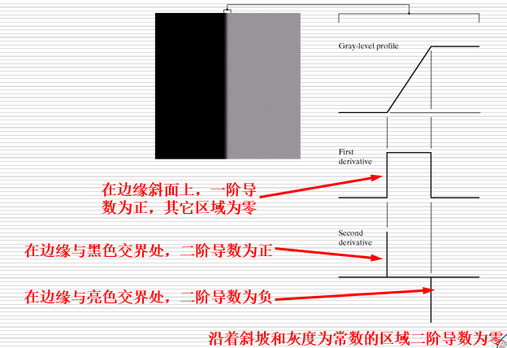

- 一阶导数可用于检测点是否再边界上
- 二阶导数可用于判断边界两边的明暗
- 零点约在二阶导数正负值得中点处
- 导数易受噪声污染

**常见梯度与算子:**

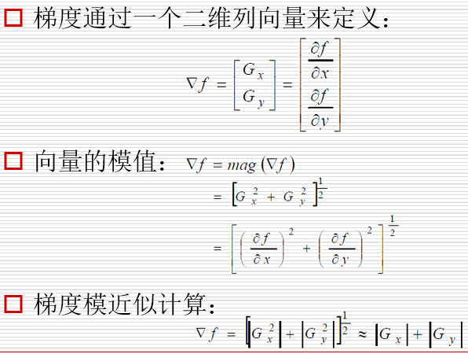
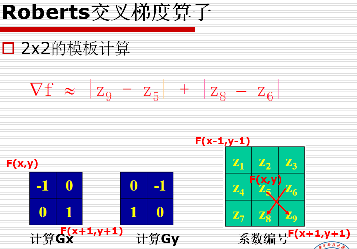
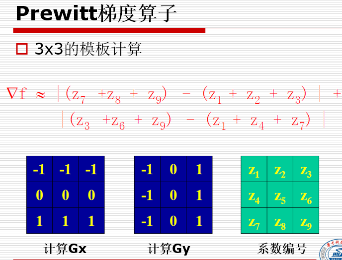
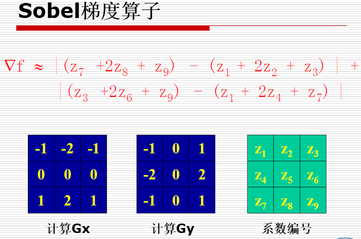
**检测对角线边缘**
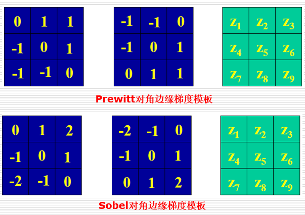

**梯度算子比较**

- Prewitt和Sobel算子是计算数字梯度时最常用的算子
- Prewitt模板比Sobel模板简单，但Sobel模板能够有效抑制噪声

**matlab实现**

```matlab
im = imread('./pics/Fig1016(a)(building_original).tif');
sobel_x = [-1,-2,-1;
            0,0,0;
            1,2,1];
sobel_y = [-1,0,1;
            -2,0,2;
            -1,0,1];
prewitt_x = [-1,-1,-1;
            0,0,0;
            1,1,1];
prewitt_y = [-1,0,1;
            -1,0,1;
            -1,0,1];
sobel_1 = imfilter(im,sobel_x);
sobel_2 = imfilter(im,sobel_y); 
sobel = sobel_1 + sobel_2;
sobel = 255 - sobel;
sobel_1 = 255 - sobel_1;
sobel_2 = 255 - sobel_2;

prewitt_1 = imfilter(im,prewitt_x);
prewitt_2 = imfilter(im,prewitt_y); 
prewitt = prewitt_1 + prewitt_2;
prewitt = 255 - prewitt;
prewitt_1 = 255 - prewitt_1;
prewitt_2 = 255 - prewitt_2;

subplot(3,3,1),imshow(im),title('原图');
subplot(3,3,2),imshow(sobel_1),title('sobel_x');
subplot(3,3,3),imshow(sobel_2),title('sobel_y');
subplot(3,3,4),imshow(sobel),title('sobel');
subplot(3,3,5),imshow(prewitt_1),title('prewitt_x');
subplot(3,3,6),imshow(prewitt_2),title('prewitt_y');
subplot(3,3,7),imshow(prewitt),title('prewitt');
```

**结果**


**代码2**

```matlab
clear all;close all;
im = imread('./pics/standard_lena.bmp');
esobel = edge(im,'sobel');
erob = edge(im,'roberts');
eprew = edge(im,'prewitt');

subplot(2,2,1),imshow(im),title('原图');
subplot(2,2,2),imshow(esobel),title('sobel');
subplot(2,2,3),imshow(erob),title('roberts');
subplot(2,2,4),imshow(eprew),title('prewitt');
```


#### 2.3.1 Canny 边缘检测

**Canny检测的三个目标**：

- 低错误率
- 边缘点应被很好的定位
- 单一的边缘点响应

**步骤：**

- 用高斯滤波器平滑图像 $f_s(x,y) = G(x,y)*f(x,y)  ,   G(x,y) = e^-\frac{x^2+y^2}{2\sigma^2}$

- 利用一阶梯度算子计算梯度的幅值和方向$G=\sqrt{G_x^2+G_y^2}   ,   \theta = tan^{-1}(\frac{G_y}{G_x})$

- 对梯度幅值进行非极大值抑制

  > 延梯度方向，比较前后两个梯度值，若中间点梯度值是最大的则令像素值g(x,y) = G，否则g(x,y) = 0

- 用双阈值算法检测和连接边缘

  > 双阈值算法:
  >
  > - 如果像素位置的幅值高于`高阈值`，该像素保留为边缘像素
  > - 小于`低阈值`则排除该像素
  > - 两者之间则， 若该像素在梯度方向上连接了一个高于阈值的像素点则保留

#### 2.3.2 拉普拉斯算子(二阶微分)


**优点：**

- 利用零交叉定位边缘
- 可以确定亮暗区域

**缺点：**

- 对噪声敏感
- 产生双边缘

#### 2.3.3 高斯型拉普拉斯算子 LoG

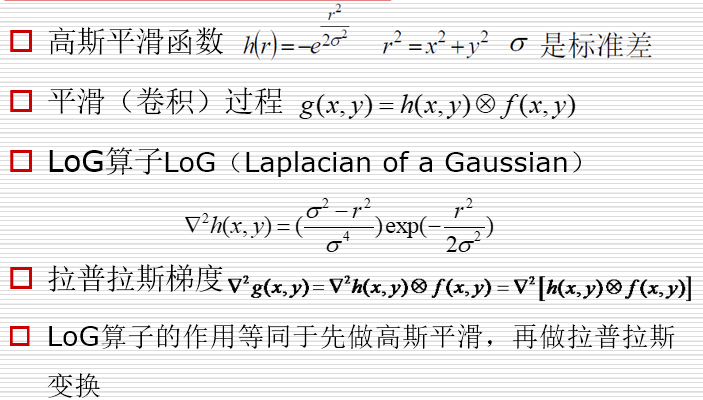

## 3 边缘连接与边界检测

### 3.1 边缘连接
将得到的间断的边缘像素连接得到完整的边缘
将满足某类相似准则的像素连接形成边缘

**相似度的确定**：依据像素梯度的强度相似度与方向的相似度

### 3.2 Hough变换检测特定的几何形状

**原理**: 根据坐标变换来检测特定几何图形

**直线检测:**

将`xy`空间上`y = ax + b`，变成`ab`空间上`b = -ax + y`,

- `xy`空间上的一条直线在`ab`空间上对应一个点

- `xy`面上过点$(x_1,y_1)$的所有直线，在`ab`空间上为一条直线

- 若$（x_1,y_1),(x_2,y_2) $共线则 两点在`ab`空间的直线有一交点

- 在`ab`上相交直线最多的点对应`xy`上一条直线
- 局限：无法检测垂线

**直线变换流程:**

>通过 `xy`空间上点得出`ab`上直线
>
>由`ab`上直线交点数量及该交点得到`xy`上`a,b`参数

**直线的极坐标方程**

解决了检测垂线的问题

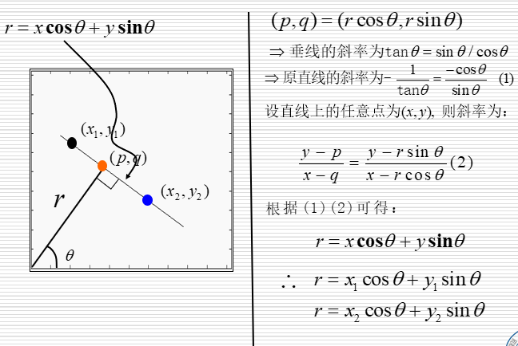

- 对于垂线又, $\theta = 0$, 则 $r = x$

- 将`xy`变换到$r \theta$, 则由$r \theta$上 $r = x_1cos\theta + y_1cos\theta,r = x_2cos\theta + y_3cos\theta$的交点就可以确定$r \theta$

**检测圆：**

变换改为$(x-c_1)^2+(y-c_2)^2=c_3^2$, 映射到三参数空间

```matlab
clear all;close all;
I = imread('./pics/Fig1016(a)(building_original).tif');
rotI = imrotate(I,33,'crop');
%rotI = I;
%imshow(rotI);
BW = edge(rotI,'canny');
imshow(BW);
% hough变换，到r theta空间
[H,theta, rho] = hough(BW);

% 画出r theta空间图
figure
imshow(imadjust(mat2gray(H)),[],...
       'XData',theta,...
       'YData',rho,...
       'InitialMagnification','fit');
xlabel('\theta (degrees)')
ylabel('\rho')
axis on
axis normal 
hold on
colormap(gca,hot)  

% 找到相交最多的点
P = houghpeaks(H,5,'threshold',ceil(0.3*max(H(:))));
x = theta(P(:,2));
y = rho(P(:,1));
plot(x,y,'s','color','black');

% 找到xy空间
lines = houghlines(BW,theta,rho,P,'FillGap',5,'MinLength',7);

% 在原图上显示
figure,imshow(rotI),hold on
max_len = 0;
for k=1:length(lines)
    xy = [lines(k).point1;lines(k).point2];
    plot(xy(:,1),xy(:,2),'LineWidth',2,'Color','green');
    
    % 画出线的起点和终点
    plot(xy(1,1),xy(1,2),'x','LineWidth',2,'Color','yellow');
    plot(xy(2,1),xy(2,2),'x','LineWidth',2,'Color','red');
    
    len = norm(lines(k).point1-lines(k).point2);
    if(len > max_len)
        max_len = len;
        xy_long = xy;
    end
end
% 画出最长的线
plot(xy_long(:,1),xy_long(:,2),'LineWidth',2,'Color','red');
```


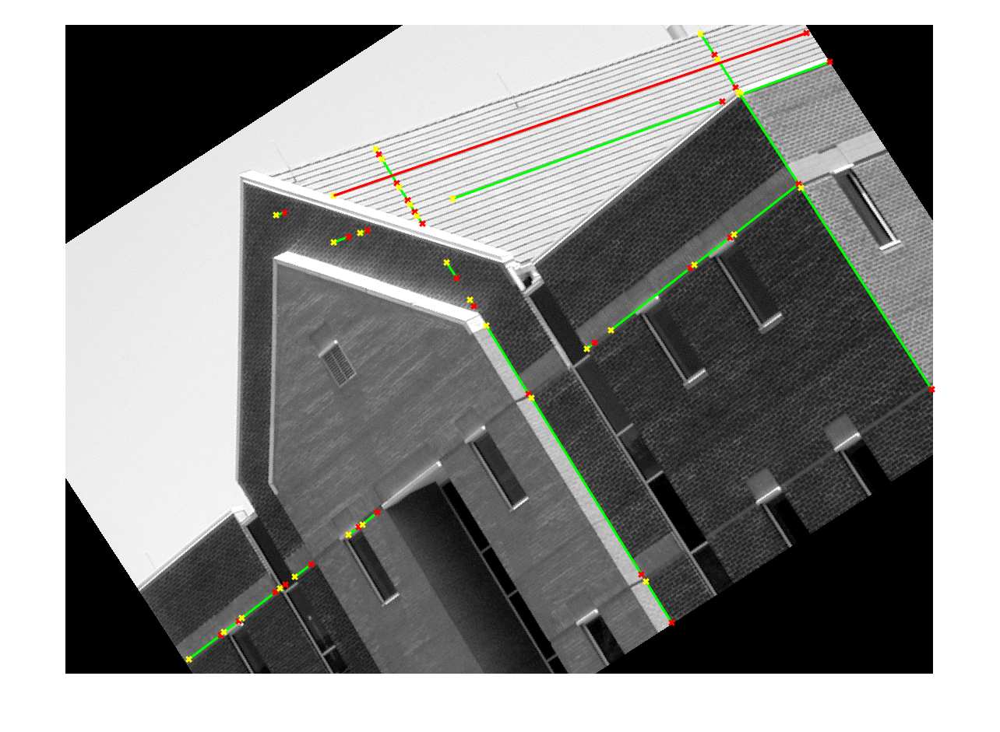

## 4.基于门限(阈值)的分割方法

**基本定义** : f(x,y) 点(x,y)处的灰度级， p(x,y) 该点的局部性质(如该点邻域的平均灰度级等)，T阈值

**分类**
- 全局 : T取决于f(x,y)  
- 自适应 : T取决于f(x,y)和p(x,y)  
- 最佳全局和自适应阈值 : T取决于该点的空间位置

由直方图这类阈值来划分

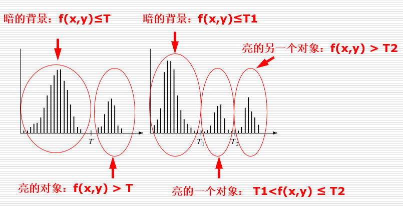

**Matlab实验**

```matlab
clear all;close all;
im = imread('./pics/test.bmp');
im = rgb2gray(im);
subplot(2,3,1),imshow(im);
[m n]=size(im);
im = medfilt2(im,[7,7]);
subplot(2,3,2),imshow(im);
subplot(2,3,3),imhist(im);

T1 = 117;
T2 = 177;

for x=1:m
    for y=1:n
        if(im(x,y)<T1)
            im(x,y)=0;
        else
            if(im(x,y)<T2)
                im(x,y)=127;
            else
                im(x,y)=255;
            end
        end
    end
end
subplot(2,3,4),imshow(im);
im=edge(im,'sobel');
subplot(2,3,5),imshow(im);
```

**结果**

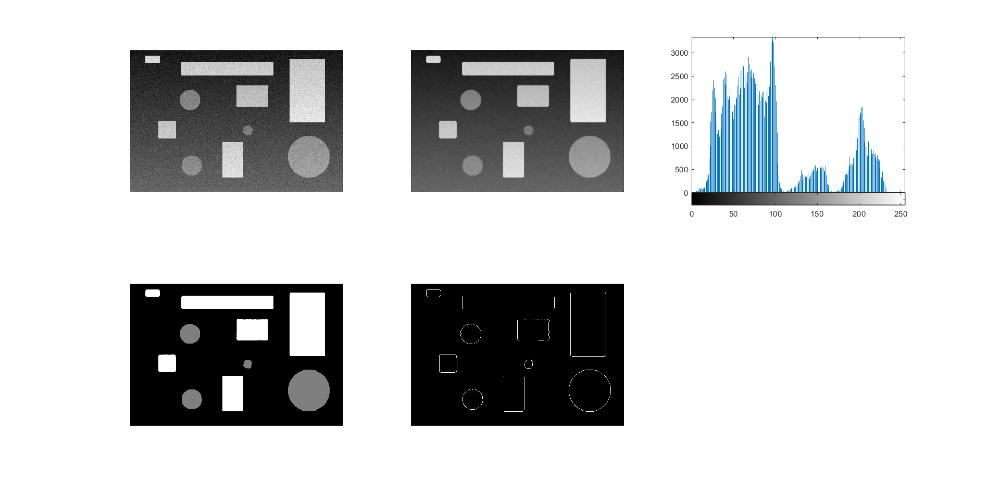

### 4.1 全局阈值

**引入matlab实例**

```matlab
clear all;close all;
im = imread('./pics/Fig10.25.jpg');
im = rgb2gray(im);
subplot(2,2,1),imshow(im);
im = medfilt2(im,[3,3]);
subplot(2,2,2),imhist(im);
T = graythresh(im);% 类间方差最大法生成的T
im = imbinarize(im,T);
subplot(2,2,3),imshow(im);
A = edge(im,'sobel');
subplot(2,2,4)
imshow(A)
```


**全局阈值算法:**

- 选一个初始的T
- 用T分割图像得到两个图
- 得到G1，G2的平均灰度u1,u2
- T = （u1 + u2)/2
- 重复2-4,直到逐次迭代的T小于事先定义的T0

**最大类间方差最大法：**

称为OTSU，将图像分层背景和目标两部分，是背景和目标之间的类间方差最大。采用遍历方法得到的阈值 `T = graythresh(im)`
### 4.2 自适应阈值

单一全局阈值存在的问题： 不均匀亮度的图像无法有效分割

解决方法：划分子图像

**4.2.1基本自适应阈值：**

依据位置划分子图，在每个子图上进行全局阈值处理

**4.2.2 最佳全局:**

假设一幅图像灰度级主要包含两个区域且其概率密度函数的估计已知:

$p_1(z),p_2(z)$,   令$p_1,p_2$分别为属于对象像素和背景像素的概率，则有

$p(z)=p_1p_1(z)+p_2p_2(z)$

**出错率:**

背景点作为对象点的概率：$E_1(T) = \int^T_{-\infty}p_2(z)dz$
对象点作为背景点的概率：$E_2(T) = \int_T^{+\infty}p_1(z)dz$

整体出错率: $E(T)=P_2E_1(T)+P_1E_2(T)$

得$P_1p_1(z)=P_2p_2(z)$

## 5.基于区域的分割方法

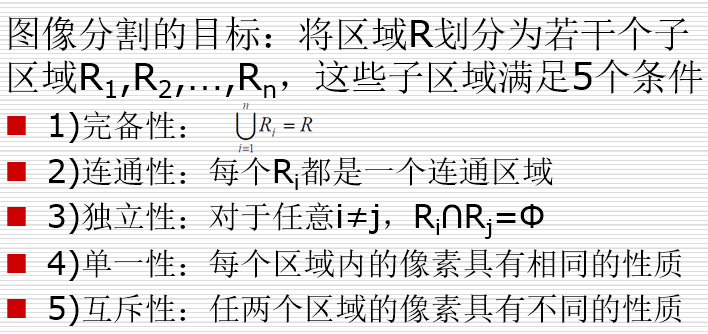

**区域生成算法：**

- 根据图像的不同应用选取一个或一组种子，如：最亮点，最暗点，点簇的中心
- 定义相似性准则
- 从该种子开始向外扩张
- 直到不满足准则

**区域分裂：**

- 起始时图像为一个区域
- 将图像划分为4个子区域
- 若相邻的之区域中所有像素性质相同，则合并

- 反复进行上面两个操作

## 6.基于形态学分水岭的分割方法

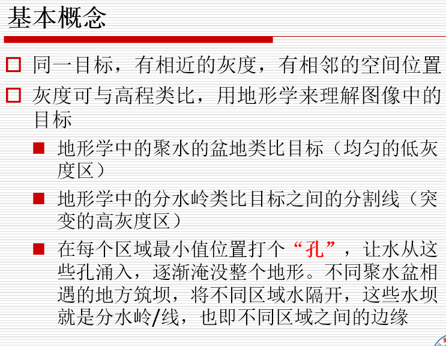

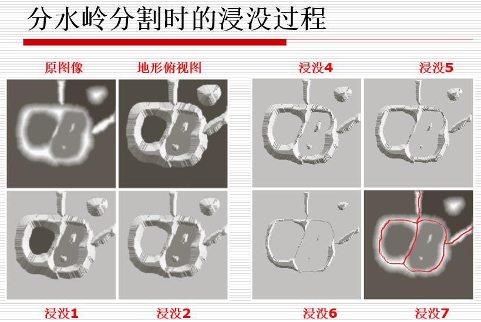

* 积水处为灰度变化小的区域
* 分水处为灰度变化大的区域

**问题：**

- 灰度图对噪声敏感直接分割造成过分割

- 太多的分割区域没有实际意义

**标记分水岭**

- 在种子的基础上使用分水岭，过程中不再产生心得区域

- 在分割结果得每个区域，进行目标背景得区分，得到最后得目标分割

**距离变换图得分水岭分割**

- 常用于实现粘连物体分割
- 二值图变换成灰度图
- 其中灰度值为像素到最近背景像素得距离


