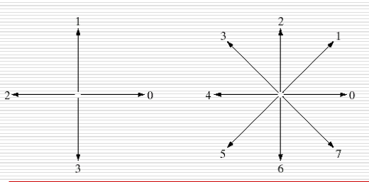
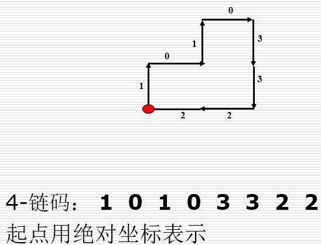

# 图像的表示与描述

以合适的方式(适合计算机存储等)来表示和描述图像分割得到的特征区域

[TOC]

## 1.概述

**表示：**

- 将特征区域表示成为适合存储，易于特征计算的数据结构

- 具体的表示目标
- 内部表示法：关心区域内的性质，如灰度，颜色，纹理
- 外部表示法：区域边界的形状

**描述：**

- 在表示的基础上对目标进行描述，如边界的长度，连接端点的直线的方向等
- 要求对目标的平移,旋转等不敏感
- 分为边界描述和对区域内的描述

## 2.表示

### 2.1 链码——表示边界

用链码指定方向，在该方向上每次移动规定的长度，以此来表示边界

常见的链码有4连接和8连接

例子：

**缺点**

- 链码较长
- 受噪声影响产生不必要的链码

#### 2.1.1 链码的归一化

**起因：**由于起点不同导致链码不同，对目标表示的一致性受到影响

**起点归一化**：得到链码后将最小的数选取为第一位

> 原码：1 0 1 0 3 3 2 2
>
> 归一化后: 0 1 0 3 3 2 2 1

**旋转归一化：**用差分码(首尾循环差分)

### 2.2 多边形近似

**方法**：

- 基于收缩的最小周长多边形
- 基于聚合的最小均方误差线段逼近
- 基于分裂的最小均方误差线段逼近

###  2.3 边界分段

### 2.4 区域骨架

**中轴变换  MAT**

- 区域R, 边界B， 骨架P的确定：
  - 区域中的点，若到边界有多于一个最短距离，则该点就是骨架点

**缺点**：

- 计算复杂度高

- 受噪声影响

