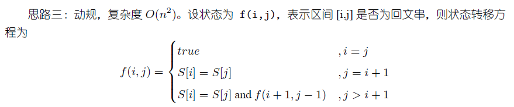

# leetcode

[TOC]

#### 1. Two Sum

> Given an array of integers, return **indices** of the two numbers such that they add up to a specific target.
>
> You may assume that each input would have **exactly** one solution, and you may not use the *same* element twice.
>
> **example**:
>
> ```
> Given nums = [2, 7, 11, 15], target = 9,
> Because nums[0] + nums[1] = 2 + 7 = 9,
> return [0, 1].
> ```

1. 暴力解法：
时间复杂度O(n^2)  
空间复杂度O(1)
```c++
class Solution{
public:
    vector<int> twoSum(vector<int>& num, int target){
        for(int i = 0;i < nums.size(); ++i){
            for(int j = i+1;j < nums.size(); ++j){
                if(nums[i] + nums[j] == target)
                return [i,j];
            }
        }
        throw invalid_argument("the input has no solution");
    }
};
```
2. hash 用一个hash表，存储每个数对应的下标,复杂度O(N)
```c++
class Solution{
public:
    vector<int> twoSum(vector<int>& num, int target){
        unordered_map<int,int> mapping;
        vector<int> result;
        for(int i=0;i<num.size();++i){
            mapping[num[i]] = i;
        }
        for(int i=0;i<num.size();++i){
            const int gap = target - num[i];
            if(mapping.find(gap) != mapping.end() && mapping[gap] > i){
                result.push_back(i);
                result.push_back(mapping[gap]);
                break;
            }
        }
        return result;
    }
};
```
#### 2. add two sum
You are given two non-empty linked lists representing two non-negative integers. The digits are stored in reverse order and each of their nodes contain a single digit. Add the two numbers and return it as a linked list.

You may assume the two numbers do not contain any leading zero, except the number 0 itself.

- example
Input: (2 -> 4 -> 3) + (5 -> 6 -> 4)
Output: 7 -> 0 -> 8
Explanation: 342 + 465 = 807.

1. 普通方法建立一个新链表，这个解法的关键在于链表边界的判断与确定，结果超过10后，如何来确定carrier
时间复杂度 O(n)
空间复杂度 O(n)

```c++
struct ListNode {
    int val;
    ListNode *next;
    ListNode(int x) : val(x), next(NULL) {}
};

class Solution{
public:
    ListNode* addTwoNumbers(ListNode* l1, ListNode* l2){
        ListNode *p1 = l1, *p2 = l2;
        ListNode *dummyHead = new ListNode(-1);
        ListNode *cur = dummyHead;
        int carrier = 0;
        while(p1 || p2){
            // 边界确定
            int a = p1 ? p1->val : 0;
            int b = p2 ? p2->val : 0;
            cur->next = new ListNode((a + b + carrier) % 10);
            carrier = (a + b + carrier)/10;

            // 边界确定
            cur = cur->next;
            p1 = p1 ? p1->next : NULL;
            p2 = p2 ? p2->next : NULL;
        }

        // 边界确定
        cur->next = carrier ? new ListNode(1) : NULL;
        ListNode* ret = dummyHead->next;
        delete dummyHead;
        return ret;
    }
};
```
2. using l1 as the result list
时间复杂度 O(n)
空间复杂度 O(n)
```c++
class Solution{
public:
    ListNode* addTwoNumbers(ListNode* l1, ListNode* l2){
        ListNode *p1 = l1;
        ListNode *p2 = l2;
        ListNode *pre = NULL;
        int carrier = 0;
        while(p1 || p2){
            int a = p1 ? p1->val : 0;
            int b = p2 ? p2->val : 0;
            if(p1)
                p1->val = (a + b + carrier) % 10;
            else{
                pre->next = new ListNode((a + b + carrier) % 10);
                p1 = pre;
            }
            carrier = (a + b + carrier) / 10;
            pre = p1;
            p1 = p1->next;
            if(p2)
                p2 = p2->next;
        }
        pre->next = carrier ? new ListNode(1) : NULL;
        return l1;
    }
};
```
3. 用最长的list来保存结果
时间复杂度 O(n)
空间复杂度 O(1)
```c++
class Solution{
public:
    ListNode* addTwoNumbers(ListNode* l1, ListNode* l2){
        int len1 = getLen(l1),len2 = getLen(l2);
        // 一个指向长的，一个指向短的
        ListNode *p1 = len1 > len2 ? l1 : l2;
        ListNode *p2 = len2 > len1 ? l1 : l2;

        ListNode* pre =NULL;
        int carrier = 0;
        while(p1){
            int a = p1->val;
            int b = p2 ? p2->val : 0;
            p1->val = (a + b + carrier) % 10;
            carrier = (a + b + carrier) / 10;

            pre = p1;
            p1 = p1->next;
            p2 = p2 ? p2->next : NULL;
        }
        pre->next = carrier ? new ListNode(1) : NULL;
        return len1 > len2 ? l1 : l2;
    }

private:
    int getLen(ListNode* l){
        int res = 0;
        while(l){
            ++res;
            l = l->next;
        }
        return res;
    }
};
```

#### 342.Power of Four

Given an integer (signed 32 bits), write a function to check whether it is a power of 4.

1. 暴力解法: 

   - runtime : 4ms, faster than 99.37%

   - memory usage : 8.2MB,  less than 11.97%

   ```c++
   class Solution {
   public:
       bool isPowerOfFour(int num) {
          
           while(num != 0 && num%4 == 0){
               num /= 4;
           }
           if (num == 1)
               return true;
           else 
               return false;    
       }
   };
   ```

2. 利用二进制规律

在二进制中4的幂次方中1都在奇数位。

* 首先判断是否是2的次幂
* 再与 0x55555555相与，如果得到的结果是本身则是4的次幂

- runtime : 4ms, faster than 99.37%
- memory usage : 8.1 MB,  less than 28.87%

```c++
    bool isPowerOfFour(int num) {
		return num > 0 && !(num & (num - 1)) && (num & 0x55555555) == num;   
    }
```

#### 3. Longest subtring without repeating characters

> Given a string, find the length of the **longest substring**  without repeating  character

exmaple 1 : 

- input : "abcabcabb"
- ouput: 3
- the answer is "abc" ，with the length of 3

exmaple 2 :

- input : "bbbbb"
- output : 1 
- the answer is "b", with the length of 1

exmaple 3:

- input : "pwwkew"
- output : 3
- the answer is "wke",with the length of 3

**分析:**利用贪心算法，从左向右扫描，遇到重复字母，用以上重复字母的index+1为新的扫描起点，重新开始扫描，直到最后一个字母。(注意最大长度与搜索开始位置)

- 时间复杂度O(n)
- 空间复杂度O(1)

```c++
class Solution {
public:
    int lengthOfLongestSubstring(string s) {
		const int ASCII_MAX = 255;
        int last[ASCII_MAX]; // 用来记录字符所在位置   'a' == 97
        int start = 0; // 开始位置
        // 初始化 last
        fill(last, last + ASCII_MAX,-1);
        int max_len = 0;
        for(int i = 0; i < s.size(); ++i){
            // 本来应该是-1，如果出现重复则last对应的要比start大
            // 找到一个重复，置开始位,得长度
            // 注意这个loop中只解决有重复出现得最大长度，当无重复时还没有更新
            if(last[s[i]] >= start){
                max_len = max(i - start,max_len);
                start = last[s[i]] + 1;
            }
            // 置last中对应字符数为其在s中的 当前的 index
            last[s[i]] = i;
        }
        // 对于无重复的最后一次，  如"abcd"
        return max((int)s.size()-start, max_len);
    }
};

```

#### 4. Median of Two Sorted Arrays

There are two sorted arrays **nums1** and **nums2** of size m and n respectively.

Find the median of the two sorted arrays. The overall run time complexity should be O(log (m+n)).

You may assume **nums1** and **nums2** cannot be both empty.

> example 1 : 
>
> nums1 = [1,3]
>
> nums2 = [2]
>
> the median is 2.0

>example 2 :
>
>nums1 = [1,2]
>
>nums2 = [3,4]
>
>the median is 2.5

- 思路一：时间复杂度O(m+n)

  找到第  k 大的数

  一个计数器 c ，记当前已经找到第 c 大的数

  用 merge sort 一个指针pA指向A，一个pB指向B，A的小则++ pA, B的小则++ pB,  同时 ++c，当c == k

  即为要找的数，时间复杂度 O(k) ,当k接近 m + n 时接近 O( m + n )

  这里相当于每次删除 一个一定小于K的元素

  每次删除一半，类似二分查找，充分利用有效性

- 思路二：时间复杂度O(log(m+n))

  > 先从第k大的元素开始入手，**假设A和B的元素个数都大于k/2**，将A的第k/2个元素`A[k/2-1]`与B的第k/2个元素`B[k/2-1]`相比较，如果**A[k/2 - 1] < B[k/2 - 1] **,则说明`A[0]--A[k/2-1]`一定在AB整体的前k个元素内部，则可以删除`A[0]--A[k/2-1]`, 同理**A[k/2 - 1] > B[k/2 - 1]**则删除`B[0]--B[k/2-1]`

  - `A[k/2 - 1] < B[k/2 - 1]` 删除`A[0]--A[k/2-1]`
  - `A[k/2 - 1] > B[k/2 - 1]`删除`B[0]--B[k/2-1]`
  - `A[k/2 - 1] = B[k/2 - 1]`则找到第k大的元素

  > **若有一个小于长度k/2,**则 假设A的长度最小，比较A[m-1] 与 B[k - m - 1]的大小

  - A[m - 1]  <  B[k - m - 1]， 即一个长度要为0的情况，则可以直接得到结果
  - A[m - 1]  >  B[k - m - 1],    删除`B[0]--B[k - m - 1]`
  - A[m - 1]  >  B[k - m - 1],    则找到第k大的元素

  **实现细节**

```c++
class Solution {
public:
    double findMedianSortedArrays(vector<int>& A, vector<int>& B) {
        const int m = A.size();
        const int n = B.size();
        int total = m + n;
        // 判断总长度是奇数还是偶数
        if (total & 0x1)
            // 总长为奇数则直接找第  int((m+n)/2) + 1  大的数
            return find_kth(A.begin() , m , B.begin() , n , total/2 + 1);
        else 
            // 总长为偶数则找 第 int((m+n)/2) 和 第 int((m+n)/2) + 1 大的数
            return (find_kth(A.begin() , m , B.begin() , n , total/2)
                  + find_kth(A.begin() , m , B.begin() , n , total/2 + 1))/ 2.0;
    }

private:
    static int find_kth(std::vector<int>::const_iterator A, int m,
                        std::vector<int>::const_iterator B, int n, int k){
        // 始终令 m <= n
        if (m > n) return find_kth(B, n, A, m,k);
        if ( m == 0 ) return  *(B + k - 1);
        if ( k == 1) return min(*A,*B);
        
        // 将k划为两部分
        // 考虑一个小于k/2的情况,则令一个为本身长度(不划分)
        int ia = min(k / 2, m), ib = k - ia;
        // A[k/2 - 1] < B[k/2 - 1]
        if ( *(A + ia -1) < *(B + ib -1))
            // 更新长度 找第 看 k-ia 大小的
            return find_kth(A + ia , m - ia, B, n,k - ia);
        else if ( *(A + ia -1) > *(B + ib -1))
            return find_kth(A , m , B + ib , n - ib,k - ib);
        else 
            return A[ia - 1];
    }
};
```

#### 5. Longest Palindromic Substring

Given a string S, find the longest palindromic substring in S. You may assume that the maximum length
of S is 1000, and there exists one unique longest palindromic substring.

解法：

- 备忘录法，复杂度O(n^2) ，用f[i][j]表示[i,j]间最长的回文子串
- 动态规划,

- Manacher，

```c++
// 动态规划
class Solution{
public:
    string longestPalindrome(const string& s){
     	const int n = s.size();
        // 状态表
        bool f[n][n];
        fill_n(&f[0][0], n*n, false);
        
        // 最大回文串的长度，起点
        size_t max_len = 1, start = 0;
        
        for(size_t i = 0; i < s.size();++i){
            // i == j
            // 设置 f[i][i] 为 true
    	    f[i][i] = true;
            for(size_t j = 0; j < i; j++){
                // 
                f[j][i] = (s[j] == s[i] && (i - j < 2 || f[j+1][i-1]));
                if( f[j][i] && max_len < (i - j + 1)){
                    max_len = i - j + 1;
                    start = j;
                }
            }
        }
        return s.substr(start,max_len);
    }
};

```


#### 138.Copy List with Random Pointer

>A linked list is given such that each node contains an additional random pointer which could point to any node in the list or null.
Return a deep copy of the list.

思路: 
1.先在原来两个顺序节点中间插入一个前一个的复制节点，
        如A->B   变为   A->A*->B->B*
      2.修改random
      3.分离
      时间复杂度O(n),空间复杂度O(1)
```cpp

// Definition for a Node.
class Node {
public:
    int val;
    Node* next;
    Node* random;

    Node() {}

    Node(int _val, Node* _next, Node* _random) {
        val = _val;
        next = _next;
        random = _random;
    }
};
// solution

class Solution{
public:
    Node* copyRandomList(Node* head) {
            if(!head) 
                return head;
        Node* p = head;

        // 1.创建并插入
        while(p){
            Node* pNode = new Node(p->val);
            pNode->next = p->next;
            p->next = pNode;
            p = pNode->next;
        }

        // 2.修改random
        p = head;
        while(p){
            if(p->random)
                p->next->random = p->random;
            else 
                p->next->random = nullptr;
            p = p->next->next;
        }

        // 3.断开并返回拷贝
        p = head;
        Node* clone = head->next;
        Node* pClone = head->next;//clone node 的指针
        while(p->next){
            p->next = pClone->next;
            pClone = p->next;
        }
        reuturn clone;
    }
};
```
#### 7. reverse integer

> given a 32 bit signed integer , reverse digits of an integer.

**重点在于 overflow**

解法一： using long type ,注意INT_MAX 和INT_MIN

```c++
class Solution{
public:
    int reverse(int x){
        long result = 0;
        while(x != 0){
            result = result * 10 + x % 10;
            x /= 10;
        }
        return (result > INT_MAX || result < INT_MIN) ？ 0 ： result;
    }
};
```


#### 24.Swap Nodes in Pairs

> Given a linked list, swap every two adjacent nodes and return its head.
You may not modify the values in the list's nodes, only nodes itself may be changed.
> Given 1->2->3->4, you should return the list as 2->1->4->3.

1.利用递归：从尾部开始每两个元素换位置；

```cpp
/**
 * Definition for singly-linked list.
 * struct ListNode {
 *     int val;
 *     ListNode *next;
 *     ListNode(int x) : val(x), next(NULL) {}
 * };
 */
class Solution {
public:
    ListNode* swapPairs(ListNode* head) {
        if(!head || !head->next) return head;
        ListNode *next = head->next;
        ListNode *n = swapPairs(head->next->next);
        next->next = head;
        head->next = n;
        return next;
    }        
};
```
2.直接遍历

```c++
class Solution{
public:
    ListNode* swapPairs(ListNode* head) {
		ListNode * dummyHead = new ListNode(0);
        dummyHead->next = head;
        ListNode* p = dummyHead;
        while(p->next && p->next->next){
            ListNode* node1 = p->next;
            ListNode* node2 = node1->next;
            ListNode* next  = node2->next;
            node2->next = node1;
            node1->next = next;
            p->next = node2;
            p = node1;
        }
        ListNode* retHead = dummyHead->next;
        delete dummyHead;
        return retHead;
    }        
};
```


#### 67.Add Binary

>Given two binary strings, return their sum (also a binary string).
The input strings are both non-empty and contains only characters 1 or 0.
>Input: a = "11", b = "1"
Output: "100"

```cpp
class Solution{
public:
    string addBinary(string a,string b){
        string res = a.size() > b.size() ? a : b;
        string add = a.size() < b.size() ? a : b;
        int index = res.size() - 1;
        for(int i = add.size() - 1; i >= 0 ;i--){
            res[index] += add[i] - '0';
            index--;
        }

        for(int i = res.size() - 1; i > 0; i--)
            if(res[i] > '1'){
                res[i-1]++;
                res[i] = '0' + (res[i]-'0')%2;
            }

        if(res[0]>'1'){
            res[0] = '0' + (res[0]-'0')%2;
            res = '1'+res;}
        return res;
    }
}
```
#### 28.Implement strStr()
>Implement strStr().
Return the index of the first occurrence of needle in haystack, or -1 if needle is not part of haystack.
Example 1:
Input: haystack = "hello", needle = "ll"
Output: 2
Example 2:
Input: haystack = "aaaaa", needle = "bba"
Output: -1

1. 暴力遍历 时间复杂度O(nm)
```cpp
class Solution{
public:
    int strStr(string haystack, string needle){
        int n = haystack.size(),m = needle.size();
        for(int i = 0;i < n-m;i++){
            int j=0;
            for(j=0;j < m ;j++)
                if(haystack[i+j] != needl[j])
                    break;
            if(j == m)
                return i;
        }
        return i;
    }
}
```

#### 9.Palindrome Number
> Determine whether an integer is a palindrome .An integer is a palindrome when it reads the same backward as forward

- example 1 :

Input : 121

Output : true

- example 2 :

Input: -121

Output : false

for 121- is not the same as -121

**Solution :**

直接利用/ * %将数字反置

```c++
class Solution {
public:
    bool isPalindrome(int x) {
        if(x < 0)
            return false;
        else {
            int length = log10(x);
            int res = 0;
            int n = x;
            for(int i=0;i <= length;++i){
                res += (n%10)*pow(10,length - i);
                n /= 10;
            }
            if (res == x)
                return true;
            else 
                return false;
        }
    }
};
```
#### 13.Roman to Integer

```c++
class Solution{
public:
    int romanToInt(string s){
        unordered_map
    }
};
```

#### 83.  Remove Duplicates from Sorted List

Given a sorted linked list, delete all duplicates such that each element appear only *once*.

**example 1：**

```c++
input : 1->1->2
output : 1->2
```

```c++
// _83.cpp
class Solution {
public:
    ListNode* deleteDuplicates(ListNode* head) {
        for(ListNode* p=head;p&&p->next;){
            if(p->val==p->next->val){
                auto temp=p->next;
                p->next=temp->next;
                // memory leak
                delete temp;
                continue;
            }
            p=p->next;
        }
        return head;
    }
};
```

#### 617.merge two binary trees

**思路一：利用递归构造一颗新树，数值为两树相加，如果一个节点的左或右为空，就直接用另外一颗树的节点**

```c++
/**
 * Definition for a binary tree node.
 * struct TreeNode {
 *     int val;
 *     TreeNode *left;
 *     TreeNode *right;
 *     TreeNode(int x) : val(x), left(NULL), right(NULL) {}
 * };
 */
class Solution {
public:
    TreeNode* mergeTrees(TreeNode* t1, TreeNode* t2) {
        if(t1 && t2){
            TreeNode* root = new TreeNode(t1->val + t2->val);
            root->left = mergeTrees(t1->left,t2->left);
            root->right = mergeTrees(t1->right,t2->right);
            return root;
        }
        else{
            return t1?t1:t2;
        }
    }
};
```

#### 104.Maximum Depth of Binary Tree

**思路一**：直接利用递归

* runtime: 4ms   , faster than 99.15%
* memory usage: 19.2MB ,  less than 84.66%

```c++
/**
 * Definition for a binary tree node.
 * struct TreeNode {
 *     int val;
 *     TreeNode *left;
 *     TreeNode *right;
 *     TreeNode(int x) : val(x), left(NULL), right(NULL) {}
 * };
 */
class Solution {
public:
    int maxDepth(TreeNode* root) {
        if(!root) return 0;
        int l = maxDepth(root->left);
        int r = maxDepth(root->right);
        return 1 + (l>r?l:r);
    }
};

```

#### 136.single number 

**思路一：异或操作分配率**

a xor b xor a  == a xor a xor b = b

```c++
class Solution {
public:
    int singleNumber(vector<int>& nums) {
        int res = 0;
        for(auto &i:nums){
            res ^= i;
        }
        return res;
    }
};
```


#### 226. invert binary tree

invert a binary tree top-down

**思路一：利用递归自顶向下**

**runtime:** 4ms  faster than 82.70%

**memory usage:** 9.2MB , less than 22.16%

```c++
/**
 * Definition for a binary tree node.
 * struct TreeNode {
 *     int val;
 *     TreeNode *left;
 *     TreeNode *right;
 *     TreeNode(int x) : val(x), left(NULL), right(NULL) {}
 * };
 */
class Solution {
public:
    TreeNode* invertTree(TreeNode* root) {
        if(!root) return nullptr;
        auto temp = root->left;
        root->left = root->right;
        root->right = temp;
        invertTree(root->left);
        invertTree(root->right);
        return root;
    }
};
```

**思路二：利用迭代**

用辅助栈来保存节点,先处理一侧的节点

**memory usage:** 9.1MB less than 65.49%

```c++
class Solution {
public:
    TreeNode* invertTree(TreeNode* root) {
        if(!root) return nullptr;
        vector<TreeNode*> stack;
        stack.push_back(root);
        while(!stack.empty()){
            auto temp = stack.back();
            stack.pop_back();
            swap(temp->left,temp->right);
            if(temp->left) stack.psh_back(temp->left);
            if(temp->right) stack.push_back(temp->right);
        }
        return root;
    }
};
```


#### 206.reverse linked list

reverse a singly linked list

**Example:**

```
Input: 1->2->3->4->5->NULL
Output: 5->4->3->2->1->NULL
```

**思路一：迭代，利用两个指针**

时间复杂度 O(n)

空间复杂度  O(1)

runtime : 8 ms   faster than 91.18%

memory usage: 9.2 MB   less than 54.91%


```c++
/**
 * Definition for singly-linked list.
 * struct ListNode {
 *     int val;
 *     ListNode *next;
 *     ListNode(int x) : val(x), next(NULL) {}
 * };
 */
class Solution {
public:
    ListNode* reverseList(ListNode* head) {
        ListNode* prev = nullptr;
        ListNode* curr = head;
        while(curr){
            auto next = curr->next;
            curr->next = prev;
            prev = curr;
            curr = next; 
        }
        return prev;
    }
};
```

**递归：**

反向，假设原链为 $n_1->n_2->...n_{k-1}....->n_{m}$ 中间状态为  $n_1->n_2->...n_{k-1}->n_{k}->n_{k+1}<-....<-n_{m}$ 

要n_{k+1} 指向 n_k则令 n_k->next->next = n_k;

```c++
class Solution {
public:
    ListNode* reverseList(ListNode* head) {
        if(!head || !head->next) return head;
        ListNode* p = reverseList(head->next);
        head->next->next = head;
        head->next = nullptr;
        return p;
};
```

#### 448.find all numbers disappeared in an array

**思路一：用一个数组存储**

时间复杂度： O(2*N)

空间复杂度 :   O(len)

```c++
class Solution {
public:
    vector<int> findDisappearedNumbers(vector<int>& nums) {
        int len = nums.size();
        for(int i=0; i<len; i++) {
            int m = abs(nums[i])-1; // index start from 0
            nums[m] = nums[m]>0 ? -nums[m] : nums[m];
        }
        vector<int> res;
        for(int i = 0; i<len; i++) {
            if(nums[i] > 0) res.push_back(i+1);
        }
        return res;
    }
};
```

#### 169. Majority Element

**思路一： 排序，找到中间元素即为 出现次数最大的**

runtime :  O(nlogn)    28 ms, faster than 35.52%

memory usage:    O(1)         11 MB , less than 65.51%

```c++
class Solution {
public:
    int majorityElement(vector<int>& nums) {
        sort(nums.begin(),nums.end());
        return nums[nums.size()/2];
    }
};
```

**思路二：利用哈希表**

runtime: O(n)  20ms faster than 88.07%

memory usage:  O(n)  11.2MB less than 32.33%

```c++
class Solution {
public:
    int majorityElement(vector<int>& nums) {
        unordered_map<int,int> res;
        for(int &num:nums)
            res[num]++;
        for(pair<int,int> i:res){
            if(i.second>nums.size()/2)
                return i.first;
        }
        throw invalid_argument("No Solution!");
    }
};
```

**思路三：随机抽取**

时间复杂度 : 平均O(n), 最坏 O(infinity)

空间复杂度: O(1)

```c++
class Solution{
public:
    int majorityElement(vector<int>& nums){
        srand(time(NULL));
        while(true){
            int randIndex = rand()%nums.size();
            if(occurance(nums,nums[randIndex])>nums.size()/2)
                return nums[randIndex];
        }
    }
private:
    int occurance(const vector<int>& nums,int target){
        int cnt=0;
        for(int num:nums){
            if(num == target)
                cnt++;
        }
        return cnt;
    }
};
```

**思路四： divide and conquer**

将数组分成左右两半，在每个子半中找出现最多的元素

时间复杂度 O(nlogn)

空间复杂度 O(logn)  递归调用栈

```c++
class Solution{
public:
    int majorityElement(vector<int>& nums){
        return majorityElement(nums,0,nums.size()-1);
    }
private:
    int majorityElement(const vector<int>& nums,int left,int right){
        int len = right - left + 1;
        if(len<=2){
            return nums[left];
        }
        int mid = (left+right)/2;
        int leftMajor = majorityElement(nums,left,mid);
        int rightMajor = majorityElement(nums,mid+1,right);
        if(leftMajor == rightMajor)
            return leftMajor;
        int leftCnt = occurance(nums,left,mid,leftMajor);
        int rightCnt = occurance(nums,mid+1,right,rightMajor);
        return leftCnt>rightCnt?leftMajor:rightMajor;
    }

    int occurance(const vector<int>& nums,int l,int r,int target){
        int cnt=0;
        for(int i=l;i<=r;++i){
            if(num[i] == target)
                cnt++;
        }
        return cnt;
    }
};
```

#### 538. convert BST to Greater Tree

**思路一：类似中序遍历,利用递归加上所有后继的值**

- 时间复杂度 O(n)

runtime :   36ms   faster than 83.83%

- 空间复杂度 O(n), 栈的调用

memory usage :   23.3MB less than 97.61%

由于是加右支的值，所以按照 右根左的顺序.

```c++
 struct TreeNode {
    int val;
    TreeNode *left;
    TreeNode *right;
    TreeNode(int x) : val(x), left(nullptr), right(nullptr) {}
};

class Solution{
private: 
    int sum=0;
public:
    TreeNode* convertBST(TreeNode* root){
        if(root != nullptr){
            convertBST(root->right);
            sum += root->val;
            root->val = sum;
            convertBST(root->left);
        }
        else return nullptr;
        return root;
    }
};
```

**思路二： 利用 栈通过迭代来实现**

向右遍历，沿途的压栈，最后最右的节点在栈顶

- 时间复杂度 O(n)

runtime :  32ms ,  faster than 94.54%

* 空间复杂度 O(n)

memory usage:   23.6MB  ,  less than 40.48%

```c++
class SOlution(){
public:
    TreeNode* convertBST(TreeNode* root){
        int sum = 0;
        TreeNode* node = root;
        stack<TreeNode*> Tstack;
        while(!Tstack.empty() || node != nullptr){
            while(node != nullptr){
                Tstack.push(node);
                node = node->right;
            }
            node = Tstack.top();
            sum += node->val;
            node->val = sum;
            node = node->left;
            Tstack.pop();
        }
        return root;
    }
};
```

**思路三： 找到直接后继,morris遍历，空间复杂度 O(1)**


#### 21. merge two sorted lists

**方法1： 常规方法：**两两比较,拆分链表节点,将两个链表合成一个新链表

- 时间复杂度   O(len_1 + len_2)

runtime :  8ms,    faster than 89.77%

- 空间复杂度  O(1)

memory usage:   8.7MB   less than 94.53%

```c++
class Solution {
public:
    ListNode* mergeTwoLists(ListNode* l1, ListNode* l2) {
        if(l1 == nullptr) return l2;
        if(l2 == nullptr) return l1;
        ListNode dummy(-1);
        ListNode* p = &dummy;
        for(;l1 != nullptr && l2 != nullptr;p = p->next){
            if(l1->val > l2->val){
                p->next = l2;
                l2 = l2->next;
            }
            else {
                p->next = l1;
                l1 = l1->next;
            }
        }
        p->next = l1 != nullptr?l1:l2;
        return dummy.next;
    }
};
```

**方法二：递归**

####  121. Best Time to Buy and Sell Stock

**one pass** 向后遍历，不断更新 min Price和 max Profit

- runtime:  8ms  faster than 85%
- memory usage:  9.4MB ,less than 76.23%

```c++
class Solution {
public:
    int maxProfit(vector<int>& prices) {
        if(prices.size()==0)
            return 0;
        int minPrice = prices[0];
        int maxProfit = 0;
        for(int i=1;i<prices.size();++i){
            maxProfit = max(maxProfit,prices[i]-minPrice);
            minPrice = min(minPrice,prices[i]);
        }
        return maxProfit;
    }
};
```

#### 543.  diameter of binary tree

**方法一： 通过深度遍历 找到左右子树深度和最大的节点**

最长路径上的根节点拥有最大的 `路径长度 = 左子树深度+右子树深度+1`

- 时间复杂度 O(N)  遍历每个节点

  runtime :  16ms   faster than 65.21%

- 空间复杂度 O(N)

   memory uasge 19.3MB	 less than 95.65%

```C++
struct TreeNode {
    int val;
    TreeNode *left;
    TreeNode *right;
    TreeNode(int x) : val(x), left(nullptr), right(nullptr) {}
};

class Solution {
public:
    int diameterOfBinaryTree(TreeNode* root) {
        travDepth(root);
        return res;
    }
private:
    int res = 0;
    int travDepth(TreeNode* root){
        if(root == nullptr) return 0;
        int leftDepth = travDepth(root->left);
        int rightDepth = travDepth(root->right);
        res = res > (leftDepth+rightDepth)?res:(leftDepth+rightDepth);
        return 1 + (leftDepth>rightDepth?leftDepth:rightDepth);
    }    
};
```

实现二：用`max`来替代比较运算

runtime 12ms,  faster than 82.78%

memory usage 19.8MB, less than 44.89%

```c++
class Solution {
public:
    int diameterOfBinaryTree(TreeNode* root) {
        travDepth(root);
        return res;
    }
private:
    int res = 0;
    int travDepth(TreeNode* root){
        if(root == nullptr) return 0;
        int leftDepth = travDepth(root->left);
        int rightDepth = travDepth(root->right);
        res = max(res,leftDepth+rightDepth);
        return 1+max(leftDepth,rightDepth);
    }    
};
```

#### 101. Symmetric Tree

**方法一:直接比较每个节点的左右子节点来判断是否是镜像**

- 时间复杂度 O(n)  

  runtime ： 4ms   faster than 91.51%

- 空间复杂度  O(n)

  memory usage: 14.7 MB    less than 80.97%

```c++
struct TreeNode {
      int val;
      TreeNode *left;
      TreeNode *right;
      TreeNode(int x) : val(x), left(nullptr), right(nullptr) {}
  };

class Solution {
public:
    bool isSymmetric(TreeNode* root) {
        return isMirror(root,root);
    }
private:
    bool isMirror(TreeNode* t1,TreeNode* t2){
        if(t1 == nullptr && t2 == nullptr) return true;
        if(t1 == nullptr || t2 == nullptr) return false;
        return (t1->val == t2->val) && isMirror(t1->right,t2->left) && isMirror(t1->left,t2->right);
    }
};
```

####  437. Path Sum  III

You are given a binary tree in which each node contains an integer value.

Find the number of paths that sum to a given value.

The path does not need to start or end at the root or a leaf, but it must go downwards (traveling only from parent nodes to child nodes).

The tree has no more than 1,000 nodes and the values are in the range -1,000,000 to 1,000,000.

**Example:**

```
root = [10,5,-3,3,2,null,11,3,-2,null,1], sum = 8

      10
     /  \
    5   -3
   / \    \
  3   2   11
 / \   \
3  -2   1

Return 3. The paths that sum to 8 are:

1.  5 -> 3
2.  5 -> 2 -> 1
3. -3 -> 11
```

**解法：两次利用递归, 遍历每一个节点， 每一个节点在当前路径上寻找当前 sum_curr -  bode->val的值，**

```c++
/**
 * Definition for a binary tree node.
 * struct TreeNode {
 *     int val;
 *     TreeNode *left;
 *     TreeNode *right;
 *     TreeNode(int x) : val(x), left(NULL), right(NULL) {}
 * };
 */
class Solution {
public:
    int pathSum(TreeNode* root, int sum) {
        if(root == nullptr)
            return 0;
        // 利用递归遍历所有节点
        return findPath(root,sum) 
            + pathSum(root->left,sum)
            + pathSum(root->right,sum);
    }
private:
    // 利用递归来获取值
    int findPath(TreeNode* node,int sum){
        if(node == nullptr)
            return 0;
        int res = 0;
        if(node->val == sum)
            res += 1;
        res += findPath(node->left,sum-node->val);
        res += findPath(node->right,sum-node->val);
        return res;
    }
};
```

时间复杂度O(n)  

runtime:  32ms  faster than 21.87%

空间复杂度O(h)

memory usage: 14.5MB  less than 83.43%

