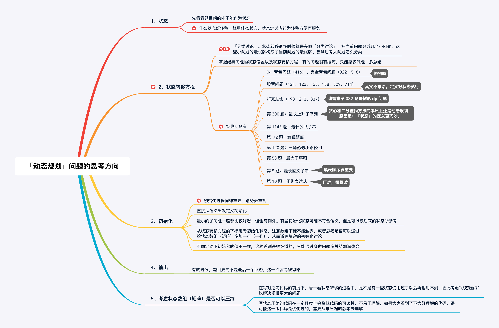

# 背包问题：

## 322 完全背包问题

给定不同面额的硬币 coins 和一个总金额 amount。编写一个函数来计算可以凑成总金额所需的最少的硬币个数。如果没有任何一种硬币组合能组成总金额，返回 -1。

示例 1:

输入: coins = [1, 2, 5], amount = 11
输出: 3 
解释: 11 = 5 + 5 + 1
示例 2:

输入: coins = [2], amount = 3
输出: -1
说明:
你可以认为每种硬币的数量是无限的。

- 方法一： DP， F(S):组成金额S，所需要的最少硬币数量 ,  至上向下，F(s) = F(s-c)+1, 所以 F(s) = min ( F(s-ci) + 1), 
  - F(s) = 0 ，当S=0；
  - F(s) = -1,   当 n=0

```c++
class Solution{
  public:
    vector<int> count; //备忘录
    int dp(vector<int>& coins, int res_amount){
        if(res_amount < 0) return -1;
        if(res_amount == 0) return 0;
        // 避免重复计算
        if(count[res_amount-1] !=0) return count[res_amount-1];
        int Min = INT_MAX;
        for(int coin : coins){
            int res = dp(coins, res_amount-coin);
            if(res >= 0 && res <Min)
                Min = res + 1;
        }
        count[res_amount-1] = Min == INT_MAX ? -1 : Min;
        return count[res_amount-1];
    }
    
    int coinChange(vector<int>& coin, int amount){
        if(amount < 1) return 0;
        count.resize(amount);
        return dp(coins, amount);
    }
};
```

**自下而上**

| F(i)  | 最小硬币数量                             |
| :---- | :--------------------------------------- |
| F(1)  | $F(1)=min(F(1-1),F(1-2), F(1-5))+1=1$    |
| F(2)  | $F(2)=min(F(2-1),F(2-2),F(2-5))+1=2$     |
| F(3)  | $F(3)=min(F(3-1),F=(3-2),F(3-5))+1=2$    |
| F(11) | $F(11)=min(F(11-1),F(11-2),F(11-5))+1=3$ |

```c++
class Solution{
public:
    int coinChange(vector<int>& coins,int amount){
        //数组大小为 amount+1, 初始值也为 amount+1
        vector<int> dp(amount+1, amount+1);
        // base case
        dp[0]=0;
        for(int i=0; i<dp.size(); ++i){
            // 内层for再求所有子问题+1的最小值
            for(int coin : coins){
                //子问题无解,跳过
                if(i-coin <0) continue;
                dp[i] = min(dp[i],1+dp[i-coin]);
            }
        }
        return (dp[amount] == amount + 1) ? -1 : dp[amount];
    }
};
```

