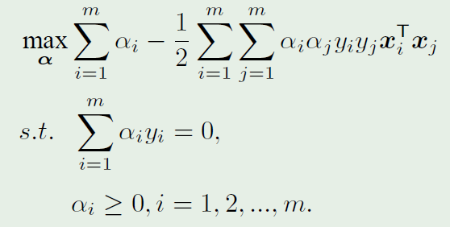
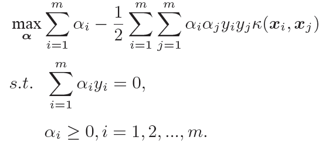
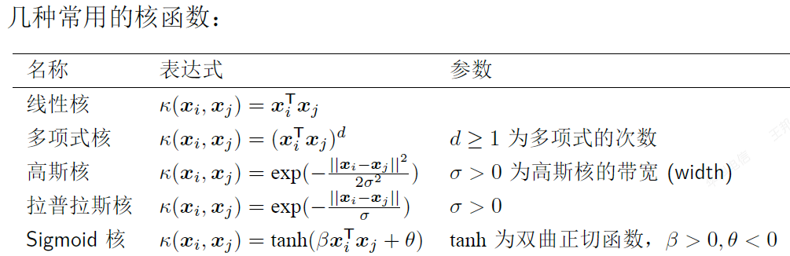
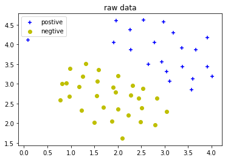
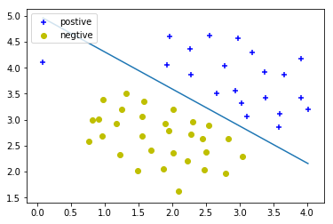
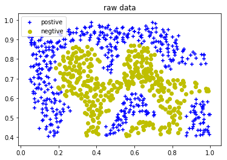
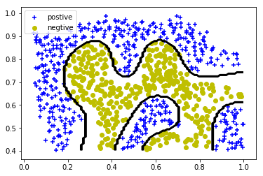
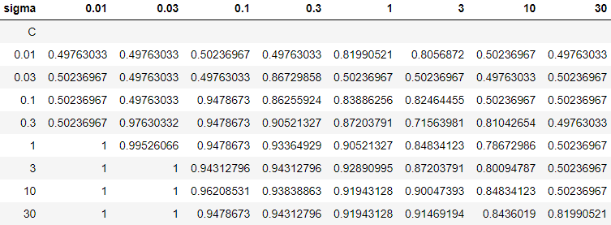

# <center> 机器学习实验报告 <center>


  <br/><br/><br/><br/>

  <br/><br/><br/><br/>
  <br/><br/><br/><br/>
### <center> 姓名：杨崇焕

### <center> &nbsp;&nbsp;&nbsp;&nbsp;&nbsp;&nbsp;&nbsp;&nbsp;&nbsp;学号：U201610531

### <center> &nbsp;&nbsp;&nbsp;&nbsp;&nbsp;&nbsp;&nbsp;&nbsp;&nbsp;&nbsp;&nbsp;&nbsp;班级：电信中英1601

### <center> &nbsp;&nbsp;&nbsp;&nbsp;&nbsp;实验内容：SVM

  <br/><br/><br/><br/>
    <br/><br/><br/><br/>
      <br/><br/><br/><br/>
        <br/><br/><br/><br/>
<div STYLE="page-break-after: always;"></div>
### 二.实验任务：

任务一：分别用线性SVM和高斯核SVM预测对数据进行分类
任务二：使用高斯核SVM对给定数据集进行分类
任务三：使用线性SVM实现对垃圾邮件分类


### 三.实验原理：

##### 1. SVM求解:


根据拉格朗日对偶性转换成如下形式，再由KKT条件求出满足α*，由α\*得到最优的w\*，b\*

再得
<p align="center"></p>  

<p align="center"></p>  

##### 2. 软间隔SVM:

当数据集不是线性可分时，样本点不满足函数间隔大于等于1的约束条件，为解决该问题引入非负松弛变量ξ，使约束条件变为<p align="center"></p>  

引入惩罚系数C>0,则目标函数变为<p align="center"></p>  


C越大越接近于硬间隔
问题又变成
<p align="center"></p>  

##### s.t.

<p align="center"></p>  

<p align="center"></p>  

##### 3. 核函数:

若数据不线性可分，则引入核函数，将其映射到新的空间
**核函数**：设X为输入空间(欧式空间的子集)，H为特征空间(希尔伯特空间)，存在一个X到H的映射<p align="center"></p>  

则核函数为<p align="center"></p>  

<p align="center"></p>  

SVM求解又变成




##### 4.  SMO

为快速求解SVM，采用启发式算法SMO(sequential minimal optimization),包括两个部分：求解两个变量二次规划的解析方法和选择变量的启发方法
**基本思路**
> 1. 若所有变量**α**都满足最优化的KKT条件则最后化问题的解就得到
> 2. 否则：取两个变量，固定其他变量，针对这两个变量构建一个二次规划问题，优化这两个变量

**两个变量α的更新：**
<p align="center"></p>  

<p align="center"></p>  

<p align="center"></p>  

其中：<p align="center"></p>  

<p align="center"></p>  

<p align="center"></p>  

<p align="center"></p>  

**阈值b的更新：**
<p align="center"></p>  

<p align="center"></p>  

如果,,同时满足0<<C,则
如果,,是0或C，则取中点为
**变量的选择：**

> 1. 称第一个变量的选择为外层循环，在外层循环中选取违反KKT条件最严重的样本点
>2. 称第二个变量的选择为内层循环，第二个变量的选择标准是希望能使有足够大的变化，使得最大。
>3. 计算更新阈值b和误差E

### 四.实验过程：

##### 任务一：分别用线性SVM和高斯核SVM预测对数据进行分类

1. **利用SMO算法训练SVM**
参考实验原理的实现过程：
这里用简化版SMO，跳过寻找最佳α对的步骤
```python
def svmTrain_SMO(X, y, C, kernelFunction='linear', tol=1e-3, max_iter=5, **kargs):
    """
    利用简化版的SMO算法训练SVM
    （参考《机器学习实战》）
  
    输入：
    X, y为loadData函数的返回值
    C为惩罚系数
    kernelFunction表示核函数类型, 对于非线性核函数，也可直接输入核函数矩阵K
    tol为容错率
    max_iter为最大迭代次数
  
    输出：
    model['kernelFunction']为核函数类型
    model['X']为支持向量
    model['y']为对应的标签
    model['alpha']为对应的拉格朗日参数
    model['w'], model['b']为模型参数
    """
  
    start = time.clock()
  
    m,n = X.shape
    X = np.mat(X)
    y = np.mat(y, dtype='float64')
    #将反例改为-1表示
    y[np.where(y==0)] = -1
  
    alphas = np.mat(np.zeros((m,1)))
    b = 0.0
    E = np.mat(np.zeros((m,1)))
    iters = 0
    eta = 0.0
    L = 0.0
    H = 0.0
  
    if kernelFunction =='linear':
        K = X*X.T
    elif kernelFunction == 'gaussian':
        K = kargs['K_matrix']
    else :
        print('Kernel Error')
        return None
  
  
    print('Training ...', end='')
    dots = 12
    while iters < max_iter:
        # 外层循环
        num_changed_alphas = 0
        for i in range(m):
            # 计算 E_i
            E[i] = b + np.sum(np.multiply(np.multiply(alphas, y), K[:,i])) - y[i]
            # 如果违反KKT条件
            if (y[i]*E[i] < -tol and alphas[i] < C) or (y[i]*E[i] > tol and alphas[i] > 0):
                #内层循环，随机找另一个α
                j = np.random.randint(m)
                while j == i:
                    j = np.random.randint(m)
                # 计算E_j
                E[j] = b + np.sum(np.multiply(np.multiply(alphas, y), K[:,j])) - y[j]
  
                # 保留 alpha^old
                alpha_i_old = alphas[i].copy()
                alpha_j_old = alphas[j].copy()
  
                # 计算L,H
                if y[i] == y[j]:
                    L = max(0, alphas[j] + alphas[i] - C)
                    H = min(C, alphas[j] + alphas[i])
                else:
                    L = max(0, alphas[j] - alphas[i])
                    H = min(C, C + alphas[j] - alphas[i])
  
                if L == H:
                    continue
  
                eta = 2*K[i,j] - K[i,i] -K[j,j]
                if eta >= 0:
                    continue
                # 计算alpha^new_j
                alphas[j] = alphas[j] - (y[j]*(E[i] - E[j]))/eta
  
                alphas[j] = min(H, alphas[j])
                alphas[j] = max(L, alphas[j])
  
                # 若改变量小于容许误差精度，则本次改变无意义，对出内存循环，寻找下一个可优化值
                if abs(alphas[j] - alpha_j_old) < tol:
                    alphas[j] = alpha_j_old
                    continue
                # 计算alpha^new_i
                alphas[i] = alphas[i] + y[i]*y[j]*(alpha_j_old - alphas[j])
  
                # 计算并更新b
                b1 = b - E[i]\
                 - y[i] * (alphas[i] - alpha_i_old) *  K[i,j]\
                 - y[j] * (alphas[j] - alpha_j_old) *  K[i,j]
  
                b2 = b - E[j]\
                 - y[i] * (alphas[i] - alpha_i_old) *  K[i,j]\
                 - y[j] * (alphas[j] - alpha_j_old) *  K[j,j]
  
                if (0 < alphas[i] and alphas[i] < C):
                    b = b1
                elif (0 < alphas[j] and alphas[j] < C):
                    b = b2
                else:
                    b = (b1+b2)/2.0
  
                num_changed_alphas = num_changed_alphas + 1
        # 最大迭代次数指没有α值变化是的最大次数
        if num_changed_alphas == 0:
            iters = iters + 1
        else:
            iters = 0
  
        print('.', end='')
        dots = dots + 1
        if dots > 78:
            dots = 0
            print()
  
    print('Done',end='')
    end = time.clock()
    print('( '+str(end-start)+'s )')
    print()
  
    idx = np.where(alphas > 0)
    #存储模型
    model = {'X':X[idx[0],:], 'y':y[idx], 'kernelFunction':str(kernelFunction), \
             'b':b, 'alphas':alphas[idx], 'w':(np.multiply(alphas,y).T*X).T}
    return model
```
2. **plot**
**linear kernel**
```python
X,y = SVM_Functions.loadData('task1_linear.mat')
SVM_Functions.plotData(X,y,title='raw data')
model = SVM_Functions.svmTrain_SMO(X,
            y, 1 , kernelFunction='linear', tol=1e-3, max_iter=5)
SVM_Functions.visualizeBoundaryLinear(X,y,model)
```
得结果



**gaussian kernel**
```python
X1,y1 = SVM_Functions.loadData('task1_gaussian.mat')
SVM_Functions.plotData(X1,y1,title='raw data')
model_1 = SVM_Functions.svmTrain_SMO(X1,
            y1, 1 , kernelFunction='gaussian',
            K_matrix=SVM_Functions.gaussianKernel(X1,sigma=0.1))
SVM_Functions.visualizeBoundaryGaussian(X1,y1,model_1,sigma=0.1)
```
得结果



#### 任务二：使用高斯核SVM对给定数据集进行分类

过程：利用任务一中得svmTrain_SMO()，通过迭代来改变C，sigma，来进行分类预测得精度
```python
#求精度函数
def accu(a,b):
    count = 0
    a = np.array(a)
    b = np.array(b)
    for  i in range(a.shape[0]):
        if a[i] == b[i]:
            count+=1
    return count/a.shape[0]
```
```python
X,y = SVMF.loadData('task2.mat')
acc=[]
for C in [0.01, 0.03, 0.1, 0.3, 1, 3, 10, 30]:
    for sigma in [0.01, 0.03, 0.1, 0.3, 1, 3, 10, 30]:
        model = SVMF.svmTrain_SMO(X,
                y, C , kernelFunction='gaussian',
                K_matrix=SVM_Functions.gaussianKernel(X,sigma))
        y_pred = SVMF.svmPredict(model, X, sigma)
        acc.extend[accu(y_pred,y]
        SVMF.visualizeBoundaryGaussian(X,y,model,sigma)
```
得结果

#### 任务三：使用线性SVM实现对垃圾邮件分类

过程：先载入训练集，划分为训练集和测试集，在训练集上训练SVM，测试结果并预测
1. 载入训练集
```python
train_feat ,labels = SVMF.loadData('task3_train.mat')
print('number of sample:{}'.format(train_feat.shape[0]))
print('dims of sample:{}'.format(train_feat.shape[1]))
```
2. 划分数据集
```python
num_train = int(0.8 * train_feat.shape[0]) # 划分训练样本和验证集样本
indices = np.arange( train_feat.shape[0])
np.random.shuffle(indices)  # shuffle 顺序
train_indices = indices[:num_train]
valid_indices = indices[num_train:]
train_data = train_feat[train_indices,:]
train_label = labels[train_indices,:]
valid_data = train_feat[valid_indices,:]
valid_label = labels[valid_indices,:]
```
3. 训练
```python
model = SVMF.svmTrain_SMO(train_data,
                train_label, C=1 , kernelFunction='linear')
y_pred = SVMF.svmPredict(model, valid_data)
accu(y_pred,valid_label)
```
得测试精度

4. 载入训练集
```python
from scipy.io import loadmat
def loadData_1(filename):
    """
    输入:
        数据集路径
    输出:
        numpy.array格式的X, y数据array
        X为m×n的数据array, m为样例数, n为特征维度
        y为m×1的标签array, 1表示正例, 0表示反例
    """
  
    dataDict = loadmat(filename)
  
    return dataDict['X']
test_feat = loadData_1('task3_test.mat')
```
5. 预测
```python
ans = SVMF.svmPredict(model, test_feat)
np.savetxt('ans.txt',ans,fmt='%d')
```
### 五.实验总结：

通过这次实验，我更加理解了SVM相关理论及其优化实现方法。
