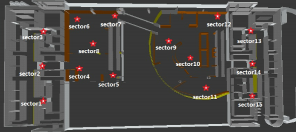
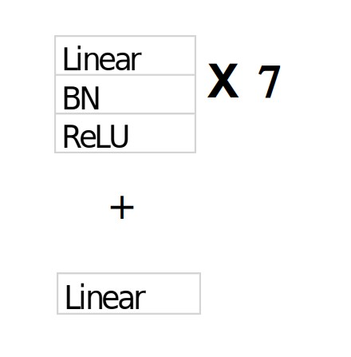
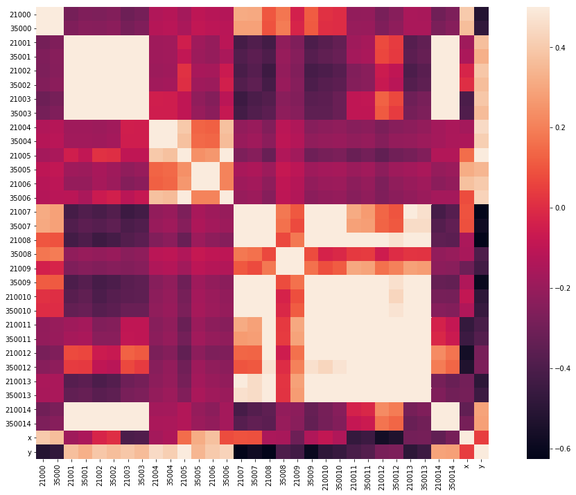
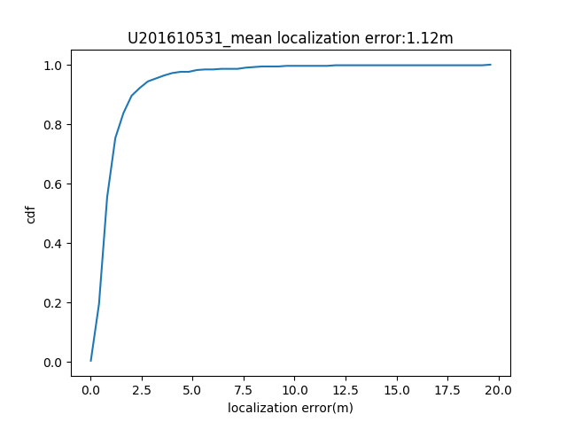
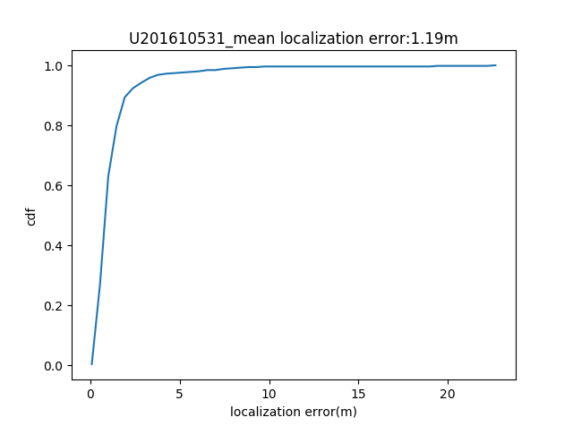
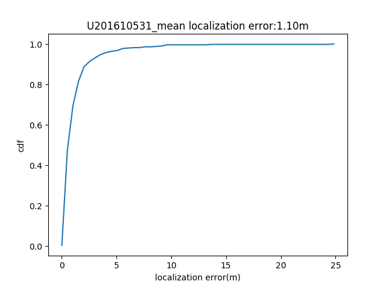

# <center> 机器学习实验报告 <center>

  <br/><br/><br/><br/>

  <br/><br/><br/><br/>
  <br/><br/><br/><br/>
### <center> 姓名：杨崇焕
### <center> &emsp;&emsp;&nbsp;&nbsp;学号：U201610531
### <center> &emsp;&emsp;&nbsp;&nbsp;&nbsp;&nbsp;班级：电信中英1601
### <center> &emsp;&nbsp;&nbsp;&nbsp;实验内容：大作业
  <br/><br/><br/><br/>
    <br/><br/><br/><br/>
      <br/><br/><br/><br/>
        <br/><br/><br/><br/>

<div STYLE="page-break-after: always;"></div>


### 二.实验任务：
**2.1 问题描述：**
给定15个sector，sector位置分布如下图所示，每个sector可以发射2.1G和3.5G频段的信号，依据每个1点接受到不同sector信号的强度，来预测该点的位置。


**2.2 数据集描述：**

`训练集`：dataAll.csv中，包括3863个样本点，每个样本点间隔0.6m，前30列表示15个sector的两个频段的信号强度，如 21005表示第 6 个 sector 中发射的 2.1G 频段信号， 350011 表示第 12 个 sector 中发射的 3.5G 频段信号。列‘ x’和‘ y’表示该样本所在点的坐标位置。

`测试集`：存于 testAll.csv,共包括 497 个样本。所有列表示 15 个 sector 在两
个频段的信号强度，其标签含义与 dataAll 中相同。
在给定的数据集中， -126.23dBm 代表该 sector 的该频段的无线信号无法传播到
该点。

**2.3 评估标准**：

采用尽量少的 sector，在满足覆盖率>95%的要求下，实现高准确度定位。

`覆盖率`：在一个点的样本中，如果存在至少一个 sector 的任意频段的信号强度大于-105dBm，则表示该点被覆盖。

`定位准确度`：预设样本实际坐标为$(x_n,y_n)$,评估坐标为$(x_{ne},y_{ne})$,则平均定位误差=$\frac{\sum_{n=1}^N((x_n-x_ne)^2+(y_n-y_ne)^2)^\frac{1}{2}}{N}$,越小则定位准确度越高。


### 三.实验环境：

&emsp;&emsp;&emsp;- ubuntu 18.04

&emsp;&emsp;&emsp;- python 3.6.8

&emsp;&emsp;&emsp;- numpy 1.14.3

&emsp;&emsp;&emsp;- pandas 0.24.2

&emsp;&emsp;&emsp;- pytorch 1.0.1.post2

&emsp;&emsp;&emsp;- scikit-learn 0.20.3


### 四.实验过程 :

#### 4.1 大致流程：

```flow
st=>start: 原始数据
e=>end
op=>operation: 模  型
op1=>operation: 特征工程
op2=>operation: 预测结果
st->op->op1->op2
op1->e
op1->op1
op1->op2
```
#### 4.2 划分数据集

将训练集随机采样划分为80%训练集和20%测试集
```python
def cos_vali(data_list,class_list,test_size = 0.2):
    data_class_list = list(zip(data_list, class_list))
    import random
    random.shuffle(data_class_list)
    index = int(len(data_class_list)*test_size)#+1
    train_list = data_class_list[index:]
    test_list = data_class_list[:index]
    train_data_list, train_class_list = zip(*train_list)
    test_data_list, test_class_list = zip(*test_list)
    return list(train_data_list),list(test_data_list),
            list(train_class_list),list(test_class_list)
```
#### 4.3 评估

- 计算误差
```python
def error(y_test,y_pre):
    y_test = np.array(y_test)
    y_pre = np.array(y_pre)
    m = y_test-y_pre
    m=np.square(m)
    m=m.sum(axis=1)
    m=np.sqrt(m)
    return m.sum()/len(y_test)
```
- 修改特征出现顺序并计算覆盖率:

先调整特征顺序，时每个sector的2.1G，3.5G信号排在一起

得到顺序如: 21000,35000,21001,35001 ...

计算给定sector编号列表的覆盖率,及分出这些sector特征构成的数据集

```python
# 先调整特征顺序，时每个sector的2.1G，3.5G信号排在一起
# 得到顺序如: 21000,35000,21001,35001 ...
a=data_train_add.columns.values.tolist()
m=[0,15,1,16,2,17,3,18,4,19,5,20,6,21,7,22,8,23,9,24,10,25,11,26,12,27,13,28,14,29]
order=[]
for i in m:
    order.extend([a[i]])
reoder_data = data_train_add[order]
def getReorderData(index):
    a = reoder_data.columns.values.tolist()
    order=[]
    for i in index:
        order.extend([a[i]])
    #return_data = 
    return reoder_data[order]

#计算覆盖率 及 得到选中几个sector的特征所构成的数据集
def getCoverRate(Sects):
    Sects = np.array(Sects)
    index = Sects*2
    index = np.hstack([index,index+1]).tolist()
    select_data = getReorderData(index)
    col_len = len(select_data.columns)
    row_len = len(select_data)
    select_data_1 = np.array(select_data)
    cover_index = []
    for i in range(row_len):
        if select_data_1[i,:].max() <= -105:
            cover_index.extend([i])
        
    drop_index = []
    '''
    for i in range(row_len):
        if select_data_1[i,:].max() <= -126.23:
            drop_index.extend([i])
    '''
    num = len(cover_index)
    rate = 1-num/row_len
    data = select_data.drop(drop_index)
    return rate,data

```
#### 4.4 建立模型

由问题描述易知，可以将该问题划分为一个回归预测问题，所以尝试了3个模型来进行分类
- 神经网络：
使用7层`全连接层+ batch norm + ReLU`和最后一个`全连接层`作为输出。


- 随机森林：
利用sklearn提供的多输出回归预测接口`MultiOutputRegressor`来训练随机森林，即`MultiOutputRegressor(RandomForestRegressor(n_estimators=400))`

- K-NN：
同样利用`MultiOutputRegressor`，得到`MultiOutputRegressor(KNeighborsRegressor())`

**模型实现细节**

神经网络
```python
def get_model(feat_dim,output_dim = 2 ):
    net = nn.Sequential(
        nn.Linear(int(feat_dim), int(feat_dim)),
        nn.BatchNorm1d(int(feat_dim)),
        nn.ReLU(inplace=True),
        
        nn.Linear(int(feat_dim), int(feat_dim)),
        nn.BatchNorm1d(int(feat_dim)),
        nn.ReLU(inplace=True),
        
        nn.Linear(int(feat_dim), int(feat_dim)),
        nn.BatchNorm1d(int(feat_dim)),
        nn.ReLU(inplace=True),
        nn.Dropout(0.5),
        
        nn.Linear(int(feat_dim), int(feat_dim*4/5)),
        nn.BatchNorm1d(int(feat_dim*4/5)),
        nn.ReLU(inplace=True),
        nn.Dropout(0.5),
        
        nn.Linear(int(feat_dim*4/5),int(feat_dim*3/5)),
        nn.BatchNorm1d(int(feat_dim*3/5)),
        nn.ReLU(inplace=True),
        nn.Dropout(0.5),
        
        nn.Linear(int(feat_dim*3/5),int(feat_dim*2/5)),
        nn.BatchNorm1d(int(feat_dim*2/5)),
        nn.ReLU(inplace=True),
        nn.Dropout(0.5),
        
        nn.Linear(int(feat_dim*2/5),int(feat_dim/5)),
        nn.BatchNorm1d(int(feat_dim/5)),
        nn.ReLU(inplace=True),
        
        nn.Linear(int(feat_dim/5), output_dim)
        )
    return net
```
随机森林
```python
regr_multirf = MultiOutputRegressor(RandomForestRegressor(n_estimators=400))
```
K-NN
```python
regr_multirf = MultiOutputRegressor(KNeighborsRegressor())
```

#### 4.5 训练模型

**神经网络训练**

1. 先将数据转成pytorch所接受的格式
2. 训练

参数设置如下，保存训练过程中产生误差最小的模型
- 损失函数：nn.MSELoss
- 优化方法：torch.optim.Adam
- 学习率：0.001
- 迭代次数：40000
- batch size: 128

实现
```python
# 转换数据为pytorch所接受的格式
def get_data(x,y,batch_size,shuffle):
    dataset = TensorDataset(x,y)
    return DataLoader(dataset, batch_size, shuffle=shuffle,num_workers=4)
# 训练函数
def train_model(model,x_train,y_train,x_valid,y_valid,
                epochs,batch_size,lr,weight_decay,use_gpu):
    
    if use_gpu:
        model = model.cuda()
    train_data = get_data(x_train,y_train,batch_size,True)

    optimizer = torch.optim.Adam(model.parameters(), lr=lr, weight_decay=weight_decay)
    criterion = nn.MSELoss()
    best_error = 0
    for e in  range(epochs):
        model.train()
        for data in train_data:
            x,y = data
            if use_gpu:
                x = x.cuda()
                y = y.cuda()
                
            out = model(x)
            loss = criterion(out, y)
            
            optimizer.zero_grad()
            loss.backward()
            optimizer.step()
        if use_gpu:
                x_valid = x_valid.cuda()
        with torch.no_grad():
            output = model(x_valid)
        output = Tensor.cpu(output)
        out = output.numpy()
        print('epoch:{}'.format(e))
        error_i = error(out,y_valid)
        print('error:{}'.format(error_i)) 
        # 保存误差最小的模型
        if e == 0:
            best_error = error_i
        elif error_i < best_error:
            best_model = copy.deepcopy(model)
    torch.save(best_model,"model_NN_master.t7")
```
```python
# 训练
batch_size = 128
epochs = 40000
lr = 0.001
wd = 0
use_gpu = False
feat_dim = train_feat.shape[1]
net = get_model(feat_dim)
train_model(net, train_features, train_label, valid_features, valid_labels, epochs, 
            batch_size, lr, wd, use_gpu)
```

**随机森林训练**

设置参数如下：
- n_estimators=400
- max_depth=29
- min_samples_leaf=2
- oob_score=True

```python
def train_pred_rf():
    X_train, X_test, y_train, y_test = cos_vali(np.array(data_train_add).tolist(),train_loc_list)
    X_train, X_test, y_train, y_test = np.array(X_train),np.array(X_test),np.array(y_train),np.array(y_test)
    regr_multirf = MultiOutputRegressor(RandomForestRegressor(n_estimators=400,
                            max_depth=29,min_samples_leaf=2,oob_score=True))
    regr_multirf.fit(X_train, y_train)
    y_multirf = regr_multirf.predict(X_test)

    a = pd.DataFrame(np.array(y_multirf))
    a.to_csv('baseline_rf.csv',header=None)
    m=error(y_test,y_multirf)    
    return m
```

**K-NN训练**

```python
def train_pred_knn():
    X_train, X_test, y_train, y_test = cos_vali(np.array(data_train_add).tolist(),train_loc_list)
    X_train, X_test, y_train, y_test = np.array(X_train),np.array(X_test),np.array(y_train),np.array(y_test)
    regr_multirf = MultiOutputRegressor(KNeighborsRegressor())
    regr_multirf.fit(X_train, y_train)
    y_multirf = regr_multirf.predict(X_test)

    a = pd.DataFrame(np.array(y_multirf))
    a.to_csv('baseline_knn.csv',header=None)
    m=error(y_test,y_multirf)    
    return m
```

#### 4.6 原始数据得到的结果

|模型|神经网络|随机森林|KNN|
|-|-|-|-|
|误差|0.7603472355574871|0.9398297277271725|1.2227503166716898|

### 5. 特征工程

尝试了如下方法：
- 标准化
- 利用相关性

#### 5.1 标准化

- 将所有数据加上126.23后再标准化
得到结果

|模型|神经网络|随机森林|KNN|
|-|-|-|-|
|误差|1.0875356262128073|1.1001906239220094|1.2398897995896054|


#### 5.2 利用相关性筛选sector

- 利用4.3中的函数调整特征所在列的位置
- 计算特征之间的相关性
- 将相关性大于0.9的特征分为一组
- 在每组中选择一个sector
- 计算覆盖率，若覆盖率小于0.95再添加sector

相关性如下图：

筛选出sector后，尝试了如下sector：

[0,1,4,5,6,7,8,9,10],

[0,1,2,4,5,6,7,8,9,10],

[0,1,4,5,6,7,8,9,10,14],

[0,1,4,5,6,7,8,9,10,12],

[0,1,4,5,6,7,8,9,10,11],

[0,1,2,3,4,5,6,7,8,9,10],

[0,1,4,5,6,7,8,9,10,11,12],

[0,1,2,3,4,5,6,7,8,9,10,12],

[0,1,2,3,4,5,6,7,8,9,10,12,13],

[0,1,2,3,4,5,6,7,8,9,10,11,12,13,14]

**每组覆盖率及利用随机森林和K-NN得到的误差如下**

- 随机森林

|组次|覆盖率|误差|
|-|-|-|
|1|0.9593580119078436|1.7544326621392756|
|2|0.9622055397359565|1.6430364547128864|
|3|0.9614289412373803|1.4728011620439883|
|4|0.9679005953921822|1.467509401407011|
|5|0.9624644059021485|1.5381403295198603|
|6|0.9658296660626456|1.330118382181314|
|7|0.9679005953921822|1.4358173532642857|
|8|0.9717835878850635|1.2639811529178118|
|9|0.9720424540512556|1.1186433159589069|
|10|0.9720424540512556|1.0556429510885716|

- K-NN

|组次|覆盖率|误差|
|-|-|-|
|1|0.9593580119078436|1.9271933591991064|
|2|0.9622055397359565|1.6148558890025309|
|3|0.9614289412373803|1.5593278242018274|
|4|0.9679005953921822|1.5195611187795366|
|5|0.9624644059021485|1.7153266202102082|
|6|0.9658296660626456|1.31676372805622|
|7|0.9679005953921822|1.4328122056228543|
|8|0.9717835878850635|1.143450922564073|
|9|0.9720424540512556|1.105033826045297|
|10|0.9720424540512556|1.0031492752485267|

### 6. 预测得结果

处于误差的考虑，没有删除sector，利用神经网络和随机森林得到结果：

- 神经网络
```python
def predict(x_test,use_gpu):
    net = torch.load('./model_NN_master.t7')
    if use_gpu:
        x_test = x_test.cuda()
    with torch.no_grad():
        a = Tensor.cpu(net(x_test)).numpy()
    a = pd.DataFrame(a)
    a.to_csv('NN_base.csv',header=None)
```
- 随机森林
```python
def train_pred_knn():
    X_train, X_test, y_train, y_test = cos_vali(np.array(data_train_add).tolist(),train_loc_list)
    X_train, X_test, y_train, y_test = np.array(X_train),np.array(X_test),np.array(y_train),np.array(y_test)
    regr_multirf = MultiOutputRegressor(KNeighborsRegressor())
    regr_multirf.fit(X_train, y_train)
    y_multirf = regr_multirf.predict(X_test)
    y_multirf = regr_multirf.predict(test_1)

    a = pd.DataFrame(np.array(y_multirf))
    a.to_csv('baseline_knn.csv',header=None)
    m=error(y_test,y_multirf)    
    return m
test_1 = np.array(pd.read_csv('testAll.csv'))
```

**最终测试集结果**

**1. 神经网络**


**2. 随机森林**


### 8. 实验总结

在这次实验的过程中，我查阅了许多关于kaggle上关于数据处理的例子，大致学会了一些关于特征工程的方法，通过这次实验我也更加了使用pytorch来构建神经网络模型，并且也从其他同学的解决方法中收获了对解决问题的新思路及许多机器学习模型选择，数据处理的新的点子。

### 9. 课程感受

&emsp;&emsp;在学习本课程前我只是大致学习了一些深度学习相关阿知识，通过本次课程，我学到了许多关于机器学习的理论知识，并且在写编程作业的过程中，我在学习github,kaggle上的教程时也学到了一些课程上没有的关于特征工程等方面的知识,同时也查阅了许多英文文档，算是在这方面也小有经验。当然这么课程也对我的编程能力有很大提高。虽然学到了许多但是这门课程也花了我很多时间，从布置编程到结束，我基本每天都有一部分时间在写代码，特别是在前期写base line的过程中，由于没怎么用过sklearn，我也找了许多的教程。课程改进上，我觉得可以减少部分解决流程重复或者类似的问题，变成数据处理或者用C/C++实现机器学习算法。

