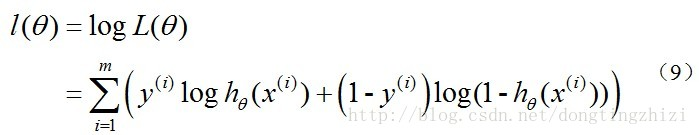
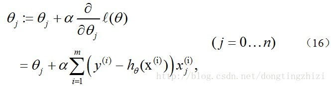
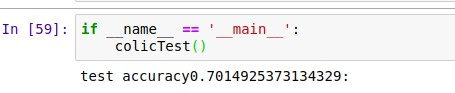
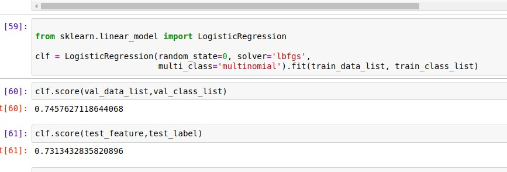
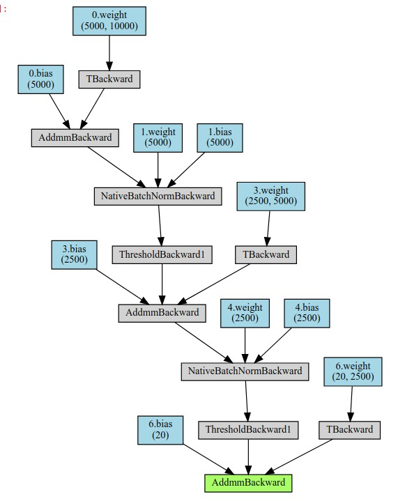
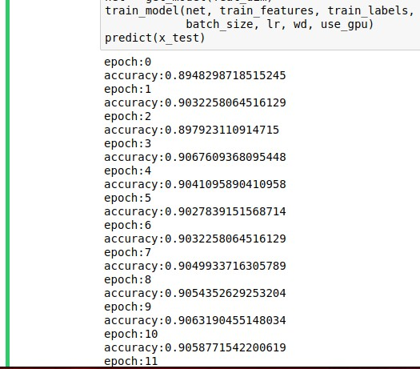

# <center> 机器学习实验报告 <center>

  <br/><br/><br/><br/>

  <br/><br/><br/><br/>
  <br/><br/><br/><br/>
### <center> 姓名：杨崇焕
### <center> &nbsp;&nbsp;&nbsp;&nbsp;&nbsp;&nbsp;&nbsp;&nbsp;&nbsp;学号：U201610531
### <center> &nbsp;&nbsp;&nbsp;&nbsp;&nbsp;&nbsp;&nbsp;&nbsp;&nbsp;&nbsp;&nbsp;&nbsp;班级：电信中英1601
### <center> &nbsp;&nbsp;&nbsp;&nbsp;&nbsp;&nbsp;&nbsp;&nbsp;&nbsp;&nbsp;&nbsp;&nbsp;&nbsp;&nbsp;&nbsp;&nbsp;&nbsp;&nbsp;&nbsp;&nbsp;&nbsp;&nbsp;&nbsp;&nbsp;&nbsp;&nbsp;&nbsp;&nbsp;&nbsp;实验内容：神经网络和回归分析
  <br/><br/><br/><br/>
    <br/><br/><br/><br/>
      <br/><br/><br/><br/>
        <br/><br/><br/><br/>
<div STYLE="page-break-after: always;"></div>

### 一.实验目的：
任务一：使用 Logistic 回归估计马疝病的死亡率
任务二：使用神经网络完成新闻分类
### 二.实验原理：
**Logistic 回归：** 预测函数如下：
$$ h(x)=\frac{1}{1+e^{-w^Tx}}
$$&emsp;&emsp;&emsp;&emsp;&emsp;其预测值 h(x) 仍为连续区间 (0,1) 上的某个值。处理方法是确定一个阈值 ϵ，使得
&emsp;&emsp;&emsp;&emsp;&emsp;h(x) ≥ ϵ predict: y = 1
&emsp;&emsp;&emsp;&emsp;&emsp;h(x) < ϵ predict: y = 0
&emsp;&emsp;&emsp;&emsp;&emsp;用线性回归模型的预测结果去逼近真实标记的对数几率，是一种分类方法
**神经网络：** 较复杂，详细见[wiki](https://en.wikipedia.org/wiki/Artificial_neural_network)

### 三.实验过程：
#### - 实验环境：
&emsp;&emsp;&emsp;- ubuntu 18.04
&emsp;&emsp;&emsp;- python 3.6
&emsp;&emsp;&emsp;- numpy 1.14.3
&emsp;&emsp;&emsp;- pandas 0.23.0
&emsp;&emsp;&emsp;- scikit-learn 0.19.1
&emsp;&emsp;&emsp;- pytorch 1.0.1.post2 
&emsp;&emsp;&emsp;- cuda 9.0.176

#### - 任务一：使用 Logistic 回归估计马疝病的死亡率
**1.构造logistic回归函数：**
1.1  sigmoid函数 
```python
def sigmoid(x):
    return 1.0 /( 1 + np.exp(-x))
```
1.2   通过梯度上升法来最大化似然函数，[具体原理如下](https://blog.csdn.net/achuo/article/details/51160101)：
> 首先定义对数似然函数

利用梯度上升最大化似然函数，参数更新如下

``` python
#随机梯度上升
def stocGradAscent(dataMatrix, classLabels, numIter = 100):
    m,n = np.shape(dataMatrix)
    #初始化权值
    weights = np.ones(n)
    for j in range(numIter):
        dataIndex = list(range(m))
        for i in range(m):
            #步长随迭代次数改变
            alpha = 4/(1.0+j+i)+0.01
            
            randIndex = int(random.uniform(0,len(dataIndex)))
            
            h = sigmoid(sum(dataMatrix[randIndex]*weights))
            
            error = classLabels[randIndex]*h
            
            weights = weights + alpha*dataMatrix[randIndex]*error
            #每次取一个小样本来计算，计算后从总体中删除
            del(dataIndex[randIndex])
    return weights
```
1.3   logistic分类函数，设阈值为0.5，大于则为正例，小于则为反例：
```python
def classifyVector(x,weights):
    prob = sigmoid(sum(x*weights))
    if prob > 0.5:
        return 1.0
    else:
        return 0.0
```
1.4  训练：迭代500次后在测试集上进行测试
```python
def colicTest():
    frTrain = open('horseColicTraining.txt')
    frTest  = open('horseColicTest.txt')
    #加载训练数据和训练标签
    trainingSet = []
    trainingLabels = []
    for line in frTrain.readlines():
        currLine = line.strip().split('\t')
        lineArr = []
        for i in range(len(currLine) - 1):
            lineArr.append(float(currLine[i]))
        trainingSet.append(lineArr)
        trainingLabels.append(float(currLine[-1]))
    #训练
    trainWeights = stocGradAscent(np.array(trainingSet), trainingLabels, 500)
    Count = 0
    numTestVect = 0.0
    for line in frTest.readlines():
        numTestVect += 1
        currLine = line.strip().split('\t')
        lineArr = []
        for i in range(len(currLine) - 1):
            lineArr.append(float(currLine[i]))
        #统计得准确率
        if int(classifyVector(np.array(lineArr),trainWeights)) 
                        == int(currLine[-1]):
            Count += 1
    accu = (float(Count)/numTestVect)
    print("test accuracy{}:".format(accu))
```
1.5  得到结果

与调用sklearn的结果对比,相差不是特别大


#### - 任务二：使用神经网络完成新闻分类
**1.数据处理：**
>利用pickle读取dat文件后，利用sklearn.feature_extraction.text中TfidfVectorizer来提取文档TF-IDF特征，并将训练集划分为train set 和 validation set,最后转换为torch tensor
```python
#读取数据
file_name = './train/train_texts.dat'
with open(file_name,'rb') as f:
    train_texts = pickle.load(f)
file_name1 = './train/train_labels.txt'
# train_labels = np.loadtxt(file_name1)
train_label = pd.read_table(file_name1,header=None,dtype=int)
file_name = './test/test_texts.dat'
with open(file_name,'rb') as f:
    test_texts = pickle.load(f)
#TF-IDF
vectorizer = TfidfVectorizer(max_features = 10000)
vectors_train = vectorizer.fit_transform(train_texts)
vectors_train = vectors_train.toarray()
vectors_train = pd.DataFrame(vectors_train)
test = vectorizer.transform(test_texts)
test = test.toarray()
test = pd.DataFrame(test)
#划分并转换为torch tensor
num_train = int(0.8 * vectors_train.shape[0]) # 划分训练样本和验证集样本
indices = np.arange( vectors_train.shape[0])
np.random.shuffle(indices)  # shuffle 顺序
train_indices = indices[:num_train]
valid_indices = indices[num_train:]

    #提取训练集和验证集的特征
train_features = vectors_train.iloc[train_indices].values.astype(np.float32)
train_features = torch.from_numpy(train_features)
valid_features = vectors_train.iloc[valid_indices].values.astype(np.float32)
valid_features = torch.from_numpy(valid_features)
train_valid_features = vectors_train[:vectors_train.shape[0]].values.astype(np.float32)
train_valid_features = torch.from_numpy(train_valid_features)

test = test.values.astype(np.float32)
x_test = torch.from_numpy(test)

    #提取训练集和验证集的label
train_labels = train_label.values[train_indices]#.astype(np.int16)
train_labels = torch.from_numpy(train_labels).squeeze()
valid_labels = train_label.values[valid_indices]#.astype(np.int16)
valid_labels = torch.from_numpy(valid_labels).squeeze()
train_valid_labels = train_label.values[:, None]#.astype(np.int16)
train_valid_labels = torch.from_numpy(train_valid_labels)
```
**2.构建神经网络：**
> 搭建如下全连接神经网络，最后输出20维，利用cross entropy loss，最后取最大值所在维为预测标签，网络结构如下：
> Sequential(
  (0): Linear(in_features=10000, out_features=5000, bias=True)
  (1): BatchNorm1d(5000, eps=1e-05, momentum=0.1, affine=True, track_running_stats=True)
  (2): ReLU(inplace)
  (3): Linear(in_features=5000, out_features=2500, bias=True)
  (4): BatchNorm1d(2500, eps=1e-05, momentum=0.1, affine=True, track_running_stats=True)
  (5): ReLU(inplace)
  (6): Linear(in_features=2500, out_features=20, bias=True)
)



```python
def get_model(feat_dim,output_dim = 20 ):
    net = nn.Sequential(
        nn.Linear(int(feat_dim), int(feat_dim/2)),
        nn.BatchNorm1d(int(feat_dim/2)),
        nn.ReLU(inplace=True),
        nn.Linear(int(feat_dim/2),int(feat_dim/4)),
        nn.BatchNorm1d(int(feat_dim/4)),
        nn.ReLU(inplace=True),
        nn.Linear(int(feat_dim/4), output_dim)
        #nn.Softmax(output_dim,20)
        )
    return net
```
**3.pytorch使用本地数据集：**
```python
def get_data(x,y,batch_size,shuffle):
    dataset = TensorDataset(x,y)
    return DataLoader(dataset, batch_size, 
            shuffle=shuffle,num_workers=4)
```
**4.训练：**
利用nn.CrossEntropyLoss()作为分类器的损失函数，
采用Adam优化方法进行训练，
保存在validation上精度最高模型
```python
def train_model(model,x_train,y_train,x_valid,
                    y_valid,epochs,batch_size,lr,weight_decay,use_gpu):
    
    if use_gpu:
        model = model.cuda()
    train_data = get_data(x_train,y_train,batch_size,True)

    optimizer = torch.optim.Adam(model.parameters(), lr=lr, weight_decay=weight_decay)
    criterion = nn.CrossEntropyLoss()
    best_accu = 0
    for e in  range(epochs):
        model.train()
        for data in train_data:
            x,y = data
            if use_gpu:
                x = x.cuda()
                y = y.cuda()
            # forward   
            out = model(x)
            loss = criterion(out, y)
            
            # backward
            optimizer.zero_grad()
            loss.backward()
            optimizer.step()
        # 计算在validation set 上精度
        if use_gpu:
                x_valid = x_valid.cuda()
        with torch.no_grad():
            output = model(x_valid)
        output = Tensor.cpu(output)
        out = output.numpy()
        print('epoch:{}'.format(e))
        accu = (np.argmax(out,axis=1) == y_valid.numpy()).sum()/len(y_valid)
        print('accuracy:{}'.format(accu))

        #保存精度最高模型
        if accu > best_accu:
            best_model = copy.deepcopy(model)
    torch.save(best_model,"model.t7")
```
**5.预测：**
使用保存的在validation set上精度最高的模型进行预测
```python
def predict(x_test):
    net = torch.load('./model.t7')
    a = net(x_test).detach().numpy()
    a = np.argmax(a,axis=1)
    with open('./ans.txt','w') as f:
        for i in a:
            f.write('{}'.format(i))
            f.write('\n')
```
**6.运行：**
```python
# 可以调整的超参
batch_size = 128
epochs = 100
lr = 0.001
wd = 0
use_gpu = False
feat_dim = vectors_train.shape[1]
net = get_model(feat_dim)
train_model(net, train_features, train_labels, valid_features, 
          valid_labels, epochs, 
            batch_size, lr, wd, use_gpu)
predict(x_test)
```
得到部分结果


### 四.实验原理：
通过这次实验，我深入理解了logistic regression的很多细节以及用法，同时也进一步复习了pytorch，TF-IDF相关知识。