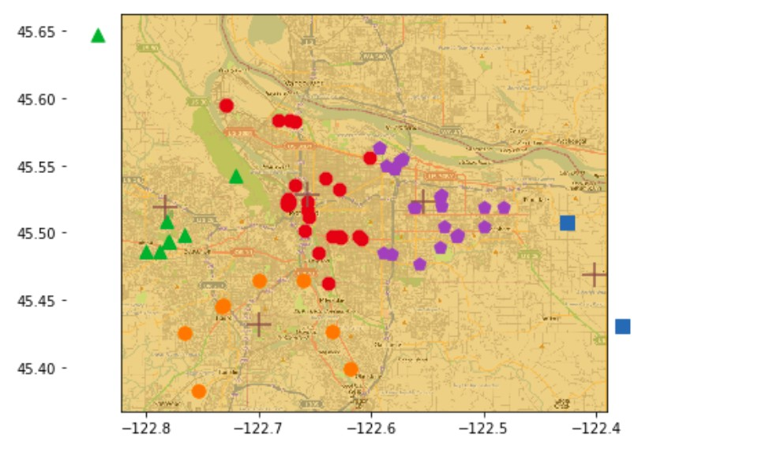
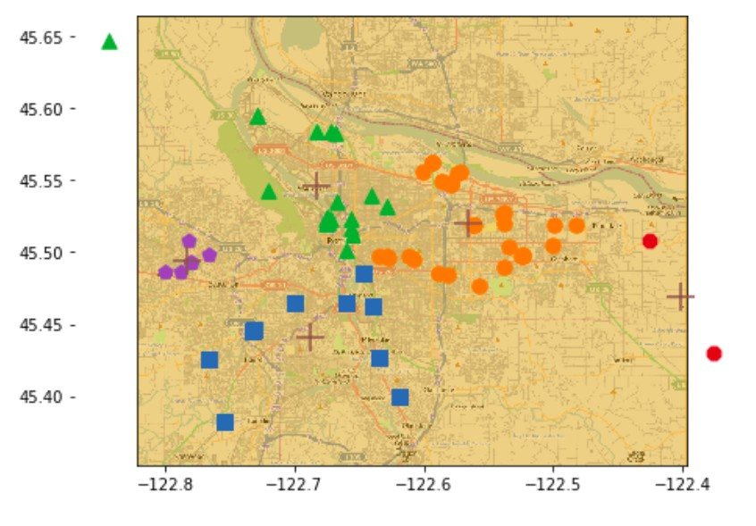

# <center> 机器学习实验报告 <center>

  <br/><br/><br/><br/>

  <br/><br/><br/><br/>
  <br/><br/><br/><br/>
### <center> 姓名：杨崇焕
### <center> &nbsp;&nbsp;&nbsp;&nbsp;&nbsp;&nbsp;&nbsp;&nbsp;&nbsp;学号：U201610531
### <center> &nbsp;&nbsp;&nbsp;&nbsp;&nbsp;&nbsp;&nbsp;&nbsp;&nbsp;&nbsp;&nbsp;&nbsp;班级：电信中英1601
### <center> &nbsp;&nbsp;&nbsp;&nbsp;实验内容：聚类
  <br/><br/><br/><br/>
    <br/><br/><br/><br/>
      <br/><br/><br/><br/>
        <br/><br/><br/><br/>
<div STYLE="page-break-after: always;"></div>

### 一.实验目的：
任务一：对地理数据应用二分 k-均值算法聚类
任务二：根据用户采集的 WiFi 信息对用户进行聚类
### 二.实验原理：
**K-means:**
根据均值与点间距离来划分簇,算法如下
> 1. 随机生成K个初始均值向量$\{\mu_1,\mu_2,...,\mu_k  \}$
> 2. 将样本点按分配给最近的均值点，得到K个簇
> 3. 计算每个簇的均值，生成一个均值向量
> 4. 重复2直到均值不改变，得到K个簇

**SSE:**
由于K-means依赖于均值，离群点对其产生较大的影响，引入SSE(sum of squared error)来度量聚类的效果，SSE越小则表示数据点越接近中心点，可以将SSE大的簇继续划分，为了使分出的簇的数量不变，可以对某簇再进行合并。有两种方法：1. 合并最近的质心，2.合并使SSE增幅最小的质心。

**二分 K-means:**
为克服K-means收敛与局部最小值，将数据以SSE最小的目标，不断分出两个簇(在一个簇上进行K=2的K-means)，算法如下：
> 1. 所有数据当成一个簇
> 2. 当簇数目小于K时
> 3. 对于每个簇：
> 4. &nbsp;&nbsp;&nbsp;&nbsp;&nbsp;&nbsp;计算总SSE
> 5. &nbsp;&nbsp;&nbsp;&nbsp;&nbsp;&nbsp;在给的簇上进行K=2的K-means
> 6. &nbsp;&nbsp;&nbsp;&nbsp;&nbsp;&nbsp;计算将该簇一分为二后的总SSE
> 7. 选使SSE最小的簇进行划分


### 三.实验环境：
&emsp;&emsp;&emsp;- ubuntu 18.04
&emsp;&emsp;&emsp;- python 3.6
&emsp;&emsp;&emsp;- numpy 1.14.3
&emsp;&emsp;&emsp;- pandas 0.23.0
&emsp;&emsp;&emsp;- scikit-learn 0.19.1

### 四.实验过程：
#### 任务一：对地理数据应用二分 k-均值算法聚类
**1. 构建K-means:**
生成一组初始化的簇中心向量,即随机生成K个取值在样本最大与最小值之间的值
```python
def randCent(dataSet, k):
    n = shape(dataSet)[1]
    centroids = mat(zeros((k,n)))
    for j in range(n):
        minJ = min(dataSet[:,j]) 
        rangeJ = float(max(dataSet[:,j]) - minJ)
        centroids[:,j] = mat(minJ + rangeJ * random.rand(k,1))
    return centroids
```
K-means实现
迭代计算所有点与中心点的距离
```python
#dataSet为数据集，k为分簇数目，distEclud为距离函数，randCent为随机选择簇中心方法
def kMeans(dataSet, k, distMeas=distEclud, createCent=randCent):
    m = shape(dataSet)[0]
    #初始化矩阵clusterAssment，第1列记录簇索引值，第2列存储误差
    clusterAssment = mat(zeros((m,2)))  
    #初始化簇中心                            
    centroids = createCent(dataSet, k)
    #标志变量，用于判断是否继续迭代
    clusterChanged = True
    while clusterChanged:
        clusterChanged = False
    #将每个样本点分配到与其最近的簇中心所在的簇
        for i in range(m): 
            minDist = inf; minIndex = -1
            # 计算样本与所有均值点之间的距离
            for j in range(k):
                # 计算第i个样本 与 第j个均值点之间的距离
                distJI = distMeas(centroids[j,:],dataSet[i,:])
                if distJI < minDist:
                    minDist = distJI; minIndex = j
            #如果样本被划分到不同的簇，则改变标志变量，表示需要继续迭代
            if clusterAssment[i,0] != minIndex: clusterChanged = True
            clusterAssment[i,:] = minIndex,minDist**2
    #打印簇中心
        #print (centroids)
        #由于样本划分发生变化，因此需要重新计算簇中心
        for cent in range(k):
        #提取处属于同一簇的所有样本
            ptsInClust = dataSet[nonzero(clusterAssment[:,0].A==cent)[0]]
            #计算不同簇所有样本的平均值作为簇中心
            centroids[cent,:] = mean(ptsInClust, axis=0) 
    return centroids, clusterAssment
```
二分K-means的实现
```python
#dataSet为数据集，k为分簇数目，distEclud为距离函数
def biKmeans(dataSet, k, distMeas=distEclud):
    m = shape(dataSet)[0]
    clusterAssment = mat(zeros((m,2)))
    #将所有样本的均值作为簇中心
    centroid0 = mean(dataSet, axis=0).tolist()[0]
    #创建簇中心列表
    centList =[centroid0] 
    #计算每个样本的误差
    for j in range(m):
        clusterAssment[j,1] = distMeas(mat(centroid0), dataSet[j,:])**2
    while (len(centList) < k):
        lowestSSE = inf
    #拆分每个簇，并计算拆分后的SSE，选择拆分后SSE最小的簇，保存拆分
        for i in range(len(centList)):
            ptsInCurrCluster = dataSet[nonzero(clusterAssment[:,0].A==i)[0],:]
            centroidMat, splitClustAss = kMeans(ptsInCurrCluster, 2, distMeas)
            sseSplit = sum(splitClustAss[:,1])
            sseNotSplit = sum(clusterAssment[nonzero(clusterAssment[:,0].A!=i)[0],1])
            #print ("sseSplit, and notSplit: ",sseSplit,sseNotSplit)
            if (sseSplit + sseNotSplit) < lowestSSE:
                bestCentToSplit = i
                bestNewCents = centroidMat
                bestClustAss = splitClustAss.copy()
                lowestSSE = sseSplit + sseNotSplit
    #一个簇拆分为二后，其中一个簇新增加簇索引，另一个保存原簇索引号
        bestClustAss[nonzero(bestClustAss[:,0].A == 1)[0],0] = len(centList) 
        bestClustAss[nonzero(bestClustAss[:,0].A == 0)[0],0] = bestCentToSplit
        #print ('the bestCentToSplit is: ',bestCentToSplit)
        #print ('the len of bestClustAss is: ', len(bestClustAss))
    #重置簇中心
        centList[bestCentToSplit] = bestNewCents[0,:].tolist()[0]
        centList.append(bestNewCents[1,:].tolist()[0])
    #调整样本的簇索引号及误差
        clusterAssment[nonzero(clusterAssment[:,0].A == bestCentToSplit)[0],:]= bestClustAss
    return mat(centList), clusterAssment
```
**2. 数据处理:**
直接提取出最后两列,并用mat存储
```python
datList = []
#导入数据
for line in open('places.txt').readlines():
    lineArr = line.split('\t')
    datList.append([float(lineArr[4]),float(lineArr[3])])
datMat = mat(datList)
```
**3. 绘制**
利用matplotlib在原图上进行标注
```python
#定义画布
fig = plt.figure()
#大小
rect = [0.0, 0.0 , 1.0 , 1.0]
#不同图形标示
scatterMarkers=['s', 'o', '^', '8', 'p', \
                    'd', 'v', 'h', '>', '<']
# 添加子图
axprops = dict(xticks=[], yticks=[])
ax0=fig.add_axes(rect, label='ax0', **axprops)
# 导入地图
imgP = plt.imread('Portland.png')
ax0.imshow(imgP)
ax1=fig.add_axes(rect, label='ax1', frameon=False)
# 每个簇用不同的图形标示
for i in range(numClust):
    #找到所有第i个簇的索引
    index = nonzero(clustAssing[:,0].A==i)[0]
    #找到所有第i个簇数据
    ptsInCurrCluster = datMat[ index ,:]
    #选择标签类型
    markerStyle = scatterMarkers[i % len(scatterMarkers)]
    x = ptsInCurrCluster[:,0].flatten().A[0]
    y = ptsInCurrCluster[:,1].flatten().A[0]
    # 在该点位置标注
    ax1.scatter(x , y , marker=markerStyle, s=90)
#采用‘+’表示簇中心
ax1.scatter(myCentroids[:,0].flatten().A[0], myCentroids[:,1].flatten().A[0], marker='+', s=300)
plt.show()
```
**4. 得到结果**
K-means

二分 K-means


#### 任务二：根据用户采集的 WiFi 信息对用户进行聚类
