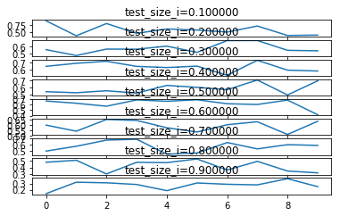

# <center> 机器学习实验报告 <center>

  <br/><br/><br/><br/>

  <br/><br/><br/><br/>
  <br/><br/><br/><br/>
### <center> 姓名：杨崇焕
### <center> &nbsp;&nbsp;&nbsp;&nbsp;&nbsp;&nbsp;&nbsp;&nbsp;&nbsp;学号：U201610531
### <center> &nbsp;&nbsp;&nbsp;&nbsp;&nbsp;&nbsp;&nbsp;&nbsp;&nbsp;&nbsp;&nbsp;&nbsp;班级：电信中英1601
### <center> &nbsp;&nbsp;&nbsp;&nbsp;&nbsp;&nbsp;&nbsp;&nbsp;&nbsp;&nbsp;&nbsp;&nbsp;&nbsp;&nbsp;&nbsp;实验内容：贝叶斯网络
  <br/><br/><br/><br/>
    <br/><br/><br/><br/>
      <br/><br/><br/><br/>
        <br/><br/><br/><br/>
<div STYLE="page-break-after: always;"></div>

### 一.实验目的：
>使用贝叶斯网络来完成如下三个分类预测问题。
​	　任务一：使用朴素贝叶斯过滤垃圾邮件
​	　任务二：使用朴素贝叶斯对搜狗新闻语料库进行分类
​	　任务三：使用朴素贝叶斯对电影评论分类
### 二.实验原理：
> 朴素贝叶斯分类器：采用**属性条件独立性假设**：对已知类别，假设所有属性相互独立，即假设每个属性独立地分类结果结果产生影响。基于属性条件独立性假设，贝叶斯公式可以写为：
> $$p(c|\vec{x})=\frac{p(c)p(\vec{x}|c)}{p(x)}=\frac{p(c)}{p(\vec{x})}\prod_{i=0}^dp(\vec{x}|c)
$$
则朴素贝叶斯分类器：
$$
h_{nb}(x)=arg\,\max_{c\in\gamma}p(c)\prod_{i=0}^dp(x_i|c)
$$
朴素贝叶斯分类器的训练过程就是基于训练集 D 来估计类先验概率 P(c)，并为每个属性估计条件概率
### 三.实验过程：
#### &emsp;&emsp;实验环境：
>- ubuntu 18.04
>- python 3.6
>- numpy 1.14.3
>- pandas 0.23.0
>- scikit-learn 0.19.1
>- jieba
#### &emsp;&emsp;任务一：使用朴素贝叶斯过滤垃圾邮件
#### &emsp;&emsp;实验原理：
> &emsp;&emsp;**词袋模型**：用所有文本组成一个词库，单个文本的向量的值对应词库中该词出现的1位置及其在全部文本中出现的次数

#### &emsp;&emsp;实验步骤：
> **数据处理**：利用bag of words处理文本得到文本向量, 并采用交叉验证的方式从数据集中随机抽取10个作为测试集，其余40个为训练集。
> **训练**：构建一个二分类朴素贝叶斯训练函数，并计算每个属性估计条件概率
> **测试**：将测试集带入训练好的模型中即可得到结果

#### &emsp;&emsp;实验具体实现：
##### &emsp;&emsp;&emsp;1.1获取文本及词库：
```python
    #获取spam，ham文本
    #将每个文本的数据作为string记录在docList
    #将类标签保存在classList中
    docList = []; classList = []
    for i in range(1, 26):
        wordList = textParse(open('./spam/%d.txt' % i, encoding="ISO-8859-1").read())
        docList.append(wordList)
        classList.append(1)

        wordList = textParse(open('./ham/%d.txt' % i, encoding="ISO-8859-1").read())
        docList.append(wordList)
        classList.append(0)
    #得到词库
    vocabList = createVocabList(docList)
```
##### &emsp;&emsp;&emsp;1.2采用生成随机检索数的方法划分数据集及测试集：
```python
    #创建训练集及测试集
    trainingSet = range(50); testSet = []
    for i in range(10):
        randIndex = int(np.random.uniform(0, len(trainingSet)))
        testSet.append(trainingSet[randIndex])
        #从原数据集中删除测试集即得到训练集
        del(list(trainingSet)[randIndex])
    #得到训练集矩阵
    trainMat = []; trainClasses = []
    for docIndex in trainingSet:
        trainMat.append(bagOfWords2VecMN(vocabList, docList[docIndex]))
        trainClasses.append(classList[docIndex])
```
##### &emsp;&emsp;&emsp;1.3构建朴素贝叶斯训练函数：通过计算每个词在词库中出现的概率来计算属性条件概率
```python
def trainNB0(trainMatrix,trainCategory):
    # number of training docs
    numTrainDocs = len(trainMatrix)
    # number of vocab in training docs
    numWords = len(trainMatrix[0])

    # p(c = 1)
    pAusive = sum(trainCategory)/float(numTrainDocs)
    # p(X|c) vector
    p0Num = np.ones(numWords) # n X 1
    p1Num = np.ones(numWords)
    #初始化概率
    p0Denom = 2.0
    p1Denom = 2.0
    #对每篇训练文档
    #   对每个类别：
    #       词条出现在文档-->增加该词条的计数
    #       增加所有词条的计数
    #   对每个类别：
    #       对每个词条：
    #           该词条数除以总词条数得到条件概率
    for i in range(numTrainDocs):
        if trainCategory[i] ==1:
            #出现词计数 
            p1Num += trainMatrix[i] 
            #计算该类别词总个数       
            p1Denom += sum(trainMatrix[i]) 
        else:
            p0Num += trainMatrix[i]
            p0Denom += sum(trainMatrix[i])
    #对每个元素做除法
    # p(X|c) vector
    p1Vect = np.log(p1Num / p1Denom)
    p0Vect = np.log(p0Num / p0Denom)
    # 得到P(X|C=0) P(X|C=1) P(C=1)
    return p0Vect,p1Vect,pAusive
```
##### &emsp;&emsp;&emsp;1.4利用朴素贝叶斯公式计算的到预测分类
```python
def classifyNB(vec2Classify,p0Vect,p1Vect,pClass1):
    p1 = sum(vec2Classify * p1Vect) + np.log(pClass1)
    p0 = sum(vec2Classify * p0Vect) + np.log(1.0 - pClass1)
    if p1 > p0:
        return 1
    else :
        return 0
```
##### &emsp;&emsp;&emsp;1.5训练并得到错误率
```python
    p0V, p1V, pSpam = trainNB0(np.array(trainMat), np.array(trainClasses))
    errorCount = 0
    for docIndex in testSet:        #classify the remaining items
        wordVector = bagOfWords2VecMN(vocabList, docList[docIndex])
        if classifyNB(np.array(wordVector), p0V, p1V, pSpam) != classList[docIndex]:
            errorCount += 1
            print("classification error", docList[docIndex])
    print('the error rate is: ', float(errorCount)/len(testSet))
```
##### &emsp;&emsp;&emsp;1.6运行得结果


#### &emsp;&emsp;任务二：使用朴素贝叶斯对搜狗新闻语料库进行分类
##### &emsp;&emsp;&emsp;2.1基本实现
> **TextClassifier()实现思路:** 将输入数据转化为list()形式，然后利用sklearn中的 PredefinedSplit() 和GridSearchCV()来找出MultinomialNB()最佳参数。然后利用交叉验证得到结果.
```python
    #获取list形似的测试集，训练集，及对应标签
    train_feature_list = list(train_feature_list)
    train_class_list = list(train_class_list)
    test_feature_list = list(test_feature_list)
    test_class_list = list(test_class_list)

    X_train = train_feature_list
    Y_train  = train_class_list

    X_train_c = np.copy(train_feature_list)
    Y_train_c  = np.copy(train_class_list)
    
    X_val  = test_feature_list
    Y_val = test_class_list

    len_X_train = len(X_train)
    len_X_val = len(X_val)

    #将训练集及测试集合并以便使用GridSearchCV
    X = vstack([X_train,X_val])
    X = np.array(X)
    Y_train.extend(Y_val)
    Y = np.array(Y_train)

    #标记training-validation以便计算精度
    train_i = np.ones((len_X_train,), dtype = int) * -1
    valid_i = np.zeros((len_X_val,), dtype = int)
    split_fold = np.concatenate((train_i, valid_i))
    ps = PredefinedSplit(split_fold)

    #tuning
    param_search = GridSearchCV(classifier,
                            params, 
                    scoring=metrics.make_scorer(metrics.f1_score, average='macro'),
                                cv=ps,
                                return_train_score=True)
    param_search.fit(X,Y)
    results = param_search.cv_results_
    best_params = param_search.best_params_ 
    
    #训练及预测
    clf = MultinomialNB(alpha = best_params['alpha'])
    clf.fit(X_train_c,Y_train_c)
    Y_pred = clf.predict(X_val)
    test_accuracy = metrics.f1_score(Y_val, Y_pred, average='macro')
```
##### &emsp;&emsp;&emsp;2.2 基本模型结果分析
>##### 重复划分与训练的过程得到多个结果
```python
if __name__ == '__main__':
    acc = []
    for i in range(10):
        # 文本预处理
        folder_path = './Database/SogouC/Sample'
        all_words_list, train_data_list, test_data_list, train_class_list, 
            test_class_list = TextProcessing(folder_path, test_size=0.2)

        # 生成stopwords_set
        stopwords_file = './stopwords_cn.txt'
        stopwords_set = MakeWordsSet(stopwords_file)

        # 文本特征提取和分类
        deleteN = 450
        feature_words = words_dict(all_words_list, deleteN, stopwords_set)
    
        train_feature_list, test_feature_list = TextFeatures(train_data_list, 
                            test_data_list, feature_words)

        m = TextClassifier(train_feature_list, test_feature_list, 
                    train_class_list, test_class_list)
        acc.extend([m])
    print(acc)
''' acc = [0.4464285714285714, 0.5074074074074074,   0.7555555555555555, 0.5875,
 0.6195286195286196, 0.6083333333333334, 
 0.7486772486772487, 0.5915343915343915, 0.6147186147186148, 0.825]
 '''
```
> ###### 由结果可知：对于不同的训练集及测试集划分，精度结果存在很大的差异，实验在删除特征词数量，不同特征词数量，训练集测试集划分比例，特征词提取方式上都存在较大改进空间，接下来将测试其中几种变量的影响

##### &emsp;&emsp;&emsp;2.3 改变删除的特征词数量
> ###### 将删除特征词的数量改为100, 160, 220, 280, 340, 400, 460, 520, 580, 640测试得到精度结果
```python

if __name__ == '__main__':
    #acc = []
    loop = 1
    for DEL_num in range(100,700,60):
        acc = []
        
        for i in range(10):
    # 文本预处理
            folder_path = './Database/SogouC/Sample'
            all_words_list, train_data_list, test_data_list, train_class_list, test_class_list = TextProcessing(folder_path, test_size=0.2)

    # 生成stopwords_set
            stopwords_file = './stopwords_cn.txt'
            stopwords_set = MakeWordsSet(stopwords_file)

    # 文本特征提取和分类
    ###################################  删除特征词数量   ######################################################
            deleteN = DEL_num
            feature_words = words_dict(all_words_list, deleteN, stopwords_set)

            train_feature_list, test_feature_list = TextFeatures(train_data_list, test_data_list, feature_words)

            m = TextClassifier(train_feature_list, test_feature_list, 
                    train_class_list, test_class_list)
            acc.extend([m])
        plt.subplot(10,1,loop)
        plt.title("DEL_num=%d"%(DEL_num))
        plt.plot(acc)
        loop += 1
```

> ###### 由图可知删除特征词数量在580左右时，精度的均值较大，方差较小，即删除词过少特征词不具备代表性，删除词过多信息损失太大

##### &emsp;&emsp;&emsp;2.4 训练集测试集划分比例
>  ###### 使测试集占比为0.1, 0.2, 0.3, 0.4, 0.5, 0.6, 0.7, 0.8, 0.9测试得到精度结果
```python
    ################################ 训练集 测试集划分比例 ###################################################
    loop = 1
    for test_size_i in [i/10 for i in range(1,10)]:
        for i in range(10):
    # 文本预处理
            folder_path = './Database/SogouC/Sample'
            all_words_list, train_data_list, test_data_list, train_class_list, test_class_list = TextProcessing(folder_path, test_size = test_size_i )

    # 生成stopwords_set
            stopwords_file = './stopwords_cn.txt'
            stopwords_set = MakeWordsSet(stopwords_file)

    # 文本特征提取和分类
            deleteN = 450
            feature_words = words_dict(all_words_list, deleteN, stopwords_set)
    
    #acc = []
    #for i in range(10):
            train_feature_list, test_feature_list = TextFeatures(train_data_list, test_data_list, feature_words)

            m = TextClassifier(train_feature_list, test_feature_list, 
                    train_class_list, test_class_list)
            acc.extend([m])
        plt.subplot(10,1,loop)
        plt.title("test_size_i=%f"%(test_size_i))
        plt.plot(acc)
        loop += 1
```

> ###### 可知占比为0.2时结果较好，测试集占比过少，得到结果对训练集拟合好，但可能产生过拟合；测试集占比过多，这产生欠拟合。
##### &emsp;&emsp;&emsp;2.5 采用TF-IDF来提取特征 
> ###### 使用sklearn的CountVectorizer() 计算词频，TfidfTransformer来产生TF—IDF结果， 测试得到精度结果
```python
if __name__ == '__main__':
    acc = []
    for i in range(10):
        # 文本预处理
        folder_path = './Database/SogouC/Sample'
        all_words_list, train_data_list, test_data_list, train_class_list, test_class_list =
             TextProcessing(folder_path, test_size=0.2)

        # 生成stopwords_set
        stopwords_file = './stopwords_cn.txt'
        stopwords_set = MakeWordsSet(stopwords_file)

        deleteN = 450
        feature_words = words_dict(all_words_list, deleteN, stopwords_set)
        
        #将[['words1',['words2'],...],['word_i',....]]转换为[‘string1’，‘str2’,....]
        # 以便使用 CountVectorizer() 
        train_feature_list = [" ".join(x) for x in train_data_list ]
        test_feature_list = [" ".join(x) for x in test_data_list ]
    
        vectorizer = CountVectorizer(max_df=0.85,stop_words=stopwords_set,max_features=1000)

        tfidf_transformer = TfidfTransformer(smooth_idf=True,use_idf=True)
        tfidf = tfidf_transformer.fit_transform(vectorizer.fit_transform(train_feature_list))
        tf_idf_vector=tfidf_transformer.transform(vectorizer.transform(test_feature_list))
        m = TextClassifier(tfidf.toarray().tolist(), tf_idf_vector.toarray().tolist(),
                train_class_list, test_class_list)
        acc.extend([m])
    print(acc)
```
> ###### 得到结果
> 
>
> ###### 由结果可知使用TF-IDF提取特征词会给精度带来较大的提升，
#### &emsp;&emsp;任务三：任务三：使用朴素贝叶斯对电影评论分类
##### &emsp;&emsp;&emsp;3.1基本实现思路
> ###### 1.提取文本及数据集划分：为方便处理将所有评论提取为一个['string1'，‘string2'...]格式的list，每个‘string'记录一条评论。使用cos validation方法，将训练集随机随机划分为80%训练样本及20%测试样本
> ###### 2.数据处理 : 利用bagOfWords统计词频后，再利用TF-IDF转化为特征词值矩阵
> ###### 3.训练与预测：使用sklearn提供的朴素贝叶斯相关训练及优化操作，利用MultinomialNB()及GridSearchCV()优化得到训练模型，后利用训练后的模型预测得到结果

##### &emsp;&emsp;&emsp;3.2具体实现过程
##### &emsp;&emsp;&emsp;3.2.1文本提取
>  ###### 读取文本后利用list来保存结果，同一评论中单个词合并为一个string,再利用cos_vali()随机划分数据集和测试集。
```python
    #读取数据
    with open('./train/train_data.txt','r') as fr:
        train_data_list = [line.strip().split('\t') for line in fr.readlines()]
    with open('./train/train_labels.txt','r') as fr:
        train_label_list = [line.strip().split('\t') for line in fr.readlines()]
        # predict
    with open('./test/test_data.txt','r') as fr:
        test_list = [line.strip().split('\t') for line in fr.readlines()]
    #合并同一评论中单个词
    train_feature_list = [" ".join(x) for x in train_data_list ]
    train_label_list = [" ".join(x) for x in train_label_list]
    test_list = [" ".join(x) for x in test_list ]
    
    #划分数据集
    train_data_list, test_data_list, train_class_list, test_class_list = cos_vali(train_feature_list,
        train_label_list,test_size = 0.2)
```
> 数据集划分函数实现
```python
def cos_vali(data_list,class_list,test_size = 0.2):
    data_class_list = list(zip(data_list, class_list))
    random.shuffle(data_class_list)
    index = int(len(data_class_list)*test_size)#+1
    train_list = data_class_list[index:]
    test_list = data_class_list[:index]
    train_data_list, train_class_list = zip(*train_list)
    test_data_list, test_class_list = zip(*test_list)
    return train_data_list, test_data_list, train_class_list, test_class_list
```
##### &emsp;&emsp;&emsp;3.2.2数据处理
>  ###### 利用CountVectorizer()得到词频计数，舍弃在不同评论中出现频率较大的词，再利用TfidfTransformer()来转化所有数据形式。
```python
    vectorizer = CountVectorizer(max_df=0.85,max_features=1000)

    tfidf_transformer = TfidfTransformer(smooth_idf=True,use_idf=True)
    tfidf = tfidf_transformer.fit_transform(vectorizer.fit_transform(train_data_list))
    tf_idf_vector=tfidf_transformer.transform(vectorizer.transform(test_data_list))

    pred_vect = tfidf_transformer.transform(vectorizer.transform(test_list))
```
##### &emsp;&emsp;&emsp;3.2.3训练并预测
>  ###### 在task2中的TextClassifier中加入预测结果模块，即可得到训练及预测结果
```python
def TextClassifier(train_feature_list, test_feature_list, 
                    train_class_list, test_class_list,test_list):
    """
    函数说明:训练及预测函数
    Parameters:
        train_feature_list - 训练集向量化的特征文本
        test_feature_list - 测试集向量化的特征文本
        train_class_list - 训练集分类标签
        test_class_list - 测试集分类标签
        test_list       - 要预测的特征文本
    Returns:
        test_accuracy - 分类器精度
        pred_target   - 预测结果

    """

    train_class_list = list(train_class_list)
    test_class_list = list(test_class_list)

    X_train = train_feature_list
    Y_train  = train_class_list

    X_train_c = np.copy(train_feature_list)
    Y_train_c  = np.copy(train_class_list)
    
    X_val  = test_feature_list
    Y_val = test_class_list

    len_X_train = len(X_train)
    len_X_val = len(X_val)

    X = vstack([X_train,X_val])
    X = np.array(X)
    Y_train.extend(Y_val)
    Y = np.array(Y_train)

    #Mark the training-validation splits
    train_i = np.ones((len_X_train,), dtype = int) * -1
    valid_i = np.zeros((len_X_val,), dtype = int)
    split_fold = np.concatenate((train_i, valid_i))
    ps = PredefinedSplit(split_fold)
    
    params = {'alpha':np.linspace(0.0001,1,10000)}
    classifier = MultinomialNB()
    
    param_search = GridSearchCV(classifier,
                            params, 
                    scoring=metrics.make_scorer(metrics.f1_score, average='macro'),
                                cv=ps,
                                return_train_score=True)
    param_search.fit(X,Y)
    results = param_search.cv_results_
    best_params = param_search.best_params_ 
    
    clf = MultinomialNB(alpha = best_params['alpha'])
    clf.fit(X_train_c,Y_train_c)
    #test the validation
    Y_pred = clf.predict(X_val)
    vali_accuracy = metrics.f1_score(Y_val, Y_pred, average='macro')
    
    pred_target = clf.predict(test_list)
    
    return vali_accuracy,pred_target

```
> 最终得训练结果


### 四.实验总结：
> ###### 在这次实验中通过完成这三个实验任务，我更加熟练的掌握了朴素贝叶斯网络的知识，对一般的文本处理有了一定的了解，学习了使用sklearn，jieba的相关API,同时也弥补了我在上一个实验中数据处理不到位，未优化模型参数的错误。