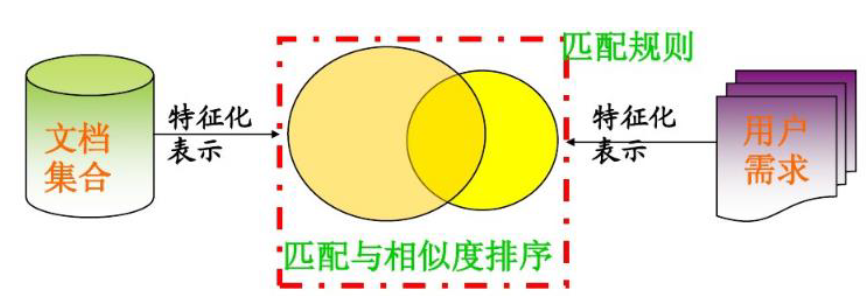

# feature indexing and retrieval

**核心问题**: 高效地基于特征向量计算对象间的相似性和距离

**1. 什么是索引 `index`** :  为提高数据集的检索效率而生成的结构化信息,如书籍目录、网格坐标

**索引方法：**

> - 多维索引法：
>   - R-tree及其变形、kd-tree等
> - 近似邻近法：
>   - VA-File等
> - 降维法：
>   - iDistance 等
> - 基于聚类的索引方法：
>   - Clindex等

# 文本处理和信息检索

## 信息检索模型

## 1. 布尔模型：

## 2. 向量模型：

