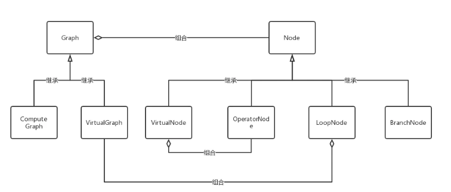

# C++ 实现的自动求导框架

## 1. 矩阵求导规则

**参考资料**

- [矩阵求导术(上)](https://zhuanlan.zhihu.com/p/24709748)
- [矩阵求导术(下)](https://zhuanlan.zhihu.com/p/24863977)

## 2.  基于链式法则和计算图

用于更新上一级参数的导数计算:      2步：矩阵求导，合并

- 矩阵对矩阵求导，使用雅可比


- 合并

  


参数更新：$X -= learningRate * X_{grad}$

​	

## 3. 框架架构



- `Tensor`  : 张量类
- `Node`  : 节点类，是虚拟节点、计算节点等节点的基类， Graph的组成部分
- `Graph` : 图类，
- 虚拟图`VitualGraph`和计算图`ComputeGraph`的基类
  - 包括图的基本算法： 构造邻接表，图的转置，根据给定节点对图进行剪枝，图的拓扑排序
  
- `OperatorNode` : 计算节点的基类，主要包括`op()`前向计算函数和`grad_op()`求解梯度函数，其子类包括参数节点`Parameter`类，数据输入节点`Input`类，各种运算比如：张量加、减，乘，偏置，sigmoid，二阶范数，一阶范数 ,**update**

> op_node
>
> - Parameter ： 权值
> - Add  
> - Input  :  输入
> - Minus
> - Mult
> - Sigmoid
> - SquareSum

- `ComputeGraph` : 计算图， 由虚拟图构建， 前向和后向两个功能。 有前向功能是因为大部分网络实际都不会拥有动态网络结构，计算图由虚拟图构建出来结构后，就不再改变。为了优化的考虑计算图提供前向传播功能。

- `VirtualGraph` : 虚拟图类， 主要包含一个前向传播计算图的构建方法`build_compute_graph`, 

  > 为解决计算图的动态问题，引入“虚拟图”的概念， 框架使用者不直接构造计算图，而是构造一个包含了控制流的虚拟图，然后框架框架图虚拟图进行前向传播的同时动态生成一个计算图，之后基于计算图进行反向传播， 虚拟图包含三个节点 `VirtualNode`  `LoopNode` 和`BranchNode`

  - 虚拟图如何生成计算图:   `build_compute_graph(cg, idx)`,`cg`: 待生成的计算图 , `idx`：循环的标识。虚拟图中，每个节点有唯一的二元组标识`<type,id>`,  `type`:虚拟节点的类别， `id` : 同一类别中的节点的区分。 由于虚拟节点中存在循环，一个循环中可能生成多个计算节点，所以计算节点使用三元标识符 `<type,id,idx>`

    ```C++
    build_compute_graph(cg, idx){
    1. 对虚拟图拓扑排序
    2. 对于排序后的节点：
        if(loop_node): 
        	1. 执行loop_node的inner_loop(cg)函数
        if(其他virtual_node):
        	1. 查找依赖是否齐全：
                1.若齐全：
                	由type生成对应的计算节点，加入计算图cg，调用op()前向计算生成节点输出
    3. 返回计算图的末尾节点            
    }
    
    
    inner_loop(cg){
    1. 调用loop_node中用户定义的init(cg)函数完成循环的初始化;
    2. while(用户自己定义的condition(cg) == 0){
        	1.循环标识递增: idx++
        	2.遍历loop_node中的虚拟子图，调用子图的build_compute_graph(cg,idx)
    	}
    3. 记录循环的结果：最后生成一个计算节点    
    }
    
    ```

    

- `VirtualNode`: 虚拟节点类， 组成虚拟图，内部包含计算节点工厂，可以根据虚拟节点类型生成计算节点。  每个虚拟节点生成的计算节点的引用都会被缓存再虚拟节点中，使得用户可以通过虚拟节点访问到生成的计算节点。  虚拟节点可以控制生成的计算节点是否共享参数，默认是不共享。

- `LoopNode`和`BranchNode`  :  控制节点实现控制流, 

  - BranchNode : 相当于一个多对一的开关，在BranchNode的父节点中选一个作为子节点的依赖，从而实现分支控制
  - LoopNode ： 若出现有环子图，则将这个子图看成一个广义节点`LoopNode`, 其在内部`inner_loop`控制下循环到满足循环跳出条件


